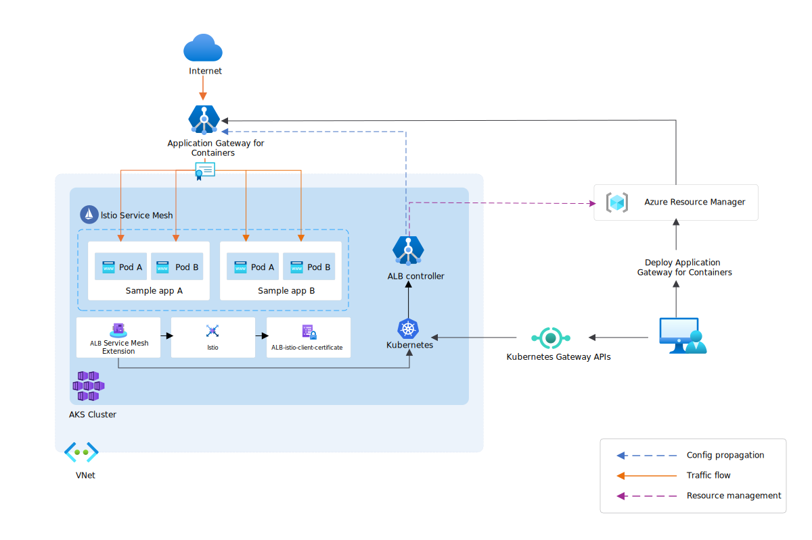

# Service mesh integration with Application Gateway for Containers

Service meshes handle east-west traffic between services and often use mutual TLS (mTLS) for security. When services need external access (north-south traffic), an ingress gateway simplifies connectivity. Application Gateway for Containers provides a service mesh extension that automates certificate lifecycle management and reduces configuration complexity.

While defining mTLS in ingress is possible, definition of mTLS configuration can become redundant and difficult to manage during certificate rotation.

To simplify communication from outside the Kubernetes cluster to the service mesh, Application Gateway for Containers has an optional service mesh extension that can be installed alongside ALB Controller. This extension can greatly decrease operational overhead by automating certificate lifecycle management and simplify ingress configuration.

Here's a diagram of Application Gateway for Containers integrating with Istio service mesh.



> [!IMPORTANT]
> Application Gateway for Containers Service Mesh Extension is currently in PREVIEW.<br>
> See the [Supplemental Terms of Use for Microsoft Azure Previews](https://azure.microsoft.com/support/legal/preview-supplemental-terms/) for legal terms that apply to Azure features that are in beta, preview, or otherwise not yet released into general availability.

## ALB Controller Service Mesh Extension (Preview)

The ALB Controller Istio Extension consists of two pods, deployed in active / standby configuration to allow resiliency during node failure, handle certificate lifecycle management between Application Gateway for Containers and Istio, and implicitly handle mTLS configuration to services part of a service mesh.

>[!NOTE]
>Application Gateway for Containers only supports the community/open source version of Istio today. Istio-based service mesh add-on for AKS isn't supported at this time.

>[!NOTE]
>To use ALB Controller Service Mesh Extension, you must define your ingress intent using Gateway API. Ingress API isn't supported.

### Install the ALB Controller Service Mesh Extension for Istio

Install the ALB Controller Service Mesh Extension using the Helm chart after provisioning [ALB Controller](quickstart-deploy-application-gateway-for-containers-alb-controller.md). The ALB Controller Service mesh Extension is installed using a separate [helm chart](service-mesh-helm-chart.md).

The following helm command can be used to install the extension.

```bash
HELM_NAMESPACE='<namespace for deployment>'
CONTROLLER_NAMESPACE='azure-alb-system'
RESOURCE_GROUP='<your resource group name>'
AKS_NAME='<your aks cluster name>'

az aks get-credentials --resource-group $RESOURCE_GROUP --name $AKS_NAME

helm install alb-controller-servicemesh-extension oci://mcr.microsoft.com/application-lb/charts/alb-controller-servicemesh-extension \
     --namespace $HELM_NAMESPACE \
     --version 1.8.12
```

### Verify the ALB Controller installation

Verify the ALB Controller Service Extension pods are ready as prefixed by `alb-controller-istio-extension`.

```azurecli-interactive
kubectl get pods -n azure-alb-system
```

You should see the following output:

| NAME                                     | READY | STATUS  | RESTARTS | AGE  |
| ---------------------------------------- | ----- | ------- | -------- | ---- |
| alb-controller-6648c5d5c-sdd9t           | 1/1   | Running | 0        | 4d6h |
| alb-controller-6648c5d5c-au234           | 1/1   | Running | 0        | 4d6h |
| alb-controller-istio-extension-69dc679455-94z7b | 2/2 | Running | 0   | 1h   |
| alb-controller-istio-extension-69dc679455-ffqzx | 2/2 | Running | 0   | 1h   |

### Integration with Istio

Application Gateway for Containers supports integration with Istio v1.24 and greater.

After the ALB Controller Service Mesh Extension is installed, if Istio is installed, the service mesh integration will attempt to provision a sidecar for integration into the mesh.

If ALB Controller Service Mesh is installed prior to Istio, you must restart the ALB Controller Service Mesh extension deployment. Restart of the ALB Controller Service Mesh deployment may be done with the command: `kubectl rollout restart deployment/alb-controller-istio-extension`

### Routing traffic to Istio service mesh

Follow these five steps to configure Istio service mesh with Application Gateway for Containers:

- Define a namespace with istio-injection
- Enable mTLS for the services in that namespace
- Deploy a sample application for testing (optional)
- Define a Gateway resource
- Define an HTTPRoute resource

#### Define the namespace

ALB Controller Service Mesh Extension will implicitly define mutual authentication to services part of a namespace with the key/value label of `istio-injection: enabled`.

For example:

```yaml
apiVersion: v1
kind: Namespace
metadata:
  name: istio-example-namespace
  labels:
    istio-injection: enabled
```

#### Enable mTLS handling for services in the namespace

In this example, we define a `PeerAuthentication` Istio custom resource to require mTLS for incoming connections to the services in the `istio-example-namespace`.

```yaml
apiVersion: security.istio.io/v1beta1
kind: PeerAuthentication
metadata:
  name: default
  namespace: istio-example-namespace
spec:
  mtls:
    mode: STRICT
```

>[!NOTE]
>Istio supports different modes to handle the behavior of mutual authentication. In Application Gateway for Containers' implementation, mTLS will always be enforced for services that are part of the namespace with the `istio-injection: enabled` label. If you wish to proxy traffic via clear-text or TLS, don't define the `istio-injection: enabled` label on the namespace and Application Gateway for Containers will proxy traffic to the backend via the defined configuration in HTTPRoute and BackendTLSPolicy resources accordingly.

#### Deploy a sample application (optional)

In this step, we provision some test resources so we can validate the end-to-end scenario.  If you have your own application, you can skip this step.

Apply the following deployment.yaml file on your cluster to create a sample web application to demonstrate sending traffic to an application part of the Istio service mesh.

  ```bash
  kubectl apply -f https://raw.githubusercontent.com/MicrosoftDocs/azure-docs/refs/heads/main/articles/application-gateway/for-containers/examples/traffic-split-scenario/deployment.yaml
  ```

 This command creates the following on your cluster:

 - A namespace called `test-infra`
 - Two services called `backend-v1` and `backend-v2` in the `test-infra` namespace
 - Two deployments called `backend-v1` and `backend-v2` in the `test-infra` namespace


#### Define Gateway resource

# [ALB managed deployment](#tab/alb-managed)

Create a gateway:

```bash
kubectl apply -f - <<EOF
apiVersion: gateway.networking.k8s.io/v1
kind: Gateway
metadata:
  name: gateway-01
  namespace: test-infra
  annotations:
    alb.networking.azure.io/alb-namespace: alb-test-infra
    alb.networking.azure.io/alb-name: alb-test
spec:
  gatewayClassName: azure-alb-external
  listeners:
  - name: http
    port: 80
    protocol: HTTP
    allowedRoutes:
      namespaces:
        from: All
EOF
```

[!INCLUDE [application-gateway-for-containers-frontend-naming](../../../includes/application-gateway-for-containers-frontend-naming.md)]

# [Bring your own (BYO) deployment](#tab/byo)

1. Set the following environment variables

    ```bash
    RESOURCE_GROUP='<resource group name of the Application Gateway For Containers resource>'
    RESOURCE_NAME='alb-test'

    RESOURCE_ID=$(az network alb show --resource-group $RESOURCE_GROUP --name $RESOURCE_NAME --query id -o tsv)
    FRONTEND_NAME='frontend'
    ```

2. Create a Gateway

    ```bash
    kubectl apply -f - <<EOF
    apiVersion: gateway.networking.k8s.io/v1
    kind: Gateway
    metadata:
      name: gateway-01
      namespace: test-infra
      annotations:
        alb.networking.azure.io/alb-id: $RESOURCE_ID
    spec:
      gatewayClassName: azure-alb-external
      listeners:
      - name: http
        port: 80
        protocol: HTTP
        allowedRoutes:
          namespaces:
            from: All
      addresses:
      - type: alb.networking.azure.io/alb-frontend
        value: $FRONTEND_NAME
    EOF
    ```

---

Once the gateway resource is created, ensure the status is valid, the listener is _Programmed_, and an address is assigned to the gateway.

```bash
kubectl get gateway gateway-01 -n test-infra -o yaml
```

Example output of successful gateway creation.

```yaml
status:
  addresses:
  - type: Hostname
    value: xxxx.yyyy.alb.azure.com
  conditions:
  - lastTransitionTime: "2023-06-19T21:04:55Z"
    message: Valid Gateway
    observedGeneration: 1
    reason: Accepted
    status: "True"
    type: Accepted
  - lastTransitionTime: "2023-06-19T21:04:55Z"
    message: Application Gateway For Containers resource has been successfully updated.
    observedGeneration: 1
    reason: Programmed
    status: "True"
    type: Programmed
  listeners:
  - attachedRoutes: 0
    conditions:
    - lastTransitionTime: "2023-06-19T21:04:55Z"
      message: ""
      observedGeneration: 1
      reason: ResolvedRefs
      status: "True"
      type: ResolvedRefs
    - lastTransitionTime: "2023-06-19T21:04:55Z"
      message: Listener is accepted
      observedGeneration: 1
      reason: Accepted
      status: "True"
      type: Accepted
    - lastTransitionTime: "2023-06-19T21:04:55Z"
      message: Application Gateway For Containers resource has been successfully updated.
      observedGeneration: 1
      reason: Programmed
      status: "True"
      type: Programmed
    name: gateway-01-http
    supportedKinds:
    - group: gateway.networking.k8s.io
      kind: HTTPRoute
```

#### Define HTTPRoute resource

Once the gateway is created, create an HTTPRoute

```bash
kubectl apply -f - <<EOF
apiVersion: gateway.networking.k8s.io/v1
kind: HTTPRoute
metadata:
  name: traffic-split-mesh-route
  namespace: istio-example-namespace
spec:
  parentRefs:
  - name: gateway-01
    namespace: test-infra
  rules:
  - backendRefs:
    - name: backend-v1
      port: 8080
EOF
```

Once the HTTPRoute resource is created, ensure the route is _Accepted_ and the Application Gateway for Containers resource is _Programmed_.

```bash
kubectl get httproute traffic-split-mesh-route -n istio-example-namespace -o yaml
```

Verify the status of the Application Gateway for Containers resource has been successfully updated.

```yaml
status:
  parents:
  - conditions:
    - lastTransitionTime: "2023-06-19T22:18:23Z"
      message: ""
      observedGeneration: 1
      reason: ResolvedRefs
      status: "True"
      type: ResolvedRefs
    - lastTransitionTime: "2023-06-19T22:18:23Z"
      message: Route is Accepted
      observedGeneration: 1
      reason: Accepted
      status: "True"
      type: Accepted
    - lastTransitionTime: "2023-06-19T22:18:23Z"
      message: Application Gateway For Containers resource has been successfully updated.
      observedGeneration: 1
      reason: Programmed
      status: "True"
      type: Programmed
    controllerName: alb.networking.azure.io/alb-controller
    parentRef:
      group: gateway.networking.k8s.io
      kind: Gateway
      name: gateway-01
      namespace: test-infra
  ```

#### Test access to the application

Now we're ready to send some traffic to our sample application, via the FQDN assigned to the frontend. Use the following command to get the FQDN:

```bash
fqdn=$(kubectl get gateway gateway-01 -n test-infra -o jsonpath='{.status.addresses[0].value}')
```

Curling this FQDN should return responses from the backends/pods as configured on the HTTPRoute.

```bash
curl http://$fqdn
```

Next, let's delete the PeerAuthentication resource to simulate removal of mTLS.

```bash
kubectl delete PeerAuthentication default -n istio-example-namespace
```

When you run the curl command again, you should see a 503 HTTP response code, indicating failure of mTLS negotiation between Application Gateway for Containers and the test application (as the test application is no longer expecting mutual authentication).

## Pricing

There's no extra price to enable service mesh integration.

## Limitations

- Application Gateway for Containers only supports the community/open source version of Istio today. Istio-based service mesh add-on for AKS isn't supported at this time.
- Ingress API isn't supported; consider migrating to Gateway API.
