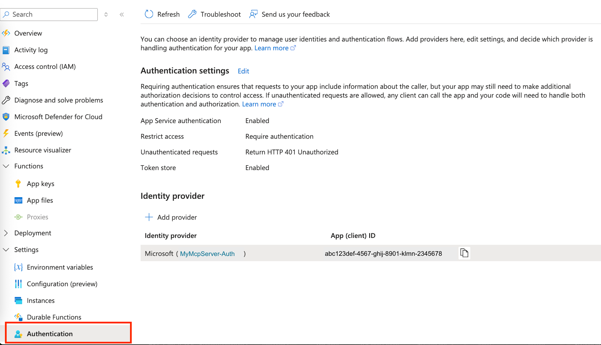
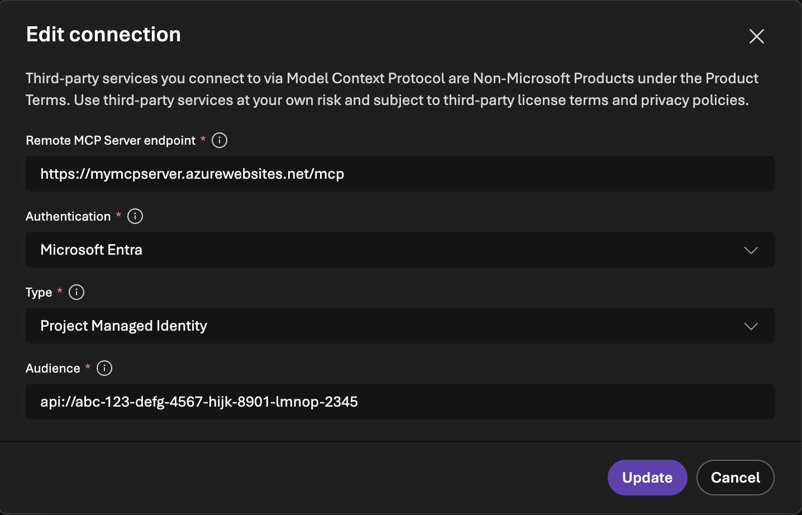

In this tutorial, you'll learn how to create and host remote MCP ([Model Context Protocol]()) servers on Azure Functions. You'll also see how to leverage a feature called Easy Auth to configure server authorization. 

There are two types of MCP servers that can be hosted remotely on Azure Functions:
1. Servers built with the [Azure Functions MCP extension](./functions-bindings-mcp.md), referred to as _MCP extension servers_ below.
1. Servers built with the [official MCP SDKs](./self-hosted-mcp-servers.md), referred to as _self-hosted servers_ below. (Currently in **public preview**.)

The choice of which to use depends on your scenario and preference. If you're an existing Azure Functions user and are familiar with the triggers and bindings programming model, then you might want to build and host your server using the extension. If you've already built servers using the official MCP SDKs and are simply looking for a hosting platform, then the second option may be better for you.

## Prerequisites 
+ An Azure account with an active subscription. [Create an account for free](https://azure.microsoft.com/pricing/purchase-options/azure-account?cid=msft_learn).

+ [Azure Developer CLI](/azure/developer/azure-developer-cli/install-azd)

+ [Azure CLI]()

+ [Azure Functions Core Tools](functions-run-local.md#install-the-azure-functions-core-tools) v4.5.0 or greater

+ [Visual Studio Code](https://code.visualstudio.com/) on one of the [supported platforms](https://code.visualstudio.com/docs/supporting/requirements#_platforms).

+ The [Azure Functions extension](https://marketplace.visualstudio.com/items?itemName=ms-azuretools.vscode-azurefunctions) for Visual Studio Code.  

::: zone pivot="programming-language-python" 
+ [uv](https://docs.astral.sh/uv/getting-started/installation/)
::: zone-end  

## Create a local MCP server project 
In this section, you use Visual Studio Code to create a local MCP server project in your preferred language. Later in the article, you update, run, and then publish your server to Azure.

### [MCP extension server](#tab/extension)

1. In Visual Studio Code, press <kbd>F1</kbd> to open the command palette and search for and run the command `Azure Functions: Create New Project...`.

1. Choose the directory location for your project workspace and choose **Select**. You should either create a new folder or choose an empty folder for the project workspace. Don't choose a project folder that is already part of a workspace.

1. Provide the following information at the prompts:
    ::: zone pivot="programming-language-csharp"
    |Prompt|Selection|
    |--|--|
    |**Select a project type**|Choose `C#`.|
    |**Select a .NET runtime**|Choose `.NET 8.0 LTS`.|
    |**Select a template for your project's first function**|Choose `MCP Tool trigger`.|
    |**Provide a function name**|Type `McpTrigger`.|
    |**Provide a namespace** | Type `My.Functions`. |
    |**Authorization level**|Choose `FUNCTION`, which requires access key when connecting to the MCP server.|
    |**Select how you would like to open your project**|Choose `Open in current window`.|
    ::: zone-end

    ::: zone pivot="programming-language-typescript" 
    |Prompt|Selection|
    |--|--|
    |**Select a project type**|Choose `TypeScript`.|
    |**Select a template for your project's first function**|Choose `MCP Tool trigger`.|
    |**Provide a function name**|Type `mcpToolTrigger`.|
    |**Authorization level**|Choose `FUNCTION`, which requires access key when connecting to the MCP server.|
    |**Select how you would like to open your project**|Choose `Open in current window`.|
    ::: zone-end

    ::: zone pivot="programming-language-python" 
    |Prompt|Selection|
    |--|--|
    |**Select a project type**| Choose `Python`.|
    |**Select a Python interpreter to create a virtual environment**| Choose your preferred Python interpreter. If an option isn't shown, type in the full path to your Python binary.|
    |**Select a template for your project's first function** | Choose `MCP Tool trigger`. |
    |**Name of the function you want to create**| Enter `mcp_trigger`.|
    |**Authorization level**| Choose `FUNCTION`, which requires access key when connecting to the MCP server.|
    |**Select how you would like to open your project** | Choose `Open in current window`.|
    ::: zone-end

Using this information, Visual Studio Code generates a code project for Azure Functions with an MCP trigger. You can view the local project files in the Explorer.

### [Self-hosted server](#tab/extension)

Self-hosted MCP servers are deployed as [custom handlers](./functions-custom-handlers.md) in Azure Functions. You can think of custom handlers as lightweight web servers that receive events from the Azure Functions host.    

1. In Visual Studio Code, press <kbd>F1</kbd> to open the command palette and search for and run the command `Azure Functions: Create New Project...`.

1. Choose the directory location for your project workspace and choose **Select**. You should either create a new folder or choose an empty folder for the project workspace. Don't choose a project folder that is already part of a workspace.

1. Provide the following information at the prompts:
    ::: zone pivot="programming-language-csharp"

    |Prompt|Selection|
    |--|--|
    |**Select a project type**|Choose `Self-hosted MCP server`.|
    |**Select a language for the MCP server**|Choose `C#`.|
    |**Include sample server code**| Choose `Yes`.|
    |**Select how you would like to open your project**|Choose `Open in current window`.|
    ::: zone-end
    ::: zone pivot="programming-language-typescript" 

    |Prompt|Selection|
    |--|--|
    |**Select a project type**|Choose `Self-hosted MCP server`.|
    |**Select a language for the MCP server**| Choose `TypeScript`.|
    |**Include sample server code**| Choose `Yes`.|
    |**Select how you would like to open your project**|Choose `Open in current window`.|
    ::: zone-end
    ::: zone pivot="programming-language-python" 

    |Prompt|Selection|
    |--|--|
    |**Select a project type**|Choose `Self-hosted MCP server`.|
    |**Select a language for the MCP server**| Choose `Python`.|
    |**Include sample server code**| Choose `Yes`.|
    |**Select how you would like to open your project**|Choose `Open in current window`.|
    ::: zone-end

    Using this information, Visual Studio Code generates an MCP server project with the following: 
        - _host.json_: This file is required by the Azure Functions host to run the server as an MCP custom handler
        - _local.settings.json_: This file is required by Azure Functions Core Tools to run the server locally. Core Tools provides a local version of Azure Functions, and it uses this file for specifying required environment variables. 

        ::: zone pivot="programming-language-csharp"
        - _Program.cs_: Contains the main entry point for .NET MCP server.
        - _Tools/HelloTool.cs_: Contains one tool that returns a hello message
        - _ProjectName.csproj_: Specifies the package dependencies
        ::: zone-end

        ::: zone pivot="programming-language-typescript"
        ::: zone-end

        ::: zone pivot="programming-language-python" 
        - _weather.py_: Contains the MCP server code
        - _pyproject.toml_: Specifies the package dependencies
        ::: zone-end

## Start the MCP server locally 

### [MCP extension server](#tab/extension)

Function apps need a storage component to run, so before starting the server you need to start the local storage emulator: 

1. In _local.setting.json_, ensure you have `"AzureWebJobsStorage": "UseDevelopmentStorage=true"`.

1. In Visual Studio Code, press <kbd>F1</kbd> to open the command palette. In the command palette, search for and select `Azurite: Start`.

1. Check the bottom bar and verify that Azurite emulation services are running. If so, you can now run the server locally.

1. To start running locally, press <kbd>F5</kbd>. 

### [Self-hosted server](#tab/extension)

Open a new terminal (``Ctrl+Shift+` ``), start the server by running the following command: 

::: zone pivot="programming-language-python" 

    ```shell
    uv run func start
    ```
::: zone-end  

::: zone pivot="programming-language-csharp" 

    ```shell
    func start
    ``` 
::: zone-end  

::: zone pivot="programming-language-typescript"

    ```shell
    npm install
    npm run build
    func start
    ```
::: zone-end  
### Test the server

1. In Visual Studio Code, open command palette and search for **MCP: Add Server...**

1. Answer the following prompts: 
    - Type of server to be added: Choose "HTTP" 
    - Enter URL of the MCP server: 
        - MCP extension server: `http://localhost:7071/runtime/webhooks/mcp`
        - Self-hosted server: `http://localhost:7071/mcp`
    - Give a server name: "local-mcp-server"
    - Choose "Workspace" to add server to current workspace

1. Visual Studio should open an `mcp.json` for you. Start the server by selecting the **Start** button above the server name.

1. When successfully connected to the server, you should see the number of tools available above the server name. 

1. Open Visual Studio Code Copilot chat in agent mode, then ask a question. For example, _Greet with MCP tool_.

1. When Copilot requests to run a tool from the local MCP server, click **Allow**.

1. Disconnect from the server when finish testing by click **Stop**, and `Cntrl+C` to stop running it locally. 

>[!TIP]
>In the Copilot chat window, click the tool icon in the bottom to see the list of servers and tools available for the chat. Ensure the local MCP server is checked when testing.

## Remote server authentication options 

There are two server authentication options for your remote MCP server:

1. _Built-in server authorization and authentication (recommended)_
    The built-in feature implements the requirements of the [MCP authorization specification](https://modelcontextprotocol.io/specification/2025-06-18/basic/authorization) protocol, such as issuing 401 challenge and hosting the Protected Resource Metadata (PRM). When the feature is enabled, clients attempting to access the server would be redirected to identity providers like Microsoft Entra ID for authentication before connecting. Continue following instructions in the next section to enable this built-in feature.
    
    >[!NOTE]
    > You may also see the built-in server authorization and authentication feature referred to as _App Service Authentication_ in other articles. 

1. _Host-based authentication with access key_
    This approach requires an access key in the client request header when connecting to the MCP server. If this approach is sufficient for your needs, you don't need to follow the sections below. Skip directly to [Create the function app in Azure](#create-the-function-app-in-azure).

## Disable host-based authentication  

The built-in server authorization feature is a component separate from Azure Functions. To configure it, you must first disable Functions host-based authentication and allow anonymous access. 

### [MCP extension server](#tab/extension)
To do that in MCP extension servers, set authentication level to anonymous:

::: zone pivot="programming-language-python" 

```python
app = func.FunctionApp(http_auth_level=func.AuthLevel.ANONYMOUS)
```
::: zone-end  
::: zone pivot="programming-language-csharp" 
::: zone-end  

### [Self-hosted server](#tab/extension)
To do that for self-hosted MCP servers, add the following in the `customHandler` section:

    ```json
    "customHandler": {
        // Other properties
        "http": {
            "DefaultAuthorizationLevel": "anonymous"
        }
    }
    ```

## Create the function app in Azure

Create a [Function app in the Azure portal](./functions-create-function-app-portal.md). 

>[!NOTE] Self-hosted servers must pick **Flex Consumption** as the hosting plan today. 

## Deploy the MCP server project 

### [MCP extension server](#tab/extension)
[!INCLUDE [functions-deploy-project-vs-code](../../includes/functions-deploy-project-vs-code.md)]

### [Self-hosted server](#tab/extension)
Before deploying the server, you need to add the required apps settings: 

1. Log into your account and pick your subscription: 

    ```shell
    az login
    ```
1. Add the setting `AzureWebJobsFeatureFlags` (plural) to the app with value `EnableMcpCustomHandlerPreview`: 

    ```shell
    az functionapp config appsettings set --name <function-app-name> --resource-group <resource-group-name> --settings "AzureWebJobsFeatureFlags=EnableMcpCustomHandlerPreview"
    ```
::: zone pivot="programming-language-python" 

3. Python apps also require the setting `"PYTHONPATH=/home/site/wwwroot/.python_packages/lib/site-packages"`.  

::: zone-end  

Now deploy the server project:

[!INCLUDE [functions-deploy-project-vs-code](../../includes/functions-deploy-project-vs-code.md)]

If you're connecting to the MCP server using access key instead of configuring built-in server authorization and authentication, skip to [Connect to server](#connect-to-server) after deployment finishes.

## Enable built-in server authorization and authentication

The following instruction shows how to enable the built-in authorization and authentication feature on the server app and configures Microsoft Entra ID as the identity provider. When done, you'll test by connecting to the server in Visual Studio Code and see that you're prompted to authenticate before connecting. 

### Configure authentication on server app

1. Open the server app on the Azure portal. 
1. Scroll down the left menu to **Settings → Authentication**
1. Click **Add identity provider**
1. Select **Microsoft** as the identity provider
1. Configure the following settings:

    **Choose a tenant for your application and its users**
      Choose "Workforce configuration (current tenant)".

    **App registration:**

      - App registration type: Choose "Create new app registration"
      - Name: Give the app a descriptive name
      - Client secret expiration: Choose "Recommended: 180 days"
      - Supported account types: Choose "Current tenant - Single tenant"

    **Additional checks:**
      - Client application requirement: Choose "Allow requests from specific client applications". Click the pencil icon, then add Visual Studio Code's client ID `aebc6443-996d-45c2-90f0-388ff96faa56`and click **OK**
      - Leave the other sections as is. 

    **App Service authentication settings:**

      - Restrict access: Choose "Require authentication"
      - Unauthenticated requests: Choose "HTTP 401 Unauthorized: recommended for APIs"
      - Token store: Check the box (this allows token refresh)

1. Click **Add**. After a bit, you should see the following: 

    

### Pre-authorize Visual Studio Code as client 

1. Click the name of the Entra app next to "Microsoft". This takes you to the Overview of the Entra app resource. 

1. On the left menu, find **Manage -> Expose an API**

1. Under "Authorized client applications", click **+Add a client application**

1. Enter the Visual Studio Code's client ID: `aebc6443-996d-45c2-90f0-388ff96faa56`

1. Check the box in front of the scope that looks like `api://abcd123-efg456-hijk-7890123/user_impersonation`

1. Click **Add application**

### Configure protected resource metatdata (preview)

1. In the same **Expose an API** view, find the "Scopes" section and copy the scope that allows admins and users to consent to the Entra app. The value looks like `api://abcd123-efg456-hijk-7890123/user_impersonation`

1. Run the same command as previous to add the setting `WEBSITE_AUTH_PRM_DEFAULT_WITH_SCOPES`: 

    ```shell
    az functionapp config appsettings set --name <function-app-name> --resource-group <resource-group-name> --settings "WEBSITE_AUTH_PRM_DEFAULT_WITH_SCOPES=<scope>"
    ```

1. Also in the **Expose an API** view, find the "Application ID URI" (looks like `api://abcd123-efg456-hijk-7890123`) on the top and save for later step.

## Connect to server

1. Get the server domain by running the following command:

    ```shell
    az functionapp show --name <function-app-name> --resource-group <resource-group-name> --query "defaultHostName" --output tsv
    ```

1. In Visual Studio Code, open command palette and search for **MCP: Add Server...**

1. Answer the following prompts: 
    - Type of server to be added: Choose "HTTP" 
    - URL of the MCP server: 
        - MCP extension server: `https://<server domain>/runtime/webhooks/mcp`
        - Self-hosted server: `https://<server domain>/mcp`
    - Give a server name: "remote-mcp-server"
    - Choose "Workspace" to add server to current workspace

1. Visual Studio should open an `mcp.json` for you. 

Follow the instructions below to connect to server depending on how you've configured the authentication.

### With built-in authencation and authorization 

1. Start the remote server by selecting the **Start** button above the server name. 

1. When prompted about authentication with Microsoft, click "Allow", then sign in with your email (the one used to log into Azure portal). 

1. When you successfully connect to the server, you should see the number of tools available above the server name. 

1. Open Visual Studio Code Copilot chat in agent mode, then ask a question. For example, 
    - MCP extension server: "Greet with MCP tool"
    - Self-hosted server: "Greet with MCP tool"

1. Stop server when finish testing.

To understand in details what happens when Visual Studio Code tries to connect to the remote MCP server, see [Server authorization protocol](#server-authorization-protocol). 

### With access key

If you didn't enable built-in authentication and authorization and instead wanted to connect to your MCP server using access key, modify the _mcp.json_ to pass in the Functions access key in the connection request header: 

### [MCP extension server](#tab/extension)
```json
{
	"servers": {
		"remote-mcp-server": {
			"type": "http",
			"url": "https://${input:functionapp-domain}/runtime/webhooks/mcp",
			"headers": {
				"x-functions-key": "${input:functions-key}"
			}
		}
	},
	"inputs": [
		{
			"type": "promptString",
			"id": "functions-key",
			"description": "Functions App Key",
			"password": true
		},
		{
			"type": "promptString",
			"id": "functionapp-domain",
			"description": "The domain of the function app.",
			"password": false
		}
	]
}
```

### [Self-hosted server](#tab/extension)

```json
{
	"servers": {
		"remote-mcp-server": {
			"type": "http",
			"url": "https://${input:functionapp-domain}/mcp",
			"headers": {
				"x-functions-key": "${input:functions-key}"
			}
		}
	},
	"inputs": [
		{
			"type": "promptString",
			"id": "functions-key",
			"description": "Functions App Key",
			"password": true
		},
		{
			"type": "promptString",
			"id": "functionapp-domain",
			"description": "The domain of the function app.",
			"password": false
		}
	]
}
```

>[!TIP]
> Above the server name, click "More" -> "Show Output" to see connection logs. For more details on the interaction between the client (Visual Studio Code) and the remote MCP server, click the gear icon and pick "Trace". 
> 

## Configure Azure AI Foundry agent to user MCP server

You can configure an agent on Azure AI Foundry to leverage tools exposed by MCP servers hosted on Azure Functions.

1. In the Foundry portal, find the agent you want to be configured with MCP servers hosted on Functions 

1. Under the "Tools" section, click the **Add** button, then **+ Add a new tool**

1. Select the "Custom" tab, then select "Model Context Protocol (MCP)". Click the **Create** button.

1. Fill in the following information:
    - Name: Name of the server
    - Remote MCP Server endpoint: 
        - MCP extension server: `https://<server domain>/runtime/webhooks/mcp`
        - Self-hosted server: `https://<server domain>/mcp`
    - Authentication: Choose "Microsoft Entra"
    - Type: Choose "Project Managed Identity" 
    - Audience: This is the Entra App ID URI from [Set authorization scope related app setting](#set-authorization-scope-related-app-setting)

    For example:
    <div align="center">
      
    </div>

1. Click **Connect**

1. Test by asking a question that can be answered with the help of a server tool in the chat window. 

## Server authorization protocol

In the debug output from Visual Studio Code, you see a series of requests and responses as the MCP client and server interact. When built-in MCP server authorization is used, you should see the following sequence of events:

1. The editor sends an initialization request to the MCP server.
1. The MCP server responds with an error indicating that authorization is required. The response includes a pointer to the protected resource metadata (PRM) for the application. The built-in authorization feature generates the PRM for the server app.
1. The editor fetches the PRM and uses it to identify the authorization server.
1. The editor attempts to obtain authorization server metadata (ASM) from a well-known endpoint on the authorization server.
1. Microsoft Entra ID doesn't support ASM on the well-known endpoint, so the editor falls back to using the OpenID Connect metadata endpoint to obtain the ASM. It tries to discover this using by inserting the well-known endpoint before any other path information.
1. The OpenID Connect specifications actually defined the well-known endpoint as being after path information, and that is where Microsoft Entra ID hosts it. So the editor tries again with that format.
1. The editor successfully retrieves the ASM. It then uses this information in conjunction with its own client ID to perform a login. At this point, the editor prompts you to sign in and consent to the application.
1. Assuming you successfully sign in and consent, the editor completes the login. It repeats the intialization request to the MCP server, this time including an authorization token in the request. This re-attempt isn't visible at the Debug output level, but you can see it in the Trace output level.
1. The MCP server validates the token and responds with a successful response to the initialization request. The standard MCP flow continues from this point, ultimately resulting in discovery of the MCP tool defined in this sample.

## Next steps

Learn how to [register](./functions-mcp-integration.md) Azure Functions-hosted MCP servers on Azure API Center.

## Troubleshooting

### Self-hosted servers

- For C# servers, ensure that the value of the `arguments` property in _host.json_ is the path to the compiled DLL, e.g. `["HelloWorld.dll"]`
- If your server is not deploying properly or the deployed server doesn't work, ensure that the required [app setting](#deploy-the-mcp-server-project) are added. Also remember to add the [authorization scope](#set-authorization-scope-related-app-setting) related setting. 