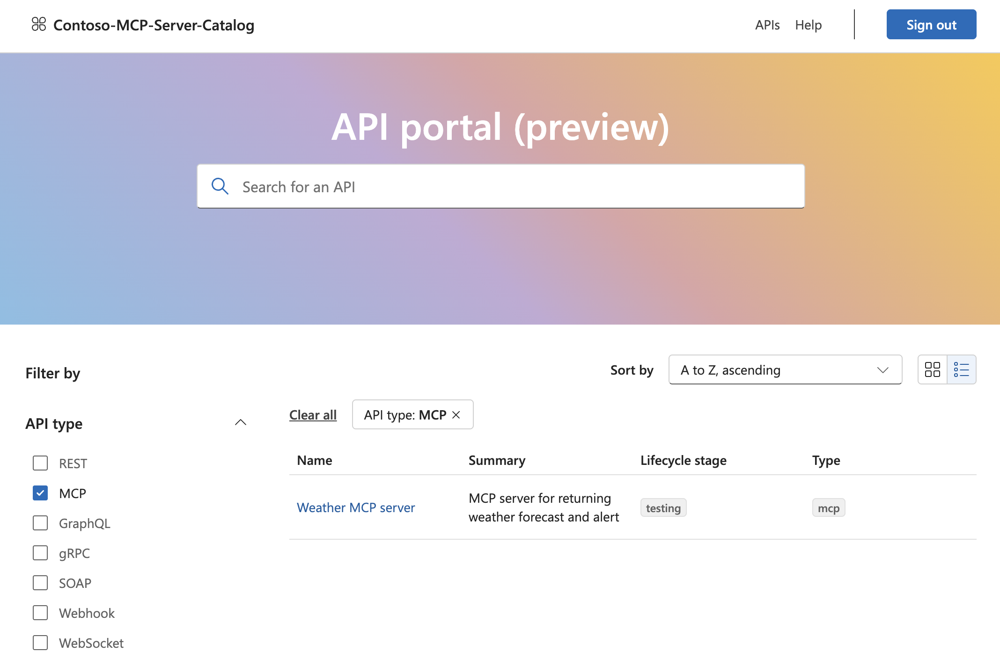
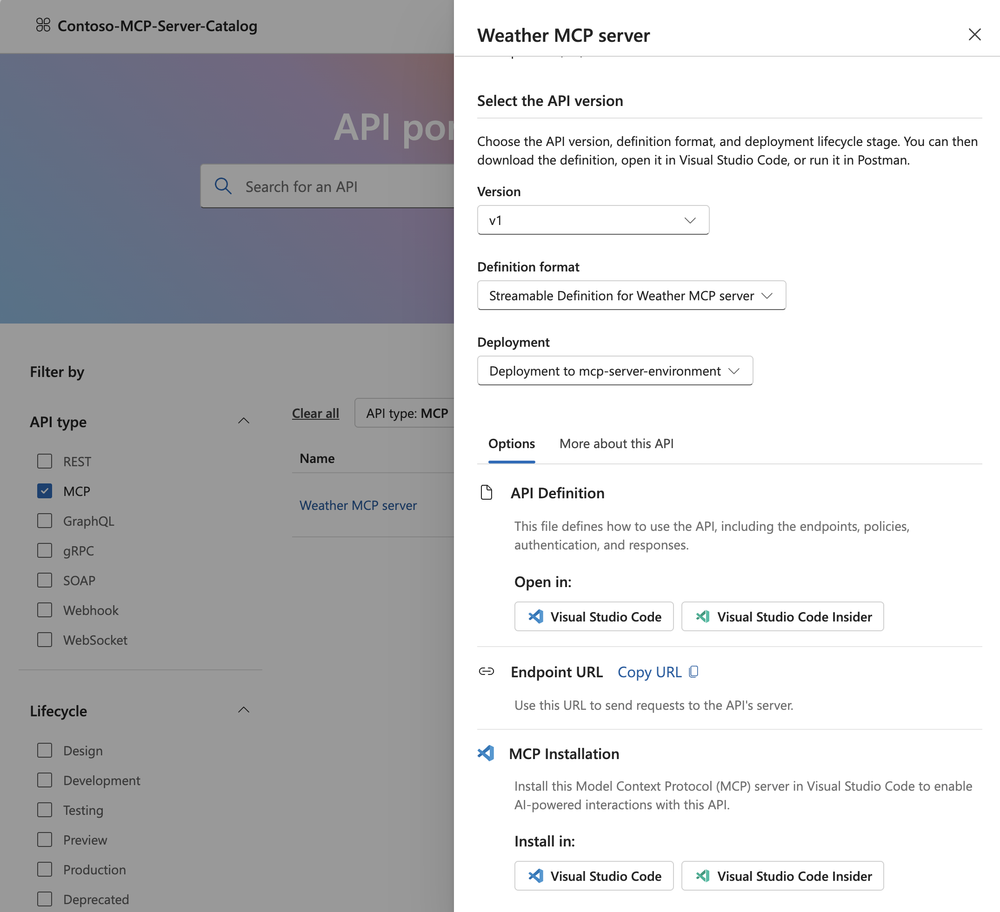

# Register MCP servers hosted in Azure Functions in Azure API Center

After hosting your MCP server remotely on Azure Functions, register it on Azure API Center. Azure API Center maintains an inventory (or registry) of remote MCP servers so that they're easily discoverable across your organization. All registered MCP servers appear in the API Center portal for teams in your organization. 



> [!TIP]
> The API Center name becomes your private tool catalog name in the registry filter. Choose an informative name that helps users identify your organization's tool catalog.

## Create resources 

1. Sign in to the Azure portal, then [create an Azure API Center resource](../api-center/set-up-api-center.md), if you don't already have one. 

1. [Create an environment](../api-center/tutorials/configure-environments-deployments.md#add-an-environment) in your API Center resource. For **Server** > **Type**, select **Azure Functions**. 

## Register MCP server 

Register your remote MCP server by adding it as an API:

1. In the left navigation pane of the API Center resource, select **APIs**.

1. Select **+ Register an API**. The following table provides example values for the required settings. You can also fill in the optional settings like MCP server description, repository, external documentation, and other information displayed in the API Center portal. 

    | Setting  | Value |
    |----------|----------|
    | **API Title**   | Enter a descriptive name for the MCP server, like `Weather MCP Server`. |
    | **Identification** | This value is autogenerated based on the API Title, but you can modify it.|
    | **API type**    | **MCP** |
    | **Runtime URL** | Enter MCP server endpoint, such as `https://contoso.azurewebsites.net/mcp` |
    | **Environment**| Select the environment you created earlier. |
    | **Version title** | Enter a version title of your choice, such as `v1`. |
    | **Version identification** | After you enter the preceding title, Azure API Center generates this identifier, which you can override. | 
    | **Version lifecycle**| Select the most appropriate value from the dropdown, such as **Testing** or **Production**. |

1. Select **Create**.

    You should now see the MCP server registered as an API on the list. 

## Update server definition

1. Create an API definition for a remote MCP server in OpenAPI 3.0 format. You need this definition so the API Center portal shows the URL endpoint of the MCP server. Save the definition where you can access it. You need to upload it in the next step. 

    Example OpenAPI 3.0 API definition for the MCP server:
    ```json
    {
        "openapi": "3.0.0",
        "info": {
            "title": "Weather MCP server",
            "description": "MCP server with tools returning weather forecast and alerts.",
            "version": "1.0"
        },
        "servers": [
            {
                "url": "https://my-mcp-server.azurewebsites.net/mcp"
            }
        ]
    }
    ```

1. Update the server definition: 

    a. On the left menu, find **Assets -> APIs**.
    
    b. Select the MCP server name to open the registration.
    
    c. On the left menu, find **Details -> Versions**.
    
    d. Under "Version", find and expand "v1". Then select **Streamable Definition for...** to open the definition.
    
    d. Select **Replace**. 
    
    e. In the side pane that opens, change the "Specification version" to 3.0, then upload the definition from the last step. 

    f. Select **Replace**.

## Set up API Center portal

1. [Set up the portal](../api-center/set-up-api-center-portal.md) if you don't already have one. 

1. Once the portal is set up, you can access it at `https://<service-name>.portal.<location>.azure-apicenter.ms`. Replace `<service-name>` and `<location>` with the name of your API center and the location where you deployed it. You need to sign in to see registered MCP servers. 

1. When you select a server name, a pane opens that shows information based on data you provide during server registration and the uploaded API definition. Users with access to the portal can connect to servers of their choice by copying the endpoint URL or the install in Visual Studio Code integration. 

    

## Related articles

[About MCP servers in Azure API Management](../api-management/mcp-server-overview.md)

