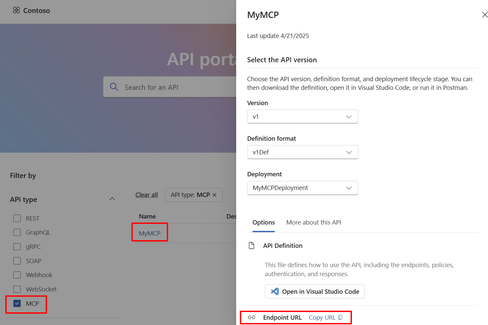

# Register MCP servers hosted in Azure Functions in Azure API Center

After hosting your MCP server remotely on Azure Functions, you can register it on Azure API Center, which maintains an inventory (or registry) of remote MCP servers so that they're easily discoverable across your organization. All registered MCP servers (and APIs) can be found in the API Center portal for teams in your organization. 

[TODO: Add portal image]

1. Sign in to the Azure portal, then [create an Azure API Center resource](../api-center/set-up-api-center.md) if you don't already have one. 

   > [!TIP]
   > The API Center name becomes your private tool catalog name in the registry filter. Choose an informative name that helps users identify your organization's tool catalog.

1. [Create an environment](../api-center/tutorials/configure-environments-deployments.md#add-an-environment) in your API Center resource. The environment is the location of the MCP server, such as an API management platform or a compute service. 

1. Register your remote MCP server by adding it as an API:

   a. In the left navigation pane of the API Center resource, select **APIs**.

   b. Select **+ Register an API** and provide the required information about your MCP server:
    
        | Setting  | Value |
        |----------|----------|
        | API Title   | Enter _Weather MCP Server_   |
        | Identification    | weather-mcp-server    |
        | API type    | Pick "MCP"   |
        | Summary    | Optionally enter summary of MCP server.    |
        | Description   | Optionally enter description of MCP server tools and details. |
        | **MCP** ||
        | Runtime URL | Enter MCP server endpoint, e.g. `https://my-server-app-name.azurewebsites.net/mcp` |
        | Environment| Pick the one you created earlier |
        | Icon URL | Optional url to the icon image for the MCP server |
        | **Use Cases** ||
        | + Add use case | Optionally add common use cases for MCP server |
        | Add repository | Optionally check the box and provide information about the MCP server repository|
        | **Version** | |
        | Version title | Enter a version title of your choice, such as "v1" |
        | Version identification | After you enter the preceding title, Azure API Center generates this identifier, which you can override. | 
        | Version lifecyle| Make a selection from the dropdown, for example, _Testing_ or _Production_. |
        | **License** | |
        | + Add | Optionally add license information |
        | **External documentation** || 
        | + Add | Optionally add external documentation links |
        | **Contact information** ||
        | Contact information | Optionally add points of contact for the MCP server | 

    c. Click **Create**

    You should now see the MCP server registered as an API in the list. 

1. Create an API definition for a remote MCP server in OpenAPI 3.0 format. This definition is required so that the URL endpoint of the MCP server is visible in the API Center portal. Save the definition somewhere you can access. You'll need to upload it in the next step. 

    Example OpenAI 3.0 API definition for the MCP server:
    ```json
    {
        "openapi": "3.0.0",
        "info": {
            "title": "Weather MCP server",
            "description": "MCP server with tools returning weather forecast and alerts.",
            "version": "1.0"
        },
        "servers": [
            {
                "url": "https://my-mcp-server.azurewebsites.net/mcp"
            }
        ]
    }
    ```

    How URL is surfaced on API Center portal: 

    

1. [Add an MCP server version](../api-center/tutorials/register-apis.md#add-an-api-version). 
    a. In the step asking for API definition file, upload the one created in the last step. 
    b. For **Add a deployment**, click "Create deployment".
        * Target environment: Choose the environment created previously
        * Runtime URL: Enter MCP server url, e.g., `https://my-mcp-server.azurewebsites.net/mcp`

1. Click **Create**

If you've already set up the API Center portal, you should now see the registered MCP server. Otherwise, follow instructions to [set up the portal](../api-center/set-up-api-center-portal.md). 


