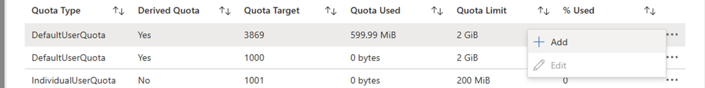

# Generate user and group quota reports for a volume (Preview)

This article explains the considerations and steps for generating user and group quota reports on Azure NetApp Files volumes. To help with capacity management on volumes shared among multiple users, individual user and group quotas in Azure NetApp Files provide a way to restrict capacity usage on NFS, SMB, and dual-protocol volumes. Checking actual usage against the defined user and group quotas on a given volume has previously required using host-based methods. The addition of quota reporting in Azure NetApp Files allows administrators to generate usage reports for an existing volume with quota rules independent of host-based tooling, without having to mount the volume.

For more information and considerations related to capacity management, see [Understand default and individual user and group quotas](default-individual-user-group-quotas-introduction.md).


## Considerations 

* Quota reporting is specific to the volume and its quota rules.
* Quota reports are supported on regular and large volumes.
* Quota reports are compiled on-demand. They aren't persisted.
* The entries in the quota report are sorted by percentage used in descending order.
* The number of entries in the quota report are capped at 1,000 entries in this private preview.
* The number of entries in the quota report can be larger than the number of quota rules on the volume. Users that are subjected to default quota are reported as individual quota report entries.
* When using quota reporting on data protection volumes:
    * Quota report is unavailable for data protection volumes when the mirror state of the replication is in mirrored state. Use the quota report on the source volume instead.
    * Quota reports become available when the replication relation is broken.
* On volumes without a default user/group quota, users that aren't mapped to any rules and are accessing the volume will show 0 for total disk limit and percentage used in the quota report. In this instance, consider creating a default user/group quota rule.
* When requesting quota reports for multiple volumes in the same subscription, these quota report requests are processed sequentially. When using the API, check responses (specifically percentComplete) for status. The quota report slide out in the Azure portal automatically retrieves the quota report in the background. Stay on the page until the quota report is successfully retrieved.
* Quota reports take 5 seconds on average to generate.
* If the quota report is an empty list or the quota report API calls fail on a volume with quota rules, retry generating the quota report after 5 minutes.


## Register  the feature

The feature must be registered on your subscription before using it for the first time. After registration and confirmation by product team, the feature is enabled on your subscription. 

1. Register the feature:

    Register-AzProviderFeature -ProviderNamespace Microsoft.NetApp -FeatureName ANFFetchQuotaReport

2. Check the status of the feature registration: 

    > [!NOTE]
    > The **RegistrationState** may be in the `Registering` state for up to 60 minutes before changing to`Registered`. Wait until the status is **Registered** before continuing.

    ```azurepowershell-interactive
    Get-AzProviderFeature -ProviderNamespace Microsoft.NetApp -FeatureName ANFFetchQuotaReport
    ```

You can also use [Azure CLI commands](/cli/azure/feature) `az feature register` and `az feature show` to register the feature and display the registration status.

## Generate a quota report for a volume

1. From the Azure portal, select the volume for which you want to generate a quota report.
2. Navigate to **User and group quotas** and select **Quota Report and Management** tab from the actions to generate the report. 

     

    The Quota Report slide out will automatically retrieve the quota report in the background, stay on the page until the quota report has been successfully retrieved. Retrieval takes on average 5 seconds, but can take longer. The quota report lists one entry per user.

    * **Quota Type**      
        Indicates which type of quota rule caused this user or group entry in the report; possible types are default or individual quotas for users or groups.

    * **Derived Quota**
        If user or group is subject to an explicit quota rule, this field shows "No". Conversely, if user or group is implicitly subject to a quota rule, like a default user or group quota rule, this field shows "Yes".

    * **Quota Target**
        UID/SID/GID for user/group

    * **Quota Used**
        Total disk limit used by the user/group

    * **Quota Limit**
        Total disk limit allocated by the user/group in kilobyte

    * **% Used**
        How much % of the total quota limit has been used by user/group

3. You can apply filter to view the specific quota reports.

> [!NOTE]
> You can add a new quota only for derived quotas and edit only non-derived quotas.

4. To edit a quota, select `…` at the end of the quota rule row, then select **Edit**.

 

5. To add a new quota for the default user and group quota, select `…` at the end of the quota rule row, then select **Add**.

 

## Next steps

* [Understand default and individual user and group quotas](default-individual-user-group-quotas-introduction.md)
* [Manage default and individual user and group quotas for a volume](manage-default-individual-user-group-quotas.md)
