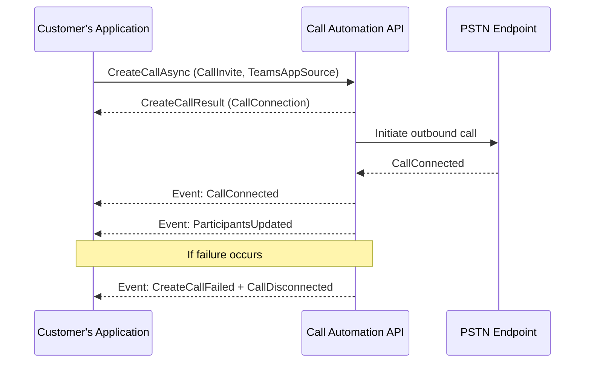

# Place server-initiated outbound calls with Teams Phone Extensibility

Teams Phone Extensibility (TPE) lets applications place outbound calls through Microsoft Teams by using **Call Automation APIs**. Use this capability to automate customer notifications, enable callbacks, or integrate calling into workflow systems.

Beginning with **Call Automation version 1.5.0‑beta.1**, you can call the `CreateCallAsync` API to place outbound calls to PSTN numbers or Teams users from a server-side application.

## Prerequisites

Before you begin, ensure the following:

- Install **Azure.Communication.CallAutomation** version **1.5.0‑beta.1** or later.
- Have:
  - A **Teams Resource Account** to use as the caller identity.
  - The **Object ID (OID)** of the Resource Account.
  - A valid **callback URI** to receive call events.
- Review:
  - [Call Automation concepts](/azure/communication-services/concepts/call-automation/call-automation)
  - [Action–event model](/azure/communication-services/concepts/call-automation/call-automation#action-event-model)
  - [User identifier types](/azure/communication-services/concepts/identifiers), including `TeamsExtensionUser` and `PhoneNumberIdentifier`.

## Licensing requirements

Starting **November 1, 2025**, Calling Plan licenses assigned to Teams Resource Accounts will no longer support On-Behalf-Of PSTN outbound calls or server-initiated outbound calls. A **[Pay-As-You-Go Calling Plan](/microsoftteams/calling-plans-for-office-365#pay-as-you-go-calling-plan)** is required for these scenarios.

> **Note:** Direct Routing numbers aren’t affected by these licensing changes.

### Calling Plan customers

Assign a Pay-As-You-Go Calling Plan license to any Teams Resource Account that uses a Calling Plan number for outbound PSTN calls. Outbound calls will fail after November 1, 2025, if licenses aren’t assigned. You can follow the below steps to make sure you get the proper licenses:
1. Log in to the [Admin portal](https://admin.microsoft.com)
2. Verify agreement type and funding source
   - For **MCA agreements**:
     - Confirm postpaid payment method is active.
     - Navigate to **Marketplace → All Products**.
     - Search for **Microsoft Teams Calling Plan (Pay-As-You-Go)**.
     - Select the appropriate **Pay-As-You-Go Calling Plan Zone (Zone 1 or Zone 2)** based on your location.
     - Add the plan under **Add-ons**.
   - For **older agreements**:
     - Navigate to **Marketplace → All Products** and purchase Communications Credits.
     - Add funds to ensure a positive balance.
     - Enable **Auto-Recharge** under **Billing → Your Products → Communications Credits**.

### Operator Connect customers

Starting November 1, 2025, On-Behalf-Of PSTN outbound calls and server-initiated outbound calls may change depending on your carrier. Work with your Operator Connect carrier to ensure uninterrupted service. Without carrier adjustments, outbound calls through Teams Phone Extensibility may fail.

**Learn more**

- [Pay-As-You-Go Calling Plan](/microsoftteams/calling-plans-for-office-365#pay-as-you-go-calling-plan)
- [Set up Communications Credits](/microsoftteams/set-up-communications-credits-for-your-organization)
- [How to buy Calling Plans](/microsoftteams/calling-plans-for-office-365)
- [Enable pay-as-you-go services](/microsoft-365/commerce/subscriptions/manage-pay-as-you-go-services)
- [Assign Teams add-on licenses](/microsoftteams/teams-add-on-licensing/assign-teams-add-on-licenses)

## How it works

1. Create a **CallInvite** by using a target phone number or Teams identity.
2. Set **TeamsAppSource** to the Resource Account OID.
3. Call `CreateCallAsync` on the `CallAutomationClient`.

You’ll receive the following events:

- **CallConnected** – the call was established.
- **ParticipantsUpdated** – provides the current participant list.

If the call fails, you’ll receive:

- **CreateCallFailed**
- **CallDisconnected**

## Code example (C#)

```csharp
public async Task PlaceOutboundCallAsync(string targetPhoneNumber, Uri baseUri)
{
    // Initialize CallAutomationClient with your connection string
    var client = new CallAutomationClient("<resource_connection_string>");

    // Convert target phone number to EL64 format if required
    PhoneNumberIdentifier callee = new PhoneNumberIdentifier(
        Helper.convertToEl64(targetPhoneNumber));

    // Create the CallInvite
    CallInvite callInvite = new CallInvite(callee, null);

    // Configure call options with TeamsAppSource (Resource Account OID)
    var options = new CreateCallOptions(callInvite, baseUri)
    {
        TeamsAppSource = new MicrosoftTeamsAppIdentifier("xxxxxxxxxxxxxxxxxxxxx") // Replace with Resource Account OID
    };

    // Place the call
    CreateCallResult result = await client.CreateCallAsync(options);

    // Use result.CallConnection for further actions (play audio, transfer, etc.)
}

```



## Next steps

- [Microsoft Teams Phone overview](/microsoftteams/what-is-phone-system-in-office-365)
- [Set up Microsoft Teams Phone in your organization](/microsoftteams/setting-up-your-phone-system)
- [Access a user's Teams Phone separate from their Teams client](/azure/communication-services/quickstarts/tpe/teams-phone-extensibility-access-teams-phone)
- [Answer Teams Phone calls from Call Automation](/azure/communication-services/quickstarts/tpe/teams-phone-extensibility-answer-teams-calls)

## Related articles

- [Teams Phone extensibility overview](/azure/communication-services/concepts/interop/tpe/teams-phone-extensibility-overview)
- [Teams Phone extensibility FAQ](/azure/communication-services/concepts/interop/tpe/teams-phone-extensibility-faq)
