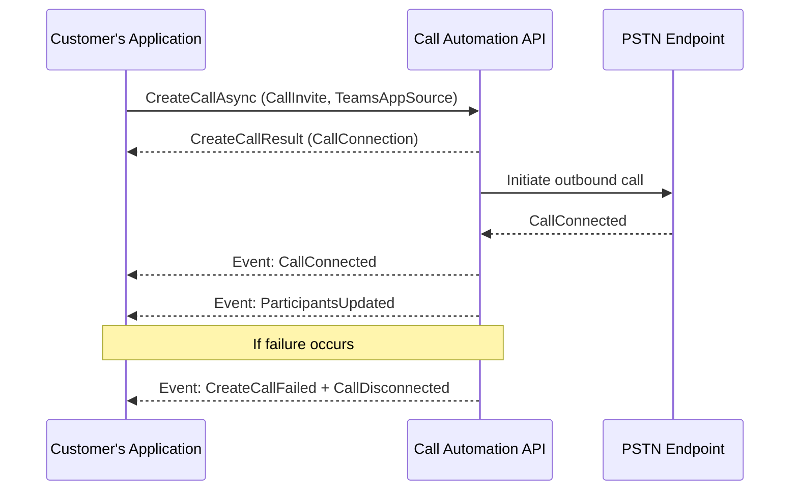

# Place Server-Initiated Outbound Calls with Teams Phone Extensibility

Teams Phone Extensibility (TPE) enables applications to place outbound calls through Microsoft Teams using **Call Automation APIs**. Use this capability to automate notifications, support customer callbacks, or integrate calling into workflow systems.

Starting with **Call Automation version 1.5.0‑beta.1**, you can use the `CreateCallAsync` API to place outbound calls to PSTN numbers or Teams users from a server-side application.


## Prerequisites
Before you start:
- Install **Azure.Communication.CallAutomation** version **1.5.0-beta.1** or later.
- Ensure you have:
  - A **Teams Resource Account** to use as the caller identity.
  - The **Object ID (OID)** of the Resource Account.
  - A valid **callback URI** for receiving call events.
- Review the following:
  - [Call Automation concepts](/azure/communication-services/concepts/call-automation/call-automation)
  - [Action-event programming model](/azure/communication-services/concepts/call-automation/call-automation#action-event-model)
  - [user identifiers](/azure/communication-services/concepts/identifiers) such as `TeamsExtensionUser` and `PhoneNumberIdentifier`.

## License Requirement
Starting **November 1, 2025**, Calling Plan licenses on Teams Resource Accounts will no longer support On-Behalf-Of PSTN outbound calls or server-initiated outbound calls. A **[Pay-As-You-Go Calling Plan](/microsoftteams/calling-plans-for-office-365#pay-as-you-go-calling-plan)** is required.

<details><summary>For Calling Plan customers (MC1123835)</summary>
Assign a Pay-As-You-Go license to Teams Resource Accounts that use Calling Plan numbers for outbound PSTN calls. If licenses aren't assigned by November 1, 2025, outbound calls will fail.
</details>

<details><summary>For Operator Connect customers (MC1123837)</summary>
On November 1, 2025, On-Behalf-Of PSTN outbound calls and server-initiated outbound calls may no longer be available depending on your carrier. Coordinate with your carrier to maintain service. Without adjustments, outbound calls made via Teams Phone Extensibility will fail.
</details>

**Note:** Direct Routing numbers are not impacted by these licensing changes.

**Learn more:**
- [Pay-As-You-Go Calling Plan](/microsoftteams/calling-plans-for-office-365#pay-as-you-go-calling-plan)
- [How to buy Calling Plans](/microsoftteams/calling-plans-for-office-365)
- [Enable pay-as-you-go for your subscription](/microsoft-365/commerce/subscriptions/manage-pay-as-you-go-services)
- [Assign Teams add-on licenses to users](/microsoftteams/teams-add-on-licensing/assign-teams-add-on-licenses)


## How It Works
1. **Create a CallInvite** using the target phone number or Teams identity.
2. **Specify TeamsAppSource** using the Teams Resource Account OID.
3. Invoke `CreateCallAsync` on the `CallAutomationClient`.

When the call connects, you’ll receive events such as:
- **CallConnected**: Indicates the call was successfully established.
- **ParticipantsUpdated**: Provides the current participant list.

If the call fails, you’ll receive:
- **CallDisconnected**
- **CreateCallFailed** (with error codes for troubleshooting).


## Code Example (C#)

```csharp

public async Task PlaceOutboundCallAsync(string targetPhoneNumber, Uri baseUri)
{
    // Initialize CallAutomationClient with your connection string
    var callAutomationClient = new CallAutomationClient("<resource_connection_string>");

    // Convert target number to EL64 format if required by your helper logic
    PhoneNumberIdentifier callee = new PhoneNumberIdentifier(Helper.convertToEl64(targetPhoneNumber));

    // Create CallInvite for the callee
    CallInvite callInvite = new CallInvite(callee, null);

    // Configure call options with TeamsAppSource (Teams Resource Account OID)
    var createCallOptions = new CreateCallOptions(callInvite, baseUri)
    {
        TeamsAppSource = new MicrosoftTeamsAppIdentifier("xxxxxxxxxxxxxxxxxxxxx") // Replace with Teams Resource Account OID
    };

    // Place the call
    CreateCallResult createCallResult = await callAutomationClient.CreateCallAsync(createCallOptions);

    // Use createCallResult.CallConnection for further actions (e.g., play audio, transfer)
}
```



## Next steps

- [Microsoft Teams Phone overview](/microsoftteams/what-is-phone-system-in-office-365)
- [Set up Microsoft Teams Phone in your organization](/microsoftteams/setting-up-your-phone-system)
- [Access a user's Teams Phone separate from their Teams client](/azure/communication-services/quickstarts/tpe/teams-phone-extensibility-access-teams-phone)
- [Answer Teams Phone calls from Call Automation](/azure/communication-services/quickstarts/tpe/teams-phone-extensibility-answer-teams-calls)

## Related articles

- [Teams Phone extensibility overview](/azure/communication-services/concepts/interop/tpe/teams-phone-extensibility-overview)
- [Teams Phone extensibility FAQ](/azure/communication-services/concepts/interop/tpe/teams-phone-extensibility-faq)
