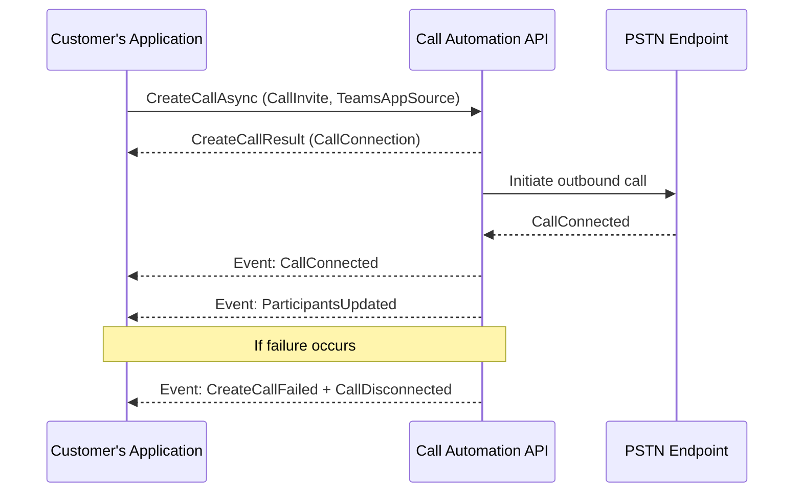

# Place Server-Initiated Outbound Calls with Teams Phone Extensibility

Teams Phone Extensibility (TPE) lets applications place outbound calls through Microsoft Teams using **Call Automation APIs**. Use this feature for automated notifications, customer callbacks, or workflow integration.

From **Call Automation version 1.5.0-beta.1**, use the `CreateCallAsync` API to call PSTN endpoints or Teams users from your server application.

## Prerequisites
Before you start:
- Install **Azure.Communication.CallAutomation** version **1.5.0-beta.1** or later.
- You need:
  - A **Teams Resource Account** (caller identity)
  - The **Object ID (OID)** of the Resource Account
  - A valid **callback URI** to receive events
- See:
  - [Call Automation concepts](/azure/communication-services/concepts/call-automation)
  - [Action-event programming model](/azure/communication-services/concepts/call-automation#action-event-model)
- Review [user identifiers](../../concepts/identifiers.md#the-communicationidentifier-type) such as `TeamsExtensionUser` and `PhoneNumberIdentifier`.

## License Requirement
Starting **November 1, 2025**, Calling Plan licenses on Teams Resource Accounts will no longer support On-Behalf-Of PSTN outbound calls or server-initiated outbound calls. A **[Pay-As-You-Go Calling Plan](/microsoftteams/calling-plans-for-office-365#pay-as-you-go-calling-plan)** is required.

<details><summary>For Calling Plan customers (MC1123835)</summary>
Assign a Pay-As-You-Go license to Teams Resource Accounts that use Calling Plan numbers for outbound PSTN calls. If licenses aren't assigned by November 1, 2025, outbound calls will fail.
</details>

<details><summary>For Operator Connect customers (MC1123837)</summary>
On November 1, 2025, On-Behalf-Of PSTN outbound calls and server-initiated outbound calls may no longer be available depending on your carrier. Coordinate with your carrier to maintain service. Without adjustments, outbound calls made via Teams Phone Extensibility will fail.
</details>

**Note:** Direct Routing phone numbers remain unchanged.

**Learn more:**
- [Pay-As-You-Go Calling Plan](/microsoftteams/pay-as-you-go)
- [How to buy Calling Plans](/microsoftteams/calling-plans)
- [Enable pay-as-you-go for your subscription](/microsoftteams/payg-enable)
- [Telco pay-as-you-go overage in new commerce](/microsoftteams/new-commerce-payg)
- [Assign Teams add-on licenses to users](/microsoftteams/assign-licenses)


## How It Works
1. **Create a CallInvite** for the target phone number.
2. **Specify TeamsAppSource** using the Teams Resource Account OID.
3. Invoke `CreateCallAsync` on the `CallAutomationClient`.

When the call connects, you’ll receive events such as:
- **CallConnected**: Indicates the call was successfully established.
- **ParticipantsUpdated**: Provides the current participant list.

If the call fails, you’ll receive:
- **CallDisconnected**
- **CreateCallFailed** (with error codes for troubleshooting).


## Code Example (C#)

```csharp

public async Task PlaceOutboundCallAsync(string targetPhoneNumber, Uri baseUri)
{
    // Initialize CallAutomationClient with your connection string
    var callAutomationClient = new CallAutomationClient("<resource_connection_string>");

    // Convert target number to EL64 format if required by your helper logic
    PhoneNumberIdentifier callee = new PhoneNumberIdentifier(Helper.convertToEl64(targetPhoneNumber));

    // Create CallInvite for the callee
    CallInvite callInvite = new CallInvite(callee, null);

    // Configure call options with TeamsAppSource (Teams Resource Account OID)
    var createCallOptions = new CreateCallOptions(callInvite, baseUri)
    {
        TeamsAppSource = new MicrosoftTeamsAppIdentifier("xxxxxxxxxxxxxxxxxxxxx") // Replace with Teams Resource Account OID
    };

    // Place the call
    CreateCallResult createCallResult = await callAutomationClient.CreateCallAsync(createCallOptions);

    // Use createCallResult.CallConnection for further actions (e.g., play audio, transfer)
}
```



## Next steps

- [Microsoft Teams Phone overview](/microsoftteams/what-is-phone-system-in-office-365)
- [Set up Microsoft Teams Phone in your organization](/microsoftteams/setting-up-your-phone-system)
- [Access a user's Teams Phone separate from their Teams client](../../../quickstarts/tpe/teams-phone-extensibility-access-teams-phone.md)
- [Answer Teams Phone calls from Call Automation](../../../quickstarts/tpe/teams-phone-extensibility-answer-teams-calls.md)

## Related articles

- [Teams Phone extensibility overview](./teams-phone-extensibility-overview.md)
- [Teams Phone extensibility FAQ](./teams-phone-extensibility-faq.md)
