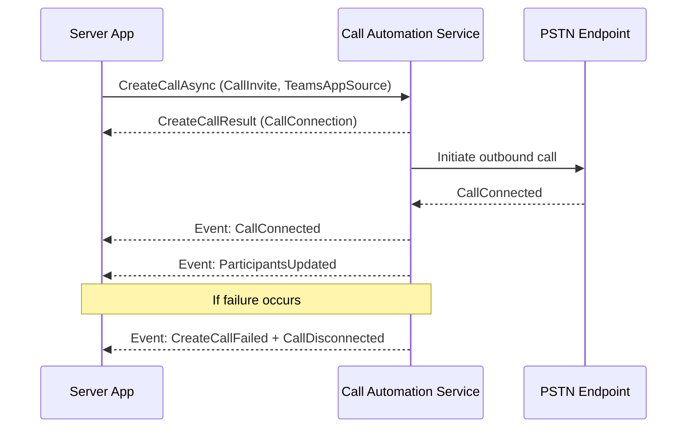

# Place Server Outbound Calls with Teams Phone Extensibility

Teams Phone Extensibility (TPE) enables applications to initiate outbound calls through Microsoft Teams infrastructure using **Call Automation** APIs. This capability is ideal for scenarios such as automated notifications, customer service callbacks, or integration with business workflows.

Starting with **Call Automation version 1.5.0-beta.1**, you can place outbound calls from your server application to PSTN endpoints or Teams users by leveraging the `CreateCallAsync` API.


## Prerequisites
Before you begin:
- Install **Azure.Communication.CallAutomation** version **1.5.0-beta.1** or later.
- Ensure you have:
  - A **Resource Account** in Teams (used as the caller identity).
  - The **Object ID (OID)** of the Resource Account.
  - A valid **base URI** for your callback endpoint to receive events.
- Familiarize yourself with:
  - [Call Automation concepts](https://learn.microsoft.com/azure/communication-services/concepts/call-automation)
  - [Action-event programming model](https://learn.microsoft.com/azure/communication-services/concepts/call-automation#action-event-model)
- Learn about the [user identifiers](../../concepts/identifiers.md#the-communicationidentifier-type) like `TeamsExtensionUser` and `PhoneNumberIdentifier`.

For all the code samples, `client` is the `CallAutomationClient` object that you can create, as shown. Also, `callConnection` is the `CallConnection` object that you obtain from the `Answer` or `CreateCall` response. You can also obtain it from callback events that your application receives

## How It Works
1. **Create a CallInvite** for the target phone number.
2. **Specify TeamsAppSource** using the Resource Account OID.
3. Invoke `CreateCallAsync` on the `CallAutomationClient`.

When the call connects, you’ll receive events such as:
- **CallConnected**: Indicates the call was successfully established.
- **ParticipantsUpdated**: Provides the current participant list.

If the call fails, you’ll receive:
- **CallDisconnected**
- **CreateCallFailed** (with error codes for troubleshooting).


## Code Example (C#)

```csharp
using Azure.Communication;
using Azure.Communication.CallAutomation;
using System;
using System.Threading.Tasks;

public async Task PlaceOutboundCallAsync(string targetPhoneNumber, Uri baseUri)
{
    // Initialize CallAutomationClient with your connection string
    var callAutomationClient = new CallAutomationClient("<resource_connection_string>");

    // Convert target number to EL64 format if required by your helper logic
    PhoneNumberIdentifier callee = new PhoneNumberIdentifier(Helper.convertToEl64(targetPhoneNumber));

    // Create CallInvite for the callee
    CallInvite callInvite = new CallInvite(callee, null);

    // Configure call options with TeamsAppSource (Resource Account OID)
    var createCallOptions = new CreateCallOptions(callInvite, baseUri)
    {
        TeamsAppSource = new MicrosoftTeamsAppIdentifier("xxxxxxxxxxxxxxxxxxxxx") // Replace with Resource Account OID
    };

    // Place the call
    CreateCallResult createCallResult = await callAutomationClient.CreateCallAsync(createCallOptions);

    // Use createCallResult.CallConnection for further actions (e.g., play audio, transfer)
}
```



## Clean up resources

If you want to clean up and remove a Communication Services subscription, you can delete the resource or resource group. Deleting the resource group also deletes any other resources associated with it. Learn more about [cleaning up resources](../../quickstarts/create-communication-resource.md#clean-up-resources).

## Next steps

- [Microsoft Teams Phone overview](/microsoftteams/what-is-phone-system-in-office-365)
- [Set up Microsoft Teams Phone in your organization](/microsoftteams/setting-up-your-phone-system)
- [Access a user's Teams Phone separate from their Teams client](../../../quickstarts/tpe/teams-phone-extensibility-access-teams-phone.md)
- [Answer Teams Phone calls from Call Automation](../../../quickstarts/tpe/teams-phone-extensibility-answer-teams-calls.md)

## Related articles

- [Teams Phone extensibility overview](./teams-phone-extensibility-overview.md)
- [Teams Phone extensibility FAQ](./teams-phone-extensibility-faq.md)
