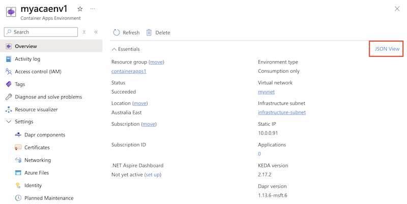

# Create a zone-redundant container app

In this article, you learn how create a zone-redundant container app inside a virtual network. You will create an Azure Container Apps Environment, enable it for zone redundancy, and configure with a new or preexisting virtual network that has an infrastructure subnet.

For more information on how Container Apps supports zone redundancy, see [Reliability in Container Apps](../reliability/reliability-container-apps.md).

## Prerequisites

Zone redundancy is available in all regions that support Container Apps and availability zones.

To see which regions support availability zones, see [Azure regions with availability zone support](../reliability/regions-list.md).

To see which regions support Container Apps, see [Product Availability by Region](https://azure.microsoft.com/explore/global-infrastructure/products-by-region/table).

## Create a zone-redundant container app

Use Azure Portal, Azure CLI, or PowerShell to create a zone-redundant container app.

# [Azure portal](#tab/portal)

1. Go to [Azure portal](https://portal.azure.com/).
1. Search for **Container Apps** in the top search box.
1. Select **Container Apps**.
1. Select **Create New** in the *Container Apps Environment* field to open the *Create Container Apps Environment* panel.
1. Enter the environment name.
1. Select **Enabled** for the *Zone redundancy* field.

Zone redundancy requires a virtual network with an infrastructure subnet.  You can choose an existing virtual network or create a new one.  When creating a new virtual network, you can accept the values provided for you or customize the settings.

1. Select the **Networking** tab.  
1. To assign a custom virtual network name, select **Create New** in the *Virtual Network* field.
1. To assign a custom infrastructure subnet name, select **Create New** in the *Infrastructure subnet* field.
1. You can select **Internal** or **External** for the *Virtual IP*.
1. Select **Create**.

:::image type="content" source="../container-apps/media/screen-shot-vnet-configuration.png" alt-text="Screenshot of Networking tab in Create Container Apps Environment page.":::

# [Azure CLI](#tab/azure-cli)

1. Create a virtual network and infrastructure subnet to include with the Container Apps environment.

    When using these commands, replace the `<PLACEHOLDERS>` with your values.
    
    >[!NOTE]
    > The Consumption only environment requires a dedicated subnet with a CIDR range of `/23` or larger. The workload profiles environment requires a dedicated subnet with a CIDR range of `/27` or larger. To learn more about subnet sizing, see the [networking architecture overview](../container-apps/custom-virtual-networks.md#subnet).
    
    
    ```azurecli-interactive
    az network vnet create \
      --resource-group <RESOURCE_GROUP_NAME> \
      --name <VNET_NAME> \
      --location <LOCATION> \
      --address-prefix 10.0.0.0/16
    ```
    
    ```azurecli-interactive
    az network vnet subnet create \
      --resource-group <RESOURCE_GROUP_NAME> \
      --vnet-name <VNET_NAME> \
      --name infrastructure \
      --address-prefixes 10.0.0.0/21
    ```

1. Query for the infrastructure subnet ID.

    ```azurecli-interactive
    INFRASTRUCTURE_SUBNET=`az network vnet subnet show --resource-group <RESOURCE_GROUP_NAME> --vnet-name <VNET_NAME> --name infrastructure --query "id" -o tsv | tr -d '[:space:]'`
    ```

1. Create the environment with the `--zone-redundant` parameter.  The location must be the same location used when creating the virtual network.

    ```azurecli-interactive
    az containerapp env create \
      --name <CONTAINER_APP_ENV_NAME> \
      --resource-group <RESOURCE_GROUP_NAME> \
      --location "<LOCATION>" \
      --infrastructure-subnet-resource-id $INFRASTRUCTURE_SUBNET \
      --zone-redundant
    ```

# [Azure PowerShell](#tab/azure-powershell)

1. Create a virtual network and infrastructure subnet to include with the Container Apps environment.

    When using these commands, replace the `<PLACEHOLDERS>` with your values.
    
    >[!NOTE]
    > The Consumption only environment requires a dedicated subnet with a CIDR range of `/23` or larger. The workload profiles environment requires a dedicated subnet with a CIDR range of `/27` or larger. To learn more about subnet sizing, see the [networking architecture overview](../container-apps/custom-virtual-networks.md#subnet).
    
    ```azurepowershell-interactive
    $SubnetArgs = @{
        Name = 'infrastructure-subnet'
        AddressPrefix = '10.0.0.0/21'
    }
    $subnet = New-AzVirtualNetworkSubnetConfig @SubnetArgs

    $VnetArgs = @{
        Name = <VNetName>
        Location = <Location>
        ResourceGroupName = <ResourceGroupName>
        AddressPrefix = '10.0.0.0/16'
        Subnet = $subnet 
    }
    $vnet = New-AzVirtualNetwork @VnetArgs
    ```

1. Query for the infrastructure subnet ID.

    ```azurepowershell-interactive
    $InfrastructureSubnet=(Get-AzVirtualNetworkSubnetConfig -Name $SubnetArgs.Name -VirtualNetwork $vnet).Id
    ```

1. Create the environment with the `--zone-redundant` parameter.  The location must be the same location used when creating the virtual network.

    A Log Analytics workspace is required for the Container Apps environment.  The following commands create a Log Analytics workspace and save the workspace ID and primary shared key to environment variables.
    
    ```azurepowershell-interactive
    $WorkspaceArgs = @{
        Name = 'myworkspace'
        ResourceGroupName = <ResourceGroupName>
        Location = <Location>
        PublicNetworkAccessForIngestion = 'Enabled'
        PublicNetworkAccessForQuery = 'Enabled'
    }
    New-AzOperationalInsightsWorkspace @WorkspaceArgs
    $WorkspaceId = (Get-AzOperationalInsightsWorkspace -ResourceGroupName <ResourceGroupName> -Name $WorkspaceArgs.Name).CustomerId
    $WorkspaceSharedKey = (Get-AzOperationalInsightsWorkspaceSharedKey -ResourceGroupName <ResourceGroupName> -Name $WorkspaceArgs.Name).PrimarySharedKey
    ```

1. Create the environment by running the following command:
    
    ```azurepowershell-interactive
    $EnvArgs = @{
        EnvName = <EnvironmentName>
        ResourceGroupName = <ResourceGroupName>
        Location = <Location>
        AppLogConfigurationDestination = "log-analytics"
        LogAnalyticConfigurationCustomerId = $WorkspaceId
        LogAnalyticConfigurationSharedKey = $WorkspaceSharedKey
        VnetConfigurationInfrastructureSubnetId = $InfrastructureSubnet
        VnetConfigurationInternal = $true
        ZoneRedundant = $true
    }
    New-AzContainerAppManagedEnv @EnvArgs
    ```
---

## Verify zone redundancy

To verify that zone redundancy is enabled for your Container Apps environment:

# [Azure portal](#tab/portal)

1. Go to [Azure portal](https://portal.azure.com/).

1. Search for **Container Apps Environments** in the top search box.

1. Select **Container Apps Environments**.

1. Select your environment.

1. Select **JSON View**:
    

1. Verify that the response contains `"zoneRedundant": true`:
    

# [Azure CLI](#tab/azure-cli)

1. Run the [`az container app env show`](/cli/azure/containerapp/env#az-containerapp-env-show) command:

    When using this command, replace the `<PLACEHOLDERS>` with your values.

    ```azurecli
    az containerapp env show \
      --name <CONTAINER_APP_ENV_NAME> \
      --resource-group <RESOURCE_GROUP_NAME> \
      --subscription <SUBSCRIPTION_ID>
    ```

1. The command returns a JSON response. Verify that the response contains `"zoneRedundant": true`.

# [Azure PowerShell](#tab/azure-powershell)

1. Run the [`az container app env show`](/cli/azure/containerapp/env#az-containerapp-env-show) command:

    When using this command, replace the `<PLACEHOLDERS>` with your values.

    ```azurecli
    $Env = Get-AzContainerAppManagedEnv `
        -Name <EnvironmentName> `
        -ResourceGroupName <ResourceGroupName>
    
    $Env.ZoneRedundant
    ```

1. The command displays `True` if the environment is zone-redundant, and `False` if it isn't.

---
