---
# Required metadata
# For more information, see https://review.learn.microsoft.com/en-us/help/platform/learn-editor-add-metadata?branch=main
# For valid values of ms.service, ms.prod, and ms.topic, see https://review.learn.microsoft.com/en-us/help/platform/metadata-taxonomies?branch=main

title: Initiate a Change of Channel Partner (COCP) request
description: This document provides Enterprise  customers to initiate Change of Channel Partner via the Microsoft admin center and Azure portalss.
author: vikrammittal8
ms.author: vikrammittal
ms.service: volume-licensing
ms.topic: article
ms.date:     14/11/2025
---

Initiate a Change of Channel Partner (COCP) request in the Azure portal

# Summary

Beginning November 2025, Enterprise Agreement (EA) Azure customers will have the capability to initiate a change of channel partner (COCP) through Azure portal.

This change moves the ability to initiate the COCP process away from Partners and enables the customers to start the process instead.

When a customer initiates a COCP, the new partner receives a notification via email to either accept or decline the request. Upon the partner's acceptance, the Azure customer will be notified of the accepted request along with the effective date when the new partner becomes Active.

# Prerequisite  information required for new partner

To initiate a COCP request, only two attributes of information are required.

**1. New partner PCN number** – Kindly request your new partner to provide their partner PCN. This information is mandatory and required for the process to proceed. The partner can obtain it by accessing any existing contract within the VL Central Contracts workspace.

**2. Partner Notification Contact** - When initiating a COCP request, you will need to provide the email address of a “partner notification contact” from your new partner organization. Ideally, your new partner should provide you with this contact information, as this person will serve as your primary point of contact for all future communications regarding your agreement.

If you do not have this information, you may enter any email address to proceed. However, please be aware that if Microsoft cannot verify the email address you provide, it will not send automatic notifications about the COCP request to your new partner due to privacy reasons. In such cases, it is essential that you directly inform your new partner about the initiation of the COCP process outside the system.

**Why is this important?** Using a verified partner contact ensures that your new partner is promptly notified and can take action on your request. If you use an unverified contact, it becomes your responsibility to inform your partner about the request.

**Key Takeaway:**  
Always try to get the correct partner notification contact from your new partner before starting the COCP. This action helps ensure a smooth and timely transition.

Please make sure that the partner accepts the request within 10 days.

### In Scope

- Only Enterprise Admin can initiate COCP requests via Azure portal.
- Agreement Type = Enterprise Agreement (EA) and Enterprise Agreements Subscription 
- Agreement status must be active.

### Out of Scope for Self-Service COCP

-   Non-EA programs, including Select, Select Plus, Open Value, Open Value Subscription, EDU / Campus, SPLA, IVR, MPSA, and Open license.
-   EA agreements with Microsoft Enterprise Direct Support (MSEDS) as Bill to / Software Advisor
-   EA agreements with expired/ended status
-   Backdated COCP requests, Early COCP (before anniversary date)

# Azure Portal customer experience

- The customer must have Enterprise Administrator role on the EA Billing Account to initiate the request.

- Go to Azure portal, Cost management + Billing -> Billing Scopes -> click on Change Partner.

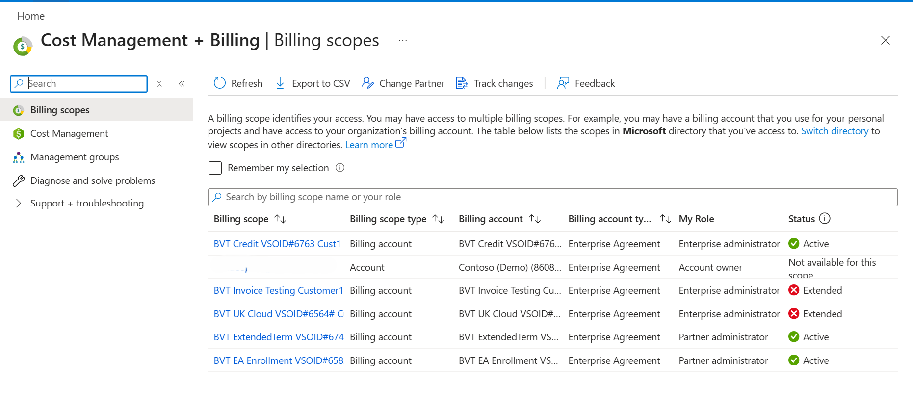

- After clicking Change Partner, the user is redirected to a page showing only eligible billing accounts on which COCP requests can be initiated. Select the Billing accounts that you want to transfer and click on next.

- User may select multiple billing accounts up to a maximum of 20 or user may select one billing account and click the three dots to Change Partner on that billing account.

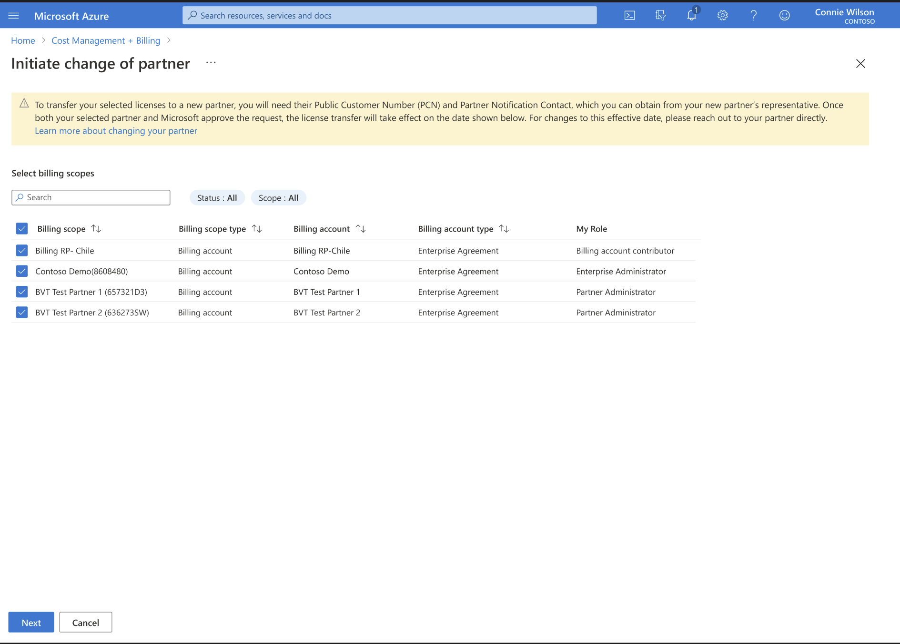

  On the **Initiate change of Partner page** user needs to
-   Input the Public Customer Number (PCN) of the new partner.
-   Input the email address of the partner’s Notification contact.
-   Select a reason for changing partner from available drop downs: Unsatisfactory service by current partner, current partner is being off boarded by Microsoft, or Other.

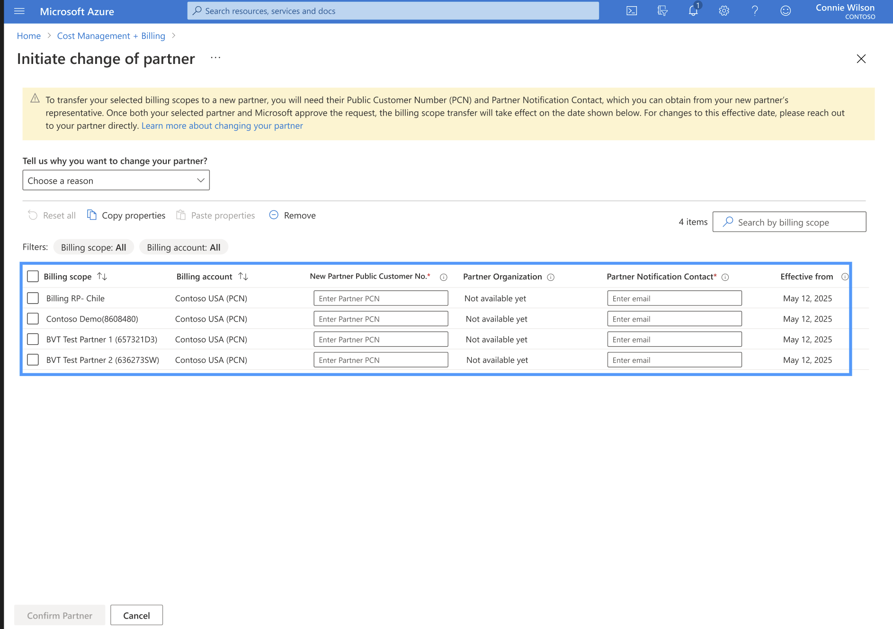

- Partner organization name displays when user inputs partner PCN and clicks “*confirm partner*” button in bottom left corner of screen.
- This check verifies whether the partner PCN entered is allowed to do business or not. if there's error reach out to partner to get the correct PCN.
- Ideally, the partner notification contact is the person who accepts the COCP request in VL Central. If no such contact exists, the system does not send a notification, but the customer admin may still initiate the request.

- The effective date defaults to 90 days from the initiation date.
  - (If customers need a different date, they should ask their partner to submit an Early COCP form to Microsoft Operations Service Center (OSC) – via VL Central My Cases).
    
- **If customer selects agreement that are not eligible for** **COCP****, Azure portal displays a message informing the user that agreements are ineligible for a COCP.**

User must expand the message to see the reasons blocking COCP for each impacted billing account.

**Scenario: User selects invalid partner PCN**

It's up to the new partner contact who is directly engaged with the customer to provide their PCN and partner notification contact details to the customer. If there's an error, reach out to the partner to get the correct PCN.

**Scenario: Partner email address inputed by customer does not have access to VL Central**.

Customer may input an email address in Partner Notification Contact of a partner user who doesn't have permissions on VLC to accept the COCP. The Azure portal displays a warning but allows the user to proceed.

This rule means the notification goes to the email address listed on COCP rather than the partner user who has VL Central access. That partner user with VLC access can see and accept the COCP in VL Central even though they do not receive the COCP notification.

.  **Review Change Partner terms**
-   If selected billing accounts are all EA direct – "Change of Software Advisor" form displayed.
-   If selected billing accounts are all EA Indirect – "Change of Reseller" form displayed.
-   If selected billing accounts are all a combination of EA direct and Indirect, one form with sections for *Change of SA Advisor* and *Change of Reseller* is displayed. The form is scrollable.
-   User needs to input their first name and last name and agree to terms and conditions by clicking on the checkbox.

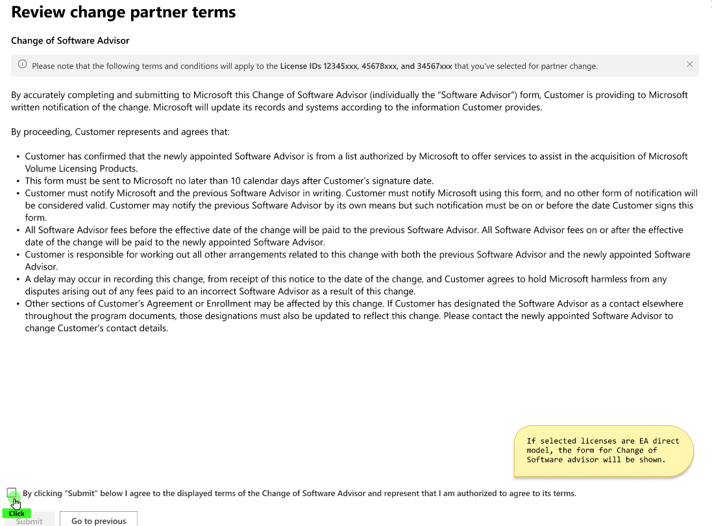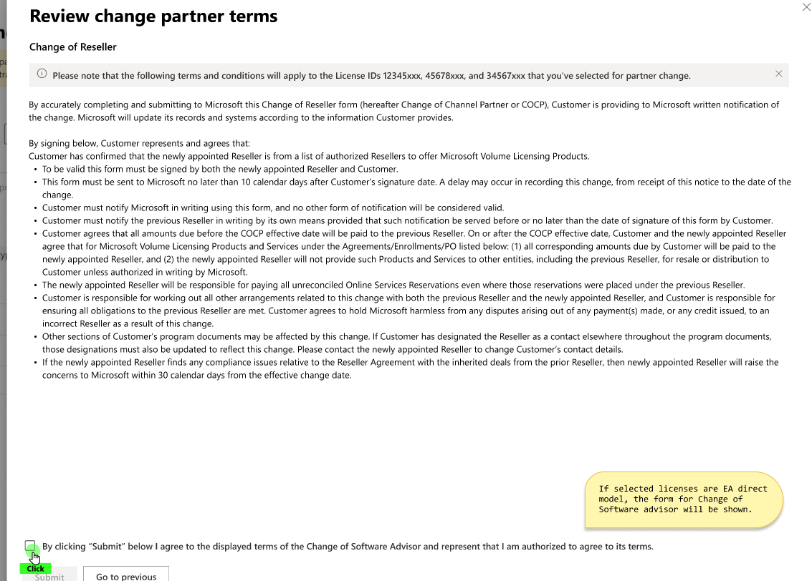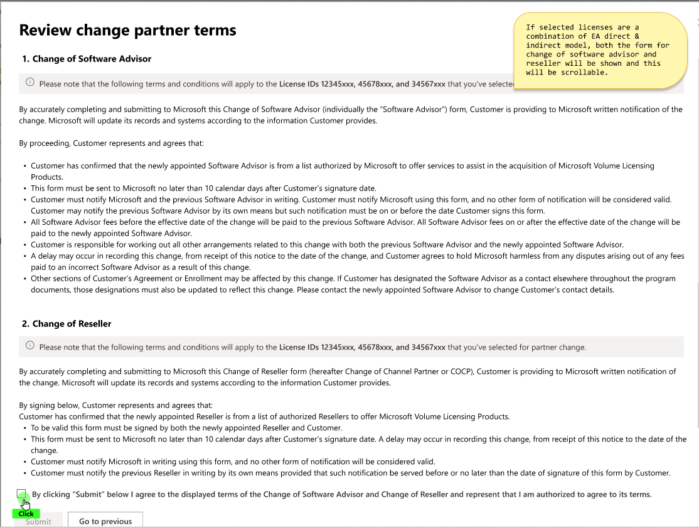

 **User must agree to terms to initiate the** COCP.

A message appears to indicate the change of channel partner is successfully submitted. Make sure that the partner accepts the request within 10 days.

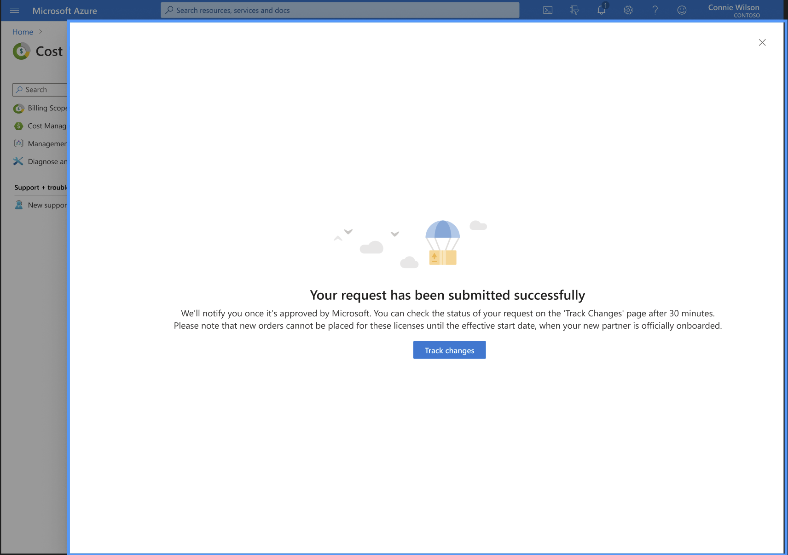

 **COCP request is sent to Partner Notification contact identified in COCP**

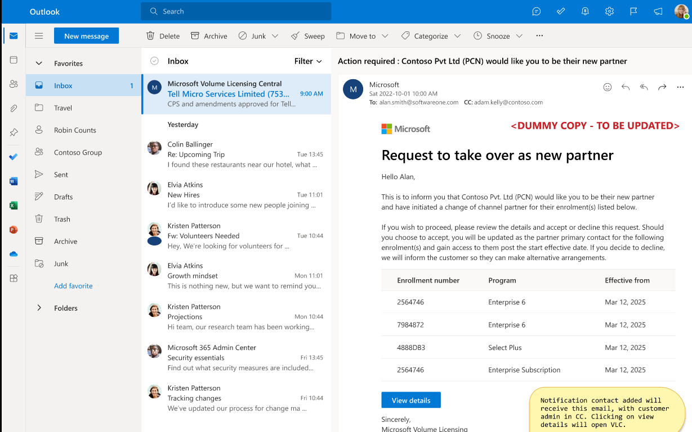

#### 

#### How to Track COCP status COCP request ID in Azure portal

Enterprise admin may see the status of the request in cost management + billing track changes page.

A ‘**Request ID’** is displayed for each billing account included in the COCP request. Where multiple billing accounts were in the same COCP package, the same request ID is displayed for all the records.

 **COCP Status Definitions** 

- **In Progress**: The COCP request has been sent to the new partner, who must accept or decline before completion.
- **Accepted**: The partner has accepted the COCP request. The Microsoft Operations Service Center (OSC) will process the request, typically within 24–48 hours.
- **Declined**: The partner has declined the COCP request.
- **Pending Microsoft Review**: The request is under review and processing by the Microsoft Operations service Center.
- **In Grace Period**: The request is in a 90‑day grace period (for enterprise). During this time, the new partner does not have access to agreements, and the old partner remains the partner of record.
- **Cancellation in Progress**: The customer has requested cancellation, and the COCP is queued to be cancelled.
- **Cancelled**: The customer canceled the request, and its status is marked as cancelled.
- **Expired**: The partner did not accept the COCP request within 30 days.
- **Completed**: Microsoft has completed the COCP.

The **effective date** is the date from which the new partner may place orders on the agreement.

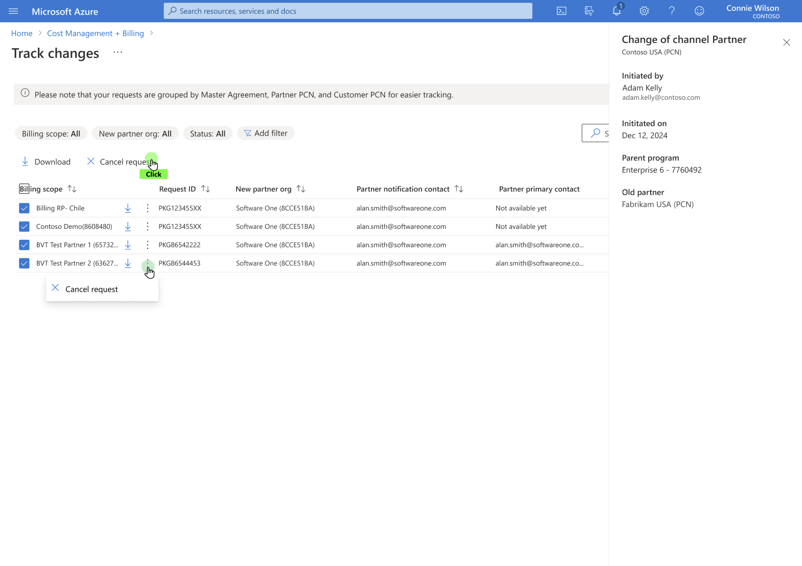

#### How to download COCP request ID in Azure portal

Customer admin must navigate to Azure Portal Track change page.

- Cost Management + billing\> Billing Scopes \> Track Change
- User can click on the download button to get the COCP form.

- The COCP form can only be downloaded once partner accepts the request or the request isn't cancelled.

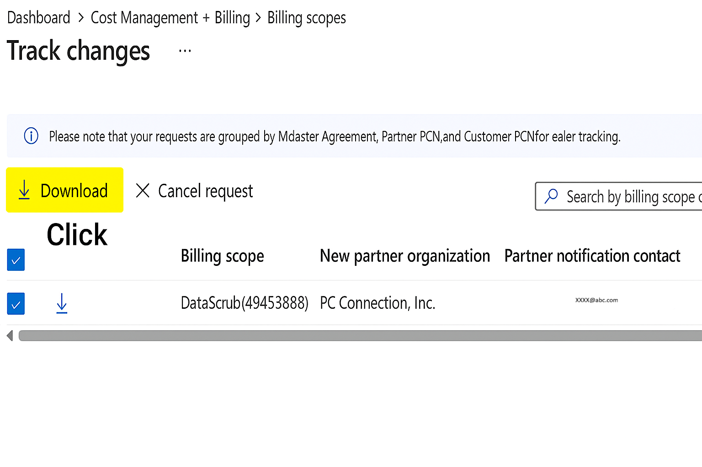

#### How to cancel COCP request in Azure portal

A COCP request with a status of In Process may be cancelled in full or partially (remove just some billing accounts from the request).

- Go to Cost Management + Billing > Billing Scopes > Track Change. Then select the billing scopes you don't want to proceed with for a COCP.

- Select Cancel Request from the action menu at the top, or the three dots next to billing scope.

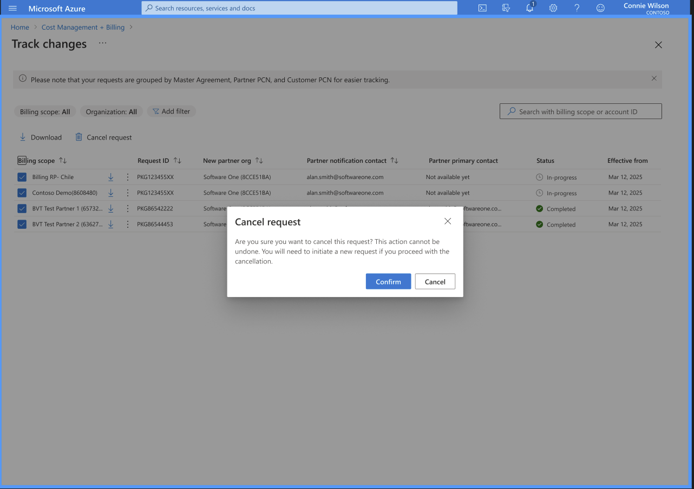

This initiates a notification to the partner to let them know that the request is cancelled.

