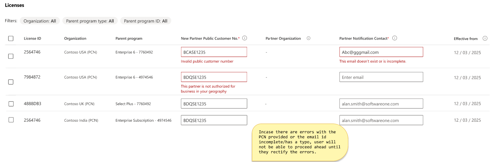
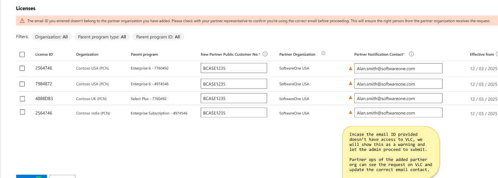
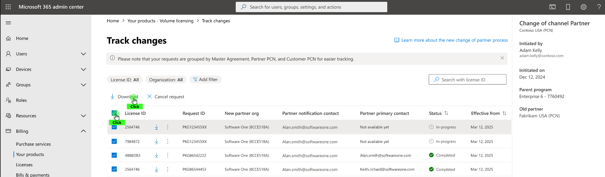

# Initiate a Change of Channel Partner (co-cp) request

## Summary

From Nov 2025, Enterprise volume licensing customers are able to initiate Change of Channel Partner via the Microsoft admin center and Azure portals.

This change moves the ability to initiate the Co-CP process away from Partners and enables the customers to start the process instead.

A customer initiates a  Co-CP, and then notifies the Partner to accept or decline. When the Partner accepts, the customer admin receives a notification with the accepted request and the effective date when the new partner becomes enabled.

## Prerequisite information required from your new partner

Only two pieces of information are required to initiate a change of channel partner request.

**The new partner PCN number** – The new partner PCN number – Please ask your new partner their partner PCN number. This is required information, and you can't proceed without it. Partner can get it by opening any existing contract in VLCentral in contracts workspace.

**Partner Notification Contact – What You Need to Know:**

-   When you (the customer admin) start a Change of Channel Partner (co-cp) request, you're asked to provide the email address of a “partner notification contact” from your new partner organization.
-   **Ideally**, your new partner should give you this contact information. This person will become your main point of contact for future communications about your agreement.
-   **If you don’t have this information:**
    -   You can enter any email address for the partner notification contact to proceed.
    -   However, if Microsoft doesn’t verify the email address you provide, it will not send automatic notifications about the Co-CP request to your new partner (for privacy reasons).
    -   In this case, you should reach out to your new partner directly (outside the system) and let them know you started the  Co-CP process.
-   **Why does this matter?**
    -   Using a verified partner contact ensures your new partner is notified promptly and can take action on your request.
    -   If you use an unverified contact, you're responsible for informing your partner about the request.

**Key Takeaway:**  
Always try to get the correct partner notification contact from your new partner before starting the  Co-CP request. This action helps ensure a smooth and timely transition.

**Please make sure that the partner accepts the request within 10 days.**

In Scope

-   Only Enterprise Admin can initiate  Co-CP requests via Azure portal.
-   Agreement Type = Enterprise enrollments (EA) and Enterprise Subscription Agreements,
-   Agreement status must be active
-   Trade status must be "Approved".

### Out of Scope for Self-Service  Co-CP

-   Non-EA programs, including Select, Select Plus, Open Value, Open Value Subscription, EDU / Campus, SPLA, IVR, MPSA, and Open license.
-   EA agreements with Microsoft Enterprise Direct Support (MSEDS) as Bill to / Software Advisor
-   EA agreements with expired status
-   EA agreements with ended status.
-   Backdated  Co-CP requests.
-   Early  Co-CP (before anniversary date)
-   A  Co-CP initiated in one portal isn't visible in the other to prevent duplication of requests.

## Azure portal customer experience

1.  The customer must have enterprise admin role on the billing scopes to initiate the request.
2.  **Customers can initiate the  Co-CP request from 1 entry point**
-   Cost management + Billing -\> Billing Scopes -\> Change partner
3.  Click on change partner

4.  After clicking Change Partner, the user is redirected to a page showing only eligible billing accounts on which Co-CP requests can be initiated. Select the Billing accounts that you want to transfer and click on next.
5.  User may select multiple billing accounts upto a mzaimum of 20 or user may select one billing account and click the three dots to Change Partner on that billing account.

6.  On the **Initiate change of Partner page** user needs to
-   Input the Public Customer Number (PCN) of the new partner.
-   Input the email address of the partner’s Notification contact.
-   Select a reason for changing partner from available drop downs: Unsatisfactory service by current partner, current partner is being off boarded by Microsoft, or Other.

-   Partner organization name displays when user inputs partner PCN and clicks “*confirm partner*” button in bottom left corner of screen.
-   This check verifies whether the partner PCN entered is allowed to do business or not. if there's error reach out to partner to get the correct PCN.
-   The partner notification contact should - but doesn't have to. Be the person in the partner organization who accesses VL Central to accept the Co-CP request. In case the notification contact isn't present in the VL Central, notification isn't sent to partner but customer admin can proceed to initiate the request.
-   The effective date defaults to 90 days from the initiation date.
    -   (If customers need a different date, they should ask their partner to submit an Early  Co-CP form to Microsoft Operations Service Center (OSC) – via VL Central My Cases).
-    Co-CP support scenario: **User selects licenses where  Co-CP cannot be performed**

**If customer selects agreement that are not eligible for  Co-CP, admin center displays a message informing the user that licenses are ineligible for a  Co-CP.**

User must expand the message to see the reasons blocking Co-CP for each impacted license ID.

**Scenario: User selects invalid partner PCN**

It's up to the new partner contact who is directly engaged with the customer to provide their PCN and partner notification contact details to the customer. If there's an error, reach out to the partner to get the correct PCN.

**Scenario: Partner email address inputted by customer does not have access to VL Central**.

Customer may input an email address in Partner Notification Contact of a partner user who doesn't have permissions on VLC to accept the  Co-CP. The Azure portal displays a warning but allows the user to proceed.

This rule means the notification goes to the email address listed on Co-CP rather than the partner user who has VL Central access. That partner user with VLC access can see and accept the Co-CP in VL Central even though they do not receive the Co-CP notification.

7.  **Review Change Partner terms**
-   If selected billing accounts are all EA direct – "Change of Software Advisor" form displayed.
-   If selected billing accounts are all EA Indirect – "Change of Reseller" form displayed.
-   If selected licenses are all a combination of EA direct and Indirect, one form with sections for *Change of SA Advisor* and *Change of Reseller* is displayed. The form is scrollable.
-   User needs to input their first name and last name and agree to terms and conditions by clicking on the checkbox.

8.  **User must agree to terms to initiate the  Co-CP.**

A message appears to indicate the Co-CP is successfully submitted. Make sure that the partner accepts the request within 10 days.

9.  ** Co-CP request is sent to Partner Notification contact identified in  Co-CP**

#### 

#### How to Track  Co-CP status  Co-CP request ID in Azure portal

Enterprise admin may see the status of the request in cost management + billing track changes page.

A ‘**Request ID’** is displayed for each billing account included in the  Co-CP request. Where multiple licenses were in the same  Co-CP package, the same request ID is displayed.

The **status** for each  Co-CP is displayed per billing account

-   A status of "in progress" means the Co-CP is sent to the new partner, who must accept or decline the Co-CP before it becomes completed.
-   A status of Accepted means the Partner accepts the Co-CP, and Microsoft Operations Service Center will process the request. (This process typically takes 24-48 hours for OSC to complete)
-   A status of declined means the Partner declined the  Co-CP.
-   A status of pending MS review means that the request is currently under processing by Microsoft operations center.
-   A status of in grace period means the request is in a grace period during which the new partner doesn't have access to agreements, and the old partner remains the partner on record. The grace period is 90 days for enterprise.
-   A status of "cancellation in progress" means the customer cancels the Co-CP request, and the request is in the queue to be canceled.
-   A customer cancels the request, so its status is marked as canceled.
-   A status of expired means that the partner didn't accept the  Co-CP request in 30 days.
-   A status of "completed" means Microsoft completes the Co-CP.

The **effective date** is the date from which the new partner may place orders on the agreement.

#### How to download  Co-CP request ID in Azure portal

Customer admin must navigate to track changes page.

-   Cost Management + billing\> Billing Scopes \> Track Change
-   User can click on the downward arrow button, which is the download button to get the  Co-CP form.
-   The  Co-CP form can only be downloaded once partner accepts the request or the request isn't canceled.

#### How to cancel  Co-CP request in Azure portal

A  Co-CP Request with a status of In Process may be canceled in full or partially (remove just some billing accounts from the request).

-   Go to Cost Management + Billing > Billing Scopes > Track Change. Then select the billing scopes you don't want to proceed with for a Co-CP.
-   Select Cancel Request from the action menu at the top, or the three dots next to billing scope.

This initiates a notification to the partner to let them know that the request is canceled.

