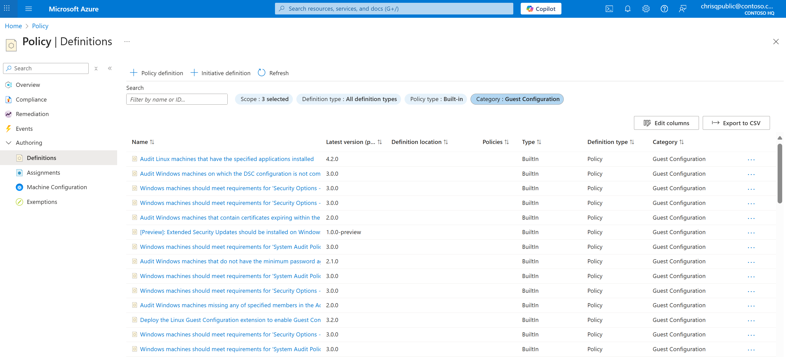
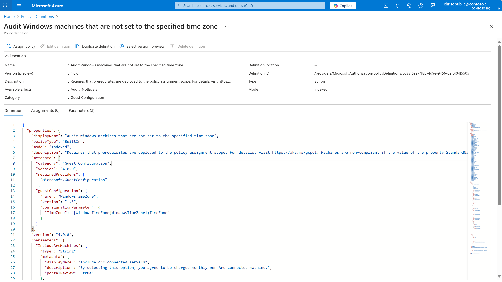
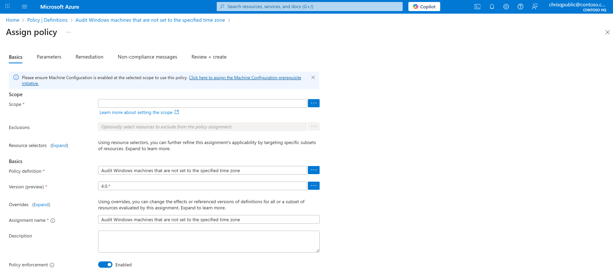
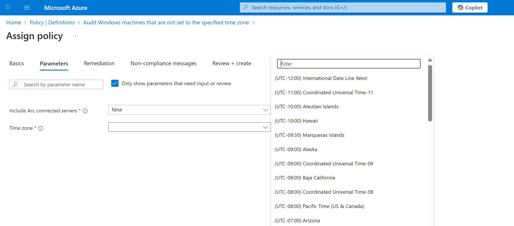

# Discover and Assign Built-In Machine Configuration Policies

Azure Policy provides a unified framework for defining and enforcing governance rules across your Azure resources.  
Machine Configuration extends this capability to the guest OS level, allowing you to audit and enforce configurations *inside* Windows and Linux machines—helping ensure your workloads remain secure and compliant with internal and industry standards.

This section explains how to discover built-in Machine Configuration policies, understand what they do, and assign them to your environment. We'll also walk through an example—using the Audit Windows Time Zone policy—to illustrate how parameters are used to tailor configurations to your organization's needs.

## Discover Built-In Machine Configuration Policies

Azure Policy definitions describe *what* is being evaluated and *how* compliance is determined. Built-in definitions are maintained by Microsoft and automatically updated to align with current security and compliance standards.

To view and explore these built-in policies:

1.  Navigate to **Azure Portal → Policy → Definitions**.

2.  In the left-hand navigation, select **Definitions** under the *Authoring* section.

3.  Open the **Category** filter and select **Guest Configuration** and **Built-in** on Policy Type to display all built-in policies related to OS auditing and compliance.

4.  Browse the list to review available definitions, such as:

    - *Audit Linux machines that have the specified applications installed*

    - *Audit Windows machines that are not set to the specified time zone*

    - *Windows machines should meet requirements for the Azure compute security baseline*

5.  Click any policy name to open its details page. You can inspect:

    - The JSON definition

    - Available parameters and versions

    - Metadata such as category, mode, and required providers

## Assign a Built-In Machine Configuration Policy

A **policy assignment** determines *where* and *how* a policy definition is applied—whether to a management group, subscription, or resource group.  
When you assign a Machine Configuration policy, Azure evaluates all in-scope machines and reports compliance directly in the **Azure Policy → Compliance** blade.

### Example: Assigning the "Audit Windows Time Zone" Policy

Let’s use one of the built-in Machine Configuration policies—**Audit Windows machines that are not set to the specified time zone**—as an example.

1.  From the **Policy Definitions** page, select  
    **Audit Windows machines that are not set to the specified time zone**.

2.  Click **Assign Policy** at the top of the page.

3.  In the **Basics** tab:

    1.  Choose the **Scope** (subscription or management group).

    2.  Confirm that **Machine Configuration prerequisites** are deployed. (A link to deploy prerequisites appears automatically if not.)

    3.  Optionally specify exclusions if certain resources shouldn't be evaluated.

4.  In the **Parameters** tab:

    1.  Set **Include Arc connected servers** to true if your environment includes Arc-enabled machines.

    2.  Choose the desired **Time zone** (for example, "Pacific Time (US & Canada)").

5.  Review your configuration under **Review + create**, then click **Create**.

Once assigned, the policy will automatically begin evaluating machines within scope. Compliance results will surface in the **Policy → Compliance** view, where you can drill down to specific resources or export results.

> [!NOTE]
> The same process is applicable to other built-in Machine Configuration policies—such as those auditing Linux baselines, password settings, or required applications. Parameters vary by definition and allow you to customize the audit scope without creating new policies.

## Programmatic Access and Automation

While this guide focuses on portal-based workflows, you can also assign and manage Machine Configuration policies programmatically through CLI, PowerShell, or REST API.

| **Interface** | **Command/Reference** | **Documentation** |
|----|----|----|
| **Azure CLI** | az policy definition list and az policy assignment create | [Assign policy via Azure CLI][01] |
| **PowerShell** | Get-AzPolicyDefinition and New-AzPolicyAssignment | [Assign policy via PowerShell][02] |
| **REST API** | Microsoft.Authorization/policyAssignments | [Azure Policy REST API Reference][03] |
| **Guest Configuration** | az guestconfig assignment list | [Guest Configuration REST API Reference][04] |
| **Azure Resource Graph** | Query guestconfigurationresources table for compliance results | [Query Guest Configuration with Azure Resource Graph][05] |

## Next Steps

After assigning your policy, you can:

- [View Machine Configuration compliance reporting][06]
- [Assign security baseline policies][07]
- [Understand Azure Policy definitions and initiatives][08]
- [Deploy Machine Configuration prerequisites][09]

<!-- Link reference definitions -->
[01]: ../../policy/assign-policy-azurecli.md
[02]: /powershell/module/az.policyinsights
[03]: /rest/api/policy
[04]: /rest/api/guestconfiguration
[05]: ../../policy/how-to/get-compliance-data.md
[06]: ./view-compliance.md
[07]: ./assign-security-baselines/overview-page.md
[08]: ../../policy/concepts/definition-structure.md
[09]: ../../policy/concepts/guest-configuration.md