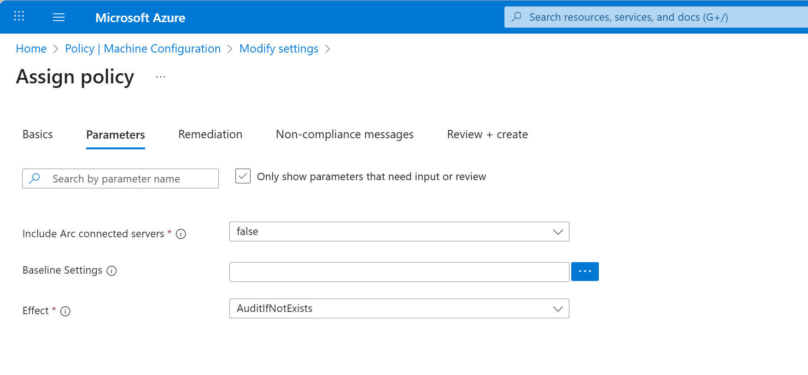
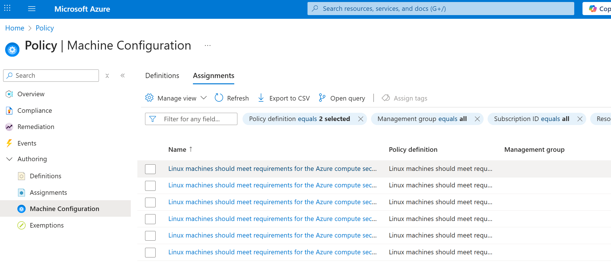

# Deploy a Security Baseline Policy Assignment

A security baseline policy assignment enables continuous compliance tracking, with results surfaced in the Azure portal to validate that your custom configurations are correctly applied across all target Windows and Linux machines. Policy assignments apply to Azure and non-Azure virtual machines (that are [Azure Arc-enabled servers][01]), extending security and compliance management across hybrid, multicloud, and edge environments. The following Policy definitions support customization:

- *Linux machines should meet requirements for the Azure compute security baseline*

- *Windows machines should meet requirements for the Azure compute security baseline*

- *\[Preview\]* *Official CIS Security Benchmarks for Linux Workloads*

Assignment of a security baseline policy is managed through [Machine Configuration][02], which enforces compliance by auditing machine settings against your chosen security baseline.

You can assign baselines via the Azure portal, Azure CLI, or automate the process in CI/CD pipelines for consistent rollout.

> [!IMPORTANT]
> Before assigning any security baseline policy, make sure you deploy the Machine Configuration prerequisite initiative. This initiative installs the extension on virtual machines and enables secure communication with a managed identity.

## Deploy via the Azure portal

The portal provides the most direct path to create or test a baseline assignment.

### Step 1—Open Machine Configuration Policies

1.  Go to **Azure portal \> Policy \> Machine Configuration**.

2.  Under **Definitions**, choose your desired baseline—for example:

    - *\[Preview\]* Official CIS Security Benchmarks for Linux Workloads

    - *Azure Security Baseline for Windows*

    - *Azure Security Baseline for Linux*

### Step 2—Select and Customize

1.  Choose **Modify settings** to tailor which benchmarks and versions you want to include.

2.  Review and optionally edit parameters for individual rules.

3.  When satisfied, click **Review + download** to generate your customized settings JSON.

4.  Press **Download All Baselines** to save the file.

Each JSON file encapsulates all selected parameters and metadata.  
Use this file later when creating the assignment.

### Step 3—Create the Assignment

1.  Select **Create audit Policy Assignment**.

2.  In the page, define:

    - **Scope** (subscription or management group)

    - **Assignment name** and optional description

3.  Under the **Parameters** tab, locate **Baseline Settings**. You may need to uncheck *"Only show parameters that need input or review"*

[](../../media/deploy-a-baseline-policy-assignment/baseline-settings-parameter-configuration.png#lightbox)

4.  Click **Browse** → Upload the JSON file you downloaded earlier.

5.  Confirm **Effect** = AuditIfNotExists for compliance tracking.

6.  Review and create.

This upload step passes your custom configuration to the BaselineSettings parameter within the relevant built-in policies.

For full assignment options (scope, remediation, noncompliance messages, managed identities), refer to [Assign a policy definition in the Azure portal][03].

## Deploy via Azure CLI or CI/CD Pipeline

For automated policy deployment, you can create the same assignment programmatically using the [Policy-as-code][07] SDK.

### Step 1—Prepare your JSON file

Ensure you download the baseline settings JSON generated from the portal. Example path:

```bash
baselineFile="./CustomizedBaselineSettings.json"
```

### Step 2—Assign the Policy

Use the Azure CLI to deploy the assignment:

```azurecli
az policy assignment create \
--name "CIS-Linux-Baseline-Custom" \
--display-name "CIS Linux Baseline (Customized)" \
--policy "/providers/Microsoft.Authorization/policyDefinitions/cis-linux-baseline" \
--params @"$baselineFile" \
--scope "/subscriptions/<subscription-id>" \
--identity
```

You can find other examples in [Assign policy with Azure CLI][04].

### View Existing Security Baseline Assignments

After deploying your customized baseline, you can verify its status and scope in the **Assignments** tab under **Policy → Machine Configuration** in the Azure portal.

[](../../media/deploy-a-baseline-policy-assignment/policy-assignments-view-deployed-baselines.png#lightbox)

This view lists all baseline policy assignments, including their policy definition, management group or subscription, and resource group. You can use filters (for example, by policy name, subscription, or scope) to quickly locate your assignment. Selecting a specific assignment opens its details, where you can review parameter input (such as your imported JSON file), scope, and compliance status once evaluations complete.

> [!NOTE]
> The compliance results in this view correspond to the same audit configuration surfaced in Azure Policy Compliance, ARG, and Guest Assignments—helping you validate that your custom baselines are applied correctly across all target machines.


## Next steps

- [View Machine Configuration compliance reporting][05]
- [Discover and assign built-in Machine Configuration policies][06]
- [Policy as Code with Azure Policy][07]

<!-- Link reference definitions -->
[01]: /azure/azure-arc/servers/overview
[02]: ../../overview.md
[03]: ../../../policy/assign-policy-portal.md
[04]: ../../../policy/assign-policy-azurecli.md
[05]: ../view-compliance.md
[06]: ../assign-built-in-policies.md
[07]: ../../../policy/concepts/policy-as-code.md