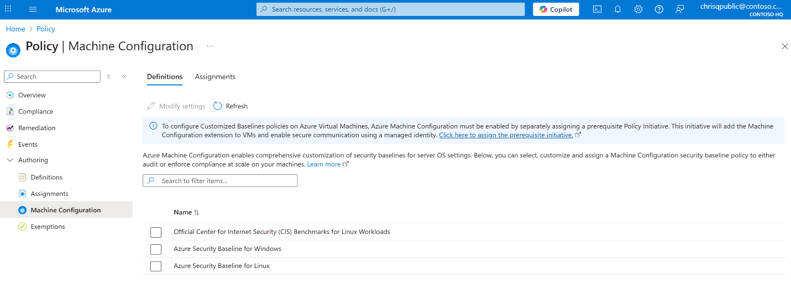
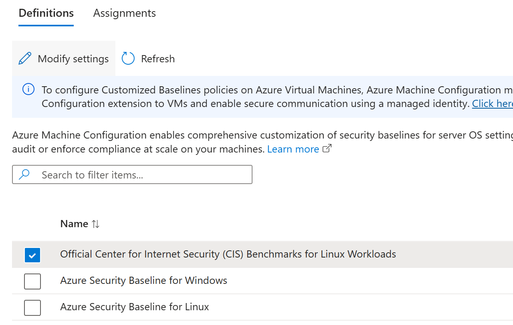
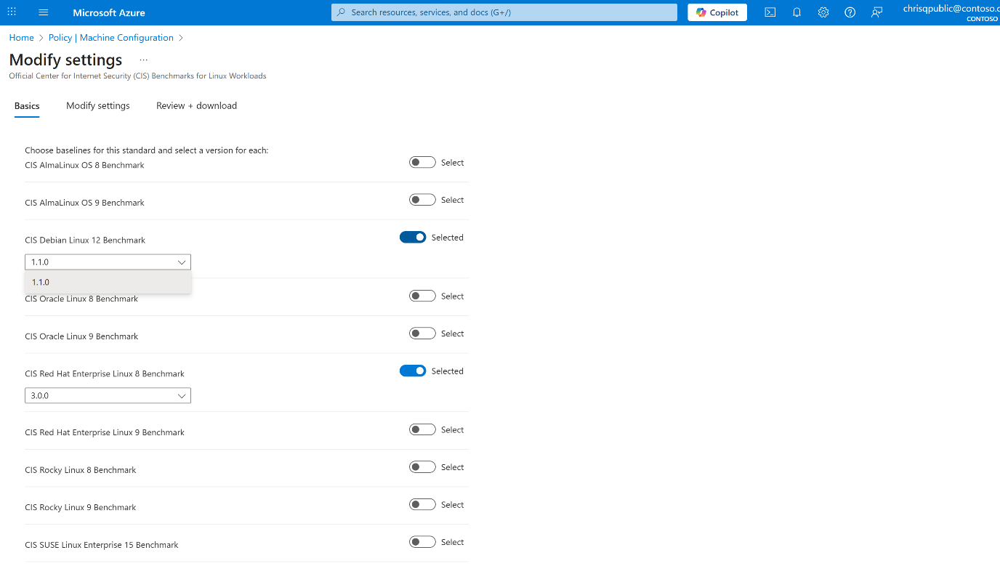
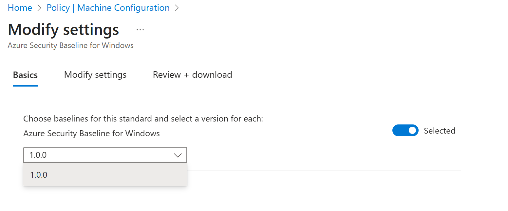
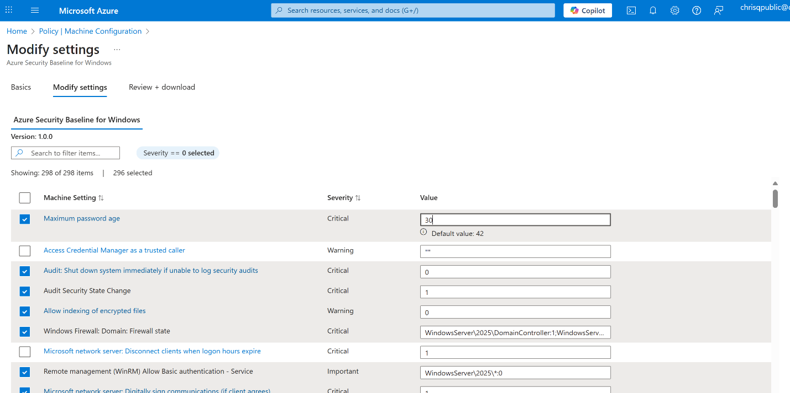
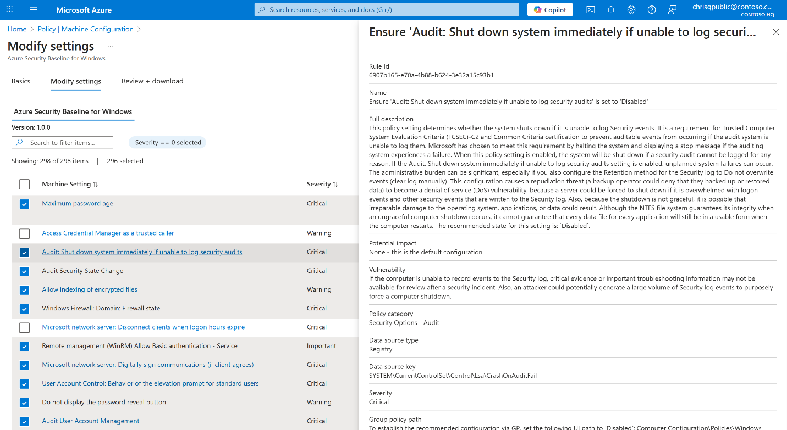
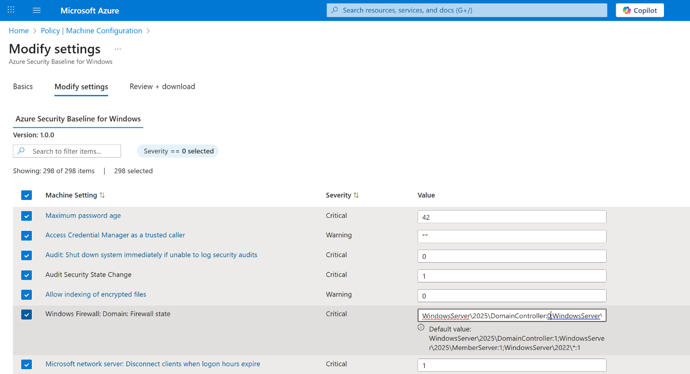
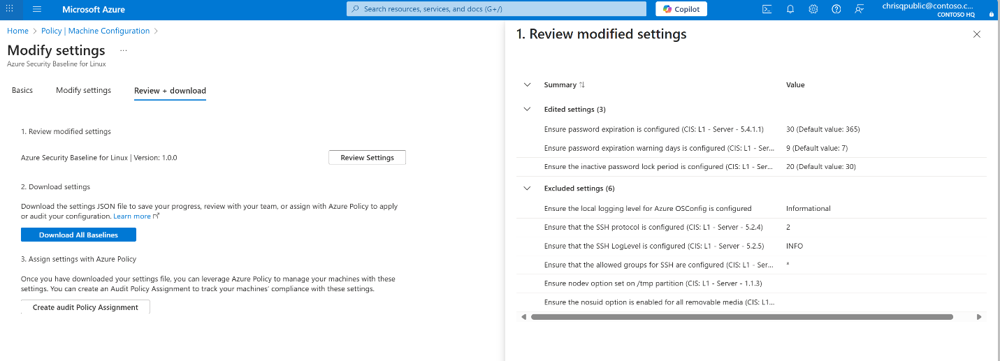

# Specify Custom Parameters for Baseline Policy

Machine Configuration security baselines provide a unified approach to enforcing security and compliance across diverse environments—including Azure, hybrid, multicloud, and edge scenarios—by supporting both native Azure virtual machines and non-Azure servers that are [Azure Arc-enabled machines][01] (Windows and Linux).

With built-in security baselines, you can customize security controls to meet your specific requirements to ensure they meet your organization’s requirements before deploying security baselines in your environment.

The new Azure Policy Settings Picker experience streamlines this process. It allows you to select which settings to evaluate and adjust configuration parameters for granular control. The experience supports advanced input formats for Linux and Windows and exports your customized baseline as a reusable JSON artifact. This flexibility ensures that policy enforcement is consistent, precise, and adaptable to complex enterprise needs, regardless of where your workloads run.

> [!NOTE]
> Ensure the *Machine Configuration prerequisites* initiative is assigned to your subscription.

## Open the Machine Configuration blade

1.  In the Azure portal, navigate to **Policy \> Machine Configuration**.

2.  Select the **Definitions** tab.

[](../../media/specify-custom-parameters-for-baseline-policy/policy-machine-configuration-definitions-tab.png#lightbox)

3.  Choose one of the built-in baselines:

    -  **Official CIS Benchmarks for Linux Workloads**

    -  **Azure Security Baseline for Windows**

    -  **Azure Security Baseline for Linux**

4.  Click **Modify settings**.

[](../../media/specify-custom-parameters-for-baseline-policy/modify-settings-button-baseline-configuration.png#lightbox)

## Select baselines and versions

The configuration experience differs slightly between Linux and Windows baselines:

- **CIS Benchmarks for Linux:** You can enable one or more supported distributions (such as Red Hat Enterprise Linux, Alma Linux, Rocky Linux, or Ubuntu). Unselected distributions are excluded from evaluation. For each enabled distro, select the CIS Benchmark version you want to apply.  
  [](../../media/specify-custom-parameters-for-baseline-policy/center-internet-security-linux-distribution-selection-versions.png#lightbox)

- **For Azure Baselines (Windows or Linux):** These baselines apply uniformly across operating systems and don't require distro selection. Confirm the baseline version under **Basics** and continue.  
  [](../../media/specify-custom-parameters-for-baseline-policy/azure-security-baseline-version-selection.png#lightbox)

## Modify settings

On the **Modify settings** tab, review and adjust configuration rules for your selected baselines.

- Use the checkbox next to each rule to include or exclude it from evaluation.

- For configurable rules, edit the **Parameter value** field to define your organization's required state.

[](../../media/specify-custom-parameters-for-baseline-policy/security-base-line-rules-list-with-checked-boxes.png#lightbox)

- View per rule Metadata by clicking on a highlighted rule. This action opens the context pane showing details such as **Rule ID**, **Description**, **Severity**, and **Compliance Standard**.

[](../../media/specify-custom-parameters-for-baseline-policy/rule-metadata-context-pane-details.png#lightbox)

These features are available uniformly for all benchmarks and baselines in Machine Configuration.

### Custom Input for CIS Benchmarks for Linux

To support advanced customization, **CIS Benchmarks for Linux** may use a **structured input format** for some parameter values. This format allows you to define multiple attributes in a single line—for example, specifying both the expected service state and the package name.

**Example format:**

```
key1=value1 key2=value2 key3=value3
```

**Example input:**

```
serviceName=named.service expectedUnitFileState=enabled expectedActiveState=active packageName=bind
```

The format enables fine-grained control, allowing you to model complex configurations that align with your existing Linux environment.

[](../../media/specify-custom-parameters-for-baseline-policy/center-internet-security-linux-parameter-structured-input-format.png#lightbox)

### Custom Input for Azure Security Baseline (Windows)

To achieve similar granularity in applicability of baseline settings, the **Azure Security Baseline for Windows** supports **formatted string input** for complex rule targeting across OS editions and server roles.

Each value uses the format:

```
WindowsServer\<Year>\<ServerRole>:<Value>
```

Separate multiple targets using semicolons ";".  
A wildcard \* may also be used to apply a rule across all versions or roles (for example, WindowsServer\2022\\:1).

**Example input:**

```
WindowsServer\2025\DomainController:1;WindowsServer\2025\MemberServer:1;WindowsServer\2022\\:1
```

The scoping provides precise control for your rule application—for example, applying a setting only to *Domain Controllers* on *Windows Server 2025*, or across all roles on *Windows Server 2022*.

[](../../media/specify-custom-parameters-for-baseline-policy/windows-baseline-parameter-server-roles-format.png#lightbox)

## Review and download

After completing your changes:

1.  Select the **Review + download** tab.

2.  Review any edited or excluded settings.

[](../../media/specify-custom-parameters-for-baseline-policy/review-download-customized-baseline-summary.png#lightbox)

3.  Click **Download All Baselines** to export your customized configuration as a JSON file.

You can also select **Assign audit policy** to create a policy assignment directly from your customized baseline within the portal.

This JSON artifact defines all active settings for your baseline, making it easy to version, share, or reuse across environments and deployment pipelines.

## Next Steps

- [Deploy a baseline policy assignment][02]
- [Understand the baseline JSON format][03]
- [View Machine Configuration compliance reporting][04]
- [Discover and assign built-in Machine Configuration policies][05]

<!-- Link reference definitions -->
[01]: /azure/azure-arc/servers/overview
[02]: ./deploy-a-baseline-policy-assignment.md
[03]: ./understand-baseline-settings-parameter.md
[04]: ../view-compliance.md
[05]: ../assign-built-in-policies.md