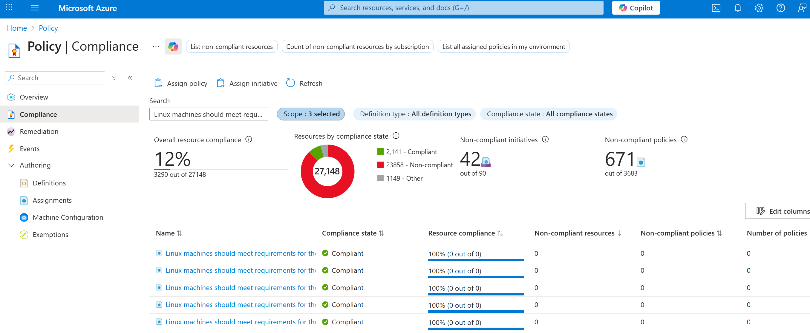
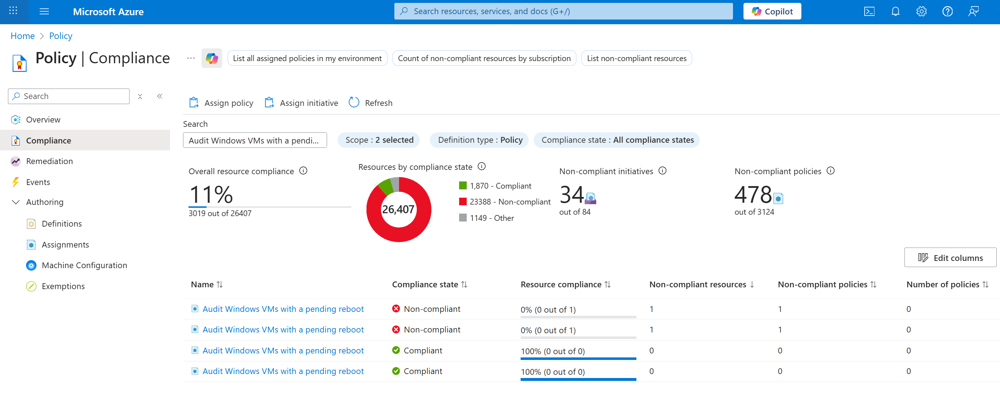
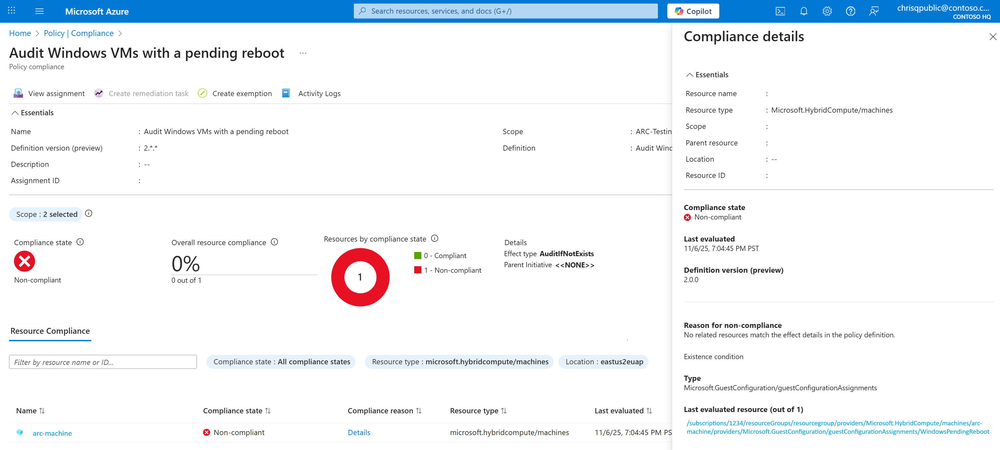
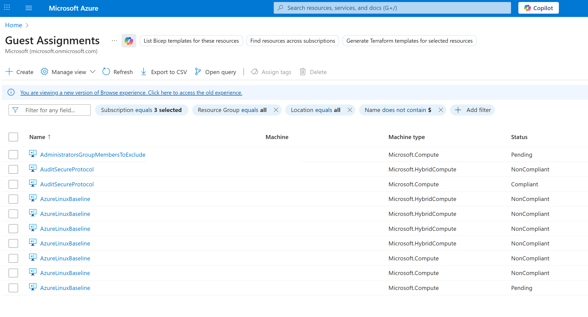
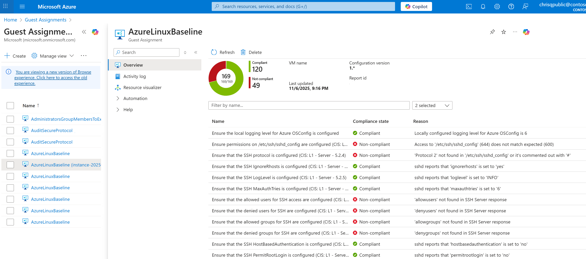
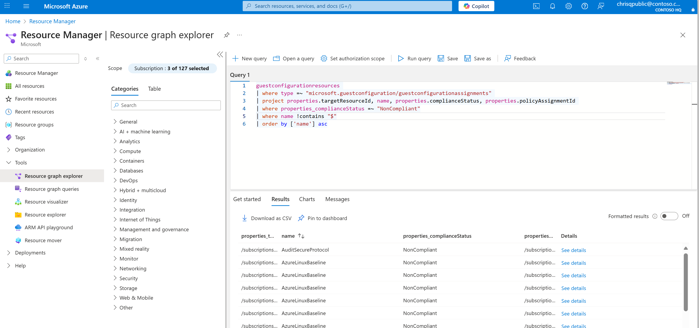

# View Machine Configuration Compliance Reporting

Once you've deployed your configuration, compliance results are available across three key surfaces in Azure: Policy Assignments, Guest Assignments, and Azure Resource Graph (ARG). Each surface serves a distinct purpose — from high-level policy compliance to deep machine-level evidence and large-scale reporting.

## Policy Compliance Page

Use this view to validate which policies are deployed, where they're scoped, and how they're performing at a policy level.

### View Assigned Policies

1. Navigate to **Azure Policy → Compliance.**

2. View each entry, which shows a deployed assignment and its target scope (subscription, management group, or resource group).

3. If needed, use filters such as **Policy definition equals all,** or **Subscription ID equals all** to narrow the list.

[](../media/view-machine-configuration-compliance-reporting/azure-policy-compliance-page-filters-export.png#lightbox)

*Use **Export to CSV** to generate quick audit reports or share assignment inventories with your compliance team.*

### View Compliance Summary

Open **Azure Policy → Compliance** to monitor compliance by initiative or policy definition.  
The **Overall resource compliance** chart summarizes compliant vs. non-compliant resources at a glance. Select any initiative or policy assignment to view resource-level results.

### Drill Down to Machine-Level Evidence

From the Compliance view:

1.  Select a policy assignment.

[](../media/view-machine-configuration-compliance-reporting/policy-assignment-compliance-status-resources.png#lightbox)

2.  In the **Resource compliance** tab, click "**Details**" next to the resource name.

3.  In the details pane, select **Last evaluated resource**.

[](../media/view-machine-configuration-compliance-reporting/resource-compliance-details-evaluated-link.png#lightbox)

This opens the corresponding **Guest Assignment**, providing traceability between the Azure Policy rule and on-machine configuration evidence.

*This connection bridges policy intent (defined in Azure Policy) with real machine state (reported by the Machine Configuration agent).*

## Guest Assignments

Use this view to investigate machine-level compliance for each assigned policy and pinpoint exactly which rules are passing or failing.

### View All Guest Assignments

1. Navigate to **Machine Configuration → Guest Assignments**.

2. View each row represents a machine's evaluation against an assigned policy.

3. Observe the **Status** column, which indicates whether the machine is *Compliant*, *NonCompliant*, or *Pending*.

[](../media/view-machine-configuration-compliance-reporting/guest-assignments-list-compliance-indicators.png#lightbox)

### Explore Rule-Level Results

Click a Guest Assignment name (e.g., *AzureLinuxBaseline*) to open detailed results.  
The results table includes:

- Configuration item name and **benchmark reference**

- **Compliance state** (✅ *Compliant* / ❌ *Non-compliant*)

- **Reason for non-compliance** (for example, missing configuration, audit failure, or file mismatch)

*Use this view to perform root-cause analysis and prepare evidence for internal or external security audits.*

[](../media/view-machine-configuration-compliance-reporting/detailed-rule-compliance-results-benchmarks.png#lightbox)

### Relationship to Azure Policy

Every Machine Configuration Azure Policy assignment creates a Guest Assignment for each machine within the scope of the policy. This ensures that machines inherit their baseline definitions consistently from the assigned policy, maintaining alignment between governance intent and technical enforcement.

## Azure Resource Graph (ARG)

For large-scale reporting and automation, you can query Machine Configuration results directly using Azure Resource Graph (ARG).  
This enables you to build dashboards, automate compliance summaries, and integrate Machine Configuration insights into existing compliance tooling.

### View All Guest Assignments in ARG

1.  Open **Resource Graph Explorer** in the Azure portal.

2.  Select a **scope** (management group or subscription).

3.  Search for the **guestconfigurationresources** table.

[](../media/view-machine-configuration-compliance-reporting/azure-resource-graph-explorer-guest-configuration.png#lightbox)

### Example Query: Identify Non-Compliant Machines

```kusto
guestconfigurationresources  
| where type =~ "microsoft.guestconfiguration/guestconfigurationassignments"  
| project properties.targetResourceId, name, properties.complianceStatus, properties.policyAssignmentId  
| where properties_complianceStatus =~ "NonCompliant"
```

This query lists:

- **Target Resource ID** – the VM or Arc-enabled server evaluated

- **Assignment Name** – the applied baseline or configuration

- **Compliance Status** – the result of the most recent audit

- **Policy Assignment ID** – the Azure Policy that triggered the Guest Assignment

### Filter and Extend

You can extend your queries by filtering for:

- **Compliance state** (Compliant, NonCompliant, or Pending)

- **Assignment name** or **machine type** (Microsoft.Compute, Microsoft.HybridCompute)

- **Subscription**, **region**, or **policy assignment**

Results can be **exported to CSV** or integrated into **Power BI** dashboards for organizational compliance tracking.

### Other Programmatic Access

While this guide focuses on portal-based experiences, all compliance and assignment data can also be accessed programmatically through the following APIs, SDKs, and reference guides.

| **Surface** | **Documentation Reference** |
|----|----|
| **Azure Policy** | [Azure Policy documentation overview][01]<br />[az policy CLI reference][02]<br />[Azure Policy REST API reference][03] |
| **Machine Configuration / Guest Assignments** | [Azure Machine Configuration documentation][04]<br />[Guest Configuration REST API reference][05]<br />[az guestconfig CLI reference][06]<br />[Get-AzGuestConfigurationAssignment PowerShell cmdlet][07] |
| **Azure Resource Graph (ARG)** | [Azure Resource Graph overview][08]<br />[Query examples and schema reference][09]<br />[az graph CLI reference][10]<br />[Azure Resource Graph REST API reference][11] |

These APIs enable you to automate compliance data collection, integrate results with existing reporting pipelines, and build dashboards that combine policy-level visibility, machine-level detail, and cross-environment trends.

## Next Steps

- [Assign built-in Machine Configuration policies][12]
- [Deploy security baseline policy assignments][13]
- [Query compliance data with Azure Resource Graph][14]
- [Understand Azure Policy compliance][15]

<!-- Link reference definitions -->
[01]: ../../policy/index.yml
[02]: /cli/azure/policy
[03]: /rest/api/policy
[04]: ../index.yml
[05]: /rest/api/guestconfiguration
[06]: /cli/azure/guestconfig
[07]: /powershell/module/az.guestconfiguration/get-azguestconfigurationassignment
[08]: ../../resource-graph/index.yml
[09]: ../../resource-graph/samples/starter.md
[10]: /cli/azure/graph
[11]: /rest/api/azure-resourcegraph
[12]: ./assign-built-in-policies.md
[13]: ./assign-security-baselines/deploy-a-baseline-policy-assignment.md
[14]: ../../policy/how-to/get-compliance-data.md
[15]: ../../policy/how-to/get-compliance-data.md