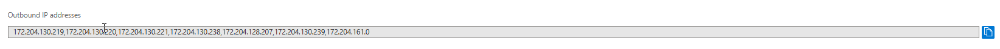
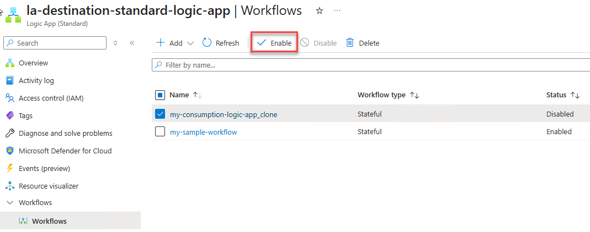
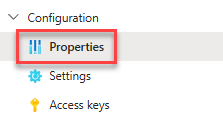
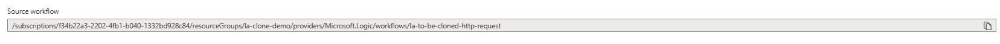

# Clone Consumption workflows to Standard workflows (Preview)

> [!IMPORTANT]
> 
> This capability is in preview and is subject to the [**Supplemental Terms of Use for Microsoft Azure Previews**](https://azure.microsoft.com/support/legal/preview-supplemental-terms/).

[!INCLUDE [logic-apps-sku-consumption](includes/logic-apps-sku-consumption.md)]

Compared to Consumption logic app workflows, Standard logic app workflows run in single-tenant Azure Logic Apps and offer many different and improved capabilities. For example, you get compute isolation, virtual network integration, and private endpoints along with App Services Environment hosting, local development and debugging using Visual Studio Code, low latency with stateless workflows, and more.

If you want the benefits from Standard workflows, but you have Consumption workflows that run in multitenant Azure Logic Apps, you can now clone your Consumption workflows to single-tenant Azure Logic Apps. This operation is useful when you require some Standard capabilities, such as isolation and network integration, lower latency, or better cost predictability.

You can now directly clone your Consumption logic app to a Standard logic app in the Azure portal, replicating your logic app as stateful workflows in a Standard logic app resource.

> [!NOTE]
> 
> The clone capability doesn't migrate your Consumption logic apps. Instead, this capability replicates artifacts, such as workflow definitions, connections, and others. Your source logic app resource remains operational, and your workflow, trigger history, run history, and other data stay intact.
> 
> You control the cloning process and your migration journey. You can test and validate your cloned workflows to your satisfaction with the destination environment. You choose when to disable or delete your source logic app. Regular billing charges still apply to your source logic app when still enabled.

## Known issues and limitations

- The clone capability doesn't export any infrastructure information, such as integration account settings.

- By default, connection configuration, including credential details, isn't cloned from source logic app workflows. You must reconfigure these connections before your destination logic app workflows can run.

- Action and workflow parameters using secure string or secure object aren't cloned to the destination. Placeholders are created for those parameters with **sanitized** as the value. You have to reconfigure those parameters with secure content from KeyVault before running your workflows. 

- By default, all connectors are cloned as managed, shared connectors, even when built-in connector versions are available.

- Cloning doesn't support workflows with the following items and actions:

  - Integration account references

    - Transform XML
    - XML Validation
    - Flat file encoding and decoding
    - EDIFACT actions
    - X12 actions

  - Nested workflows
  - Choose or call an Azure function

## Prerequisites

- An Azure account and subscription. If you don't have a subscription, [sign up for a free Azure account](https://azure.microsoft.com/free/?WT.mc_id=A261C142F).

- A Standard logic app resource as the destination for cloning your Consumption logic app.

  For more information, see [Create a Standard logic app workflow in the Azure portal](create-single-tenant-workflows-azure-portal.md).

- To update cloned connections, you need the [**Logic Apps Standard Contributor** built-in role](../role-based-access-control/built-in-roles/integration#logic-apps-standard-contributor-preview), which gives you resource group-level access.

- Review and meet the requirements for [how to set up Visual Studio Code with the Azure Logic Apps (Standard) extension](create-single-tenant-workflows-visual-studio-code.md#prerequisites).

## Clone Consumption to Standard

1. In the [Azure portal](https://portal.azure.com), open the Consumption logic app resource to clone.

1. On the resource sidebar, select **Overview**. On the page toolbar, select **Clone** **>** **Clone to Standard**.

   :::image type="content" source="media/clone-consumption-logic-app-to-standard-workflow/clone-wizard-start.png" alt-text="Screenshot shows the Azure portal, Consumption logic app, Overview toolbar, and selected Clone to Standard." lightbox="clone-consumption-logic-app-to-standard-workflow/clone-wizard-start.png":::

1. Provide information about destination logic app, such as the subscription, resource group, and Standard logic app resource name.

   > [!NOTE]
   > 
   > You can rename the workflow to match your naming convention, if necessary. The Azure portal checks whether the name is valid and that it doesn't conflict with an existing workflow in the destination Standard logic app to avoid overwriting the destination workflow.

   :::image type="content" source="media/clone-consumption-logic-app-to-standard-workflow/clone-wizard-configure.png" alt-text="Screenshot shows configuration information for Clone to Standard." lightbox="clone-consumption-logic-app-to-standard-workflow/clone-wizard-configure.png":::

1. When you're done, select **Next**.

1. Confirm the logic app destination settings, and then select **Clone**.

   :::image type="content" source="media/clone-consumption-logic-app-to-standard-workflow/clone-wizard-review-clone.png" alt-text="Screenshot shows Clone to Standard wizard with clone settings and Clone button selected." lightbox="clone-consumption-logic-app-to-standard-workflow/clone-wizard-review-clone.png":::

1. After the cloning process completes, select **Go to workflow** to open the cloned workflow.

   :::image type="content" source="media/clone-consumption-logic-app-to-standard-workflow/clone-wizard-success.png" alt-text="Screenshot shows Clone to Standard wizard with success message and Go to workflow button selected." lightbox="clone-consumption-logic-app-to-standard-workflow/clone-wizard-success.png":::

   > [!NOTE]
   >
   > The new workflow is created in a disabled state to avoid conflicts with any existing workflows or execution errors before you complete the configuration.

## Review the new workflow configuration

Before you enable your workflow, you must review and complete any required actions for the following workflow areas:

### Configure connections

If your source workflow has any managed API connections, copies of these connections are created in the same resource group as your Standard logic app resource. 

1. In the Azure portal, open your Standard logic app resource.

1. On the resource sidebar, under **Workflows**, select **Workflows**. Select the new workflow.

1. On the workflow designer toolbar, select **Connections** to find any connection errors:

   ::image type="content" source="media/clone-consumption-logic-app-to-standard-workflow/designer-connections-review.png" alt-text="Screenshot shows the workflow designer toolbar with Connections selected." lightbox="clone-consumption-logic-app-to-standard-workflow/designer-connections-review.png":::

   The **Connections** pane opens so that you can review each connection.

1. Expand each connection that has an error (red dot), and then select **Open Connection** to go to the connection and reconfigure its properties, including any authentication properties.

   ::image type="content" source="media/clone-consumption-logic-app-to-standard-workflow/connection-error.png" alt-text="Screenshot shows the workflow designer toolbar with connection errors." lightbox="clone-consumption-logic-app-to-standard-workflow/connection-error.png":::

### Configure networking

If your source Consumption logic app connects to a system via a firewall, you might need to reconfigure the firewall rules with a new set of outbound IPs to include in the allowlist.

You can find the outbound IPs for your Logic Apps Standard application selecting on **Properties** on the application blade.

You can find the list of Outbound IPs under **Outbound IP Addresses**:

> [!NOTE]
> 
> If your Standard logic app connects to an Azure virtual network, use Virtual Network Integration instead. This approach gives you more control over traffic. It separates communication between your logic app and your resources inside the virtual network. For more information, see [Secure traffic between Standard logic apps and Azure virtual networks using private endpoints](secure-single-tenant-workflow-virtual-network-private-endpoint.md).

## Enable your cloned workflow

Once you complete the configuration of your cloned workflow and are ready to test, you must first enable your cloned workflow.

To enable your workflow:

1.  Navigate the workflow list
    1.  Select the workflow you want to enable
    2.  select on the **Enable** button on the Toolbar.

> Important
> 
> If your workflow uses a polling or event based trigger and your new API connections are pointing to the same resource of the source Consumption logic apps, you should disable your source logic apps before enabling the cloned workflow, to avoid concurrency between the source and cloned workflows.
> 
> To find the source Consumption Logic Apps:
> 
> 1.  Navigate to the cloned workflow
> 2.  select on **Properties** on the workflow side panel
> 
> 
> 
> You'll find the source Consumption logic app reference under **Source workflow:**
> 
> 
