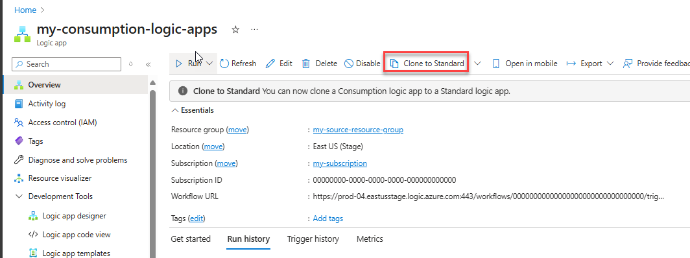
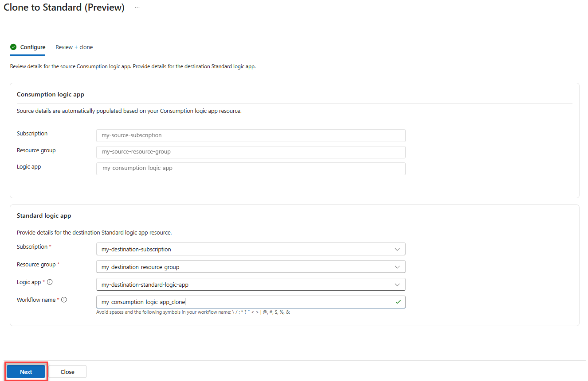
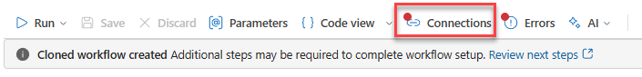
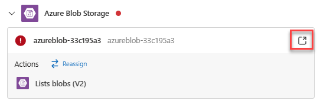

# Clone Consumption logic apps to Standard workflows (Preview)

> [!IMPORTANT]
> 
> This capability is in preview and is subject to the [**Supplemental Terms of Use for Microsoft Azure Previews**](https://azure.microsoft.com/support/legal/preview-supplemental-terms/).

Standard logic app workflows, which run in single-tenant Azure Logic Apps, offer many new and improved capabilities. For example, you get compute isolation, virtual network integration, and private endpoints along with App Services Environment hosting, local development and debugging using Visual Studio Code, low latency with stateless workflows, and more.

If you want the benefits from Standard workflows, but your workflows run in multitenant Azure Logic Apps, you can now clone your Consumption workflows to single-tenant Azure Logic Apps. This operation makes sense in scenarios that require some of the Standard capabilities such as isolation and network integration, lower latency or better predictability of costs.

You can now clone your Consumption logic apps to a Standard logic app directly from the Azure Portal, replicating your logic app as stateful workflows in a Standard logic app resource.

> [!NOTE]
> 
> The export capability doesn't migrate your Consumpion logic apps. Instead, this tool replicates artifacts, such as workflow definitions, connections and others. Your source logic app resources, workflows, trigger history, run history, and other data stay intact.
> 
> You control the export process and your migration journey. You can test and validate your exported workflows to your satisfaction with the destination environment. You choose when to disable or delete your source logic apps.

## Known issues and limitations

-   The clone feature doesn't export any infrastructure information, such as integration account settings.
-   By default, connection configuration isn’t cloned from source logic app workflows. Before your logic app workflows can run, you'll have to reconfigure these connections after export.
-   By default, all connectors are cloned as Azure Connectors, even when a built-in option is available. No option exists to opt out from this behavior.

## Prerequisites

-   A destination Standard logic apps application where the Consumption logic apps will be cloned.
-   Azure Logic Apps Standard contributor resource group-level access to create the cloned connections.
-   Review and meet the requirements for [how to set up Visual Studio Code with the Azure Logic Apps (Standard) extension](https://learn.microsoft.com/en-us/azure/logic-apps/create-single-tenant-workflows-visual-studio-code#prerequisites).

## Walkthrough

1.  Login to Azure Portal and navigate to the Consumption logic app you want to clone.
2.  In the Overview page, select **Clone to Standard** on the toolbar.

3.  Define the clone destination, selecting the subscription, resource group and Standard logic app resource, then click **Next**.

> [!NOTE]
> 
> You can rename the workflow name to a name that matches your naming convention if required. The interface will verify if the name is valid and that it doesn’t clash with an existing workflow in the destination Standard logic app, avoiding overwriting of the destination workflow.

4.  Review yourclone settings and click on Clone to start the process.

Once the clone process completes, you can click on **Go to** workflow, tonavigate to the new workflow created.

> [!NOTE]

> The new workflow will be created in a disabled state, so it doesn’t clash with the existing workflow or generate execution errors before you complete the configuration.

## Reviewing the new workflow configuration

You must review the following areas before enabling your workflow:

### Connection configuration

If your workflow have any API connections, a copy of that connection is created in the same resource group of your Logic Apps Standard application. When you navigate to the workflow, you can click on the Connection button to verify connection any connection errors:

This opens the Connections side pane. Within that pane you can review each connection.

Expand each connection marked with an error (red dot) and click on **Open Connection** button to navigate to the connection and reconfigure its property, including any authentication properties.

### Networking configuration

If your source Consumption logic app connects to a system via a firewall, you might need to reconfigure the firewall rules with a new set of outbound IPs to include in the allow list.

You can find the outbound IPs for your Logic Apps Standard application clicking on **Properties** on the application blade.

You will find the list of Outbound IPs under **Outbound IP Addresses**:

> [!NOTE]
> 
> If your application is connecting to an Azure virtual network, you can configure Virtual Network Integration instead, which will give you more granular control over the traffic between the Logic Apps Standard application and your resources within the virtual network. See [**Secure traffic between Standard logic apps and Azure virtual networks using private endpoints**](https://learn.microsoft.com/en-us/azure/logic-apps/secure-single-tenant-workflow-virtual-network-private-endpoint) for more information.

## Enabling your cloned workflow

Once you complete the configuration of your cloned workflow and are ready to test, you must first enable your cloned workflow.

To enable your workflow:

1.  Navigate the workflow list
    1.  Select the workflow you want to enable
    2.  Click on the **Enable** button on the Toolbar.

> Important
> 
> If your workflow uses a polling or event based trigger and your new API connections are pointing to the same resource of the source Consumption logic apps, you should disable your source logic apps before enabling the cloned workflow, to avoid concurrency between the source and cloned workflows.
> 
> To find the source Consumption Logic Apps:
> 
> 1.  Navigate to the cloned workflow
> 2.  Click on **Properties** on the workflow side panel
> 
> 
> 
> You will find the source Consumption logic app reference under **Source workflow:**
> 
> 
