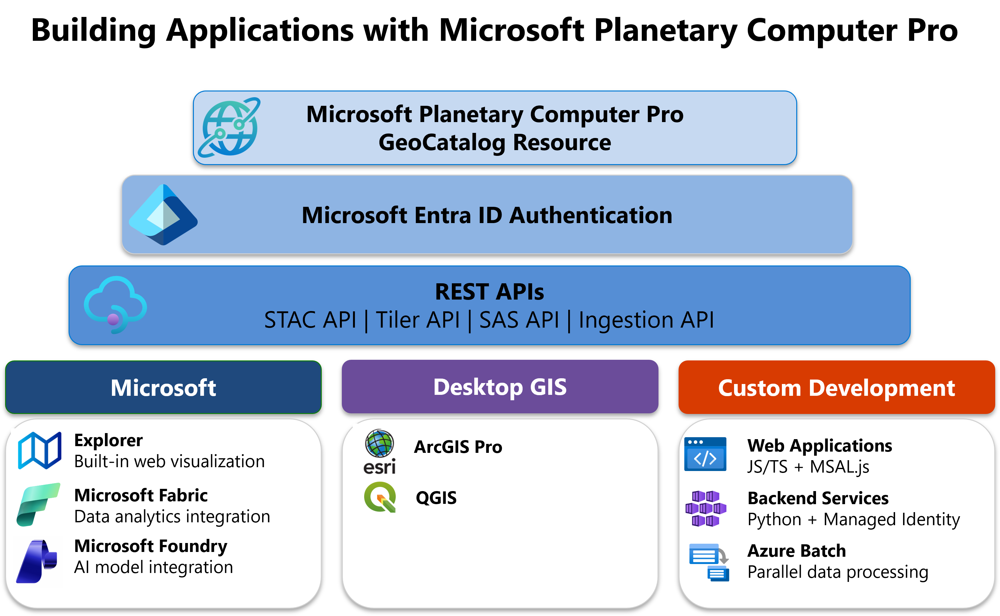

# Connect and build applications with your data

Microsoft Planetary Computer Pro provides multiple ways to connect to your geospatial data—whether you want to explore it visually, integrate it with desktop GIS tools, or build custom applications. This article helps you choose the right integration approach for your needs.

## Choose your integration approach

Select the approach that best fits your use case:

| Use case | Recommended approach | Get started |
|----------|---------------------|-------------|
| [**Explore and visualize data**](#built-in-explorer) | Use the built-in Explorer web application | [Use the Explorer](./use-explorer.md) |
| [**Desktop GIS with ArcGIS Pro**](#desktop-gis-applications) | Connect ArcGIS Pro directly to GeoCatalog | [Configure ArcGIS Pro](./create-connection-arc-gis-pro.md) |
| [**Desktop GIS with QGIS**](#desktop-gis-applications) | Connect QGIS to GeoCatalog via STAC | [Configure QGIS](./configure-qgis.md) |
| [**Build a custom web application**](#custom-applications-with-rest-apis) | Browser-based app with JavaScript/TypeScript using MSAL.js | [Build a web application](./build-web-application.md) |
| **Batch processing on Azure** | Run processing jobs with Azure Batch and managed identity | [Use Azure Batch](./azure-batch.md) |
| **Backend/server-side integration** | Python applications using managed identity or service principal | [Configure application authentication](./application-authentication.md) |

## Prerequisites

- An Azure account and subscription. [Create an account for free](https://azure.microsoft.com/pricing/purchase-options/azure-account?cid=msft_learn).
- Access to a Microsoft Planetary Computer Pro [GeoCatalog resource](./deploy-geocatalog-resource.md).

## Integration options

### Built-in Explorer

The fastest way to get started is with the built-in **Explorer** web application. Explorer allows you to visualize and interact with geospatial data directly in your browser—no coding required.

With Explorer, you can:
- Browse collections and view items on an interactive map
- Apply filters and mosaic definitions to refine your data
- Generate code samples for Python integration
- Create collection thumbnails

Once your data is [configured for visualization](./collection-configuration-concept.md), you can [use the Explorer](./use-explorer.md) immediately. Explorer is ideal for data exploration, quick visualization, and sharing insights with stakeholders.

### Desktop GIS applications

For geospatial professionals who prefer working with desktop GIS tools, Planetary Computer Pro integrates with industry-standard applications:

**ArcGIS Pro** — Connect Planetary Computer Pro data directly to ESRI ArcGIS Pro to access and analyze cloud-hosted geospatial datasets, use advanced visualization and analysis capabilities, and integrate cloud-based data with local projects. For more information, see [Configure ArcGIS Pro to access a GeoCatalog](./create-connection-arc-gis-pro.md).

**QGIS** — The open-source QGIS desktop application connects via the STAC API for browsing and visualization. QGIS enables direct interaction with STAC collections, so you can visualize, analyze, and style data on the fly. For more information, see [Configure QGIS to access a GeoCatalog resource](./configure-qgis.md).

### Custom applications with REST APIs

For full control over your application's functionality, integrate directly with Planetary Computer Pro's REST APIs. You can build custom web applications, backend services, and automated pipelines.

| API Name      | Description                                                                                   |
|---------------|----------------------------------------------------------------------------------------------|
| STAC API      | Search, discover, and access geospatial data using the SpatioTemporal Asset Catalog (STAC) specification. |
| Tiler API     | Serve map tiles and imagery for visualization in web maps and GIS apps.                      |
| SAS API       | Generate secure, time-limited access tokens for sharing geospatial data.                     |
| Ingestion API | Ingest and transform new geospatial datasets into the GeoCatalog.                            |

These APIs support [standard authentication through Microsoft Entra ID](/entra/architecture/guide-for-independent-software-developers), enabling secure access to your resources. For a complete walkthrough of building a browser-based application, see [Build a web application with Microsoft Planetary Computer Pro](./build-web-application.md).

You can also integrate data in Planetary Computer Pro with Microsoft applications such as [Fabric](/fabric) and [Azure AI Foundry](/azure/ai-foundry/what-is-azure-ai-foundry).

The [REST API is detailed in the API reference](/rest/api/planetarycomputer).

## Authentication

All integrations with Planetary Computer Pro require authentication through Microsoft Entra ID. The recommended authentication method depends on where your application runs:

- **Applications on Azure** — Use managed identities for credential-free authentication with automatic token management.
- **Applications outside Azure** — Register a service principal in Microsoft Entra ID and manage credentials securely.

For step-by-step guidance on configuring authentication, including RBAC role assignments and token acquisition, see [Configure application authentication for Planetary Computer Pro](./application-authentication.md).

## Related content

- [Configure application authentication for Planetary Computer Pro](./application-authentication.md)
- [Build a web application with Microsoft Planetary Computer Pro](./build-web-application.md)
- [Use Azure Batch with Microsoft Planetary Computer Pro](./azure-batch.md)
- [Configure ArcGIS Pro to access a GeoCatalog](./create-connection-arc-gis-pro.md)
- [Configure QGIS to access a GeoCatalog resource](./configure-qgis.md)
- [Manage access to Microsoft Planetary Computer Pro](./manage-access.md)
- [Microsoft Planetary Computer Pro REST API reference](/rest/api/planetarycomputer)
