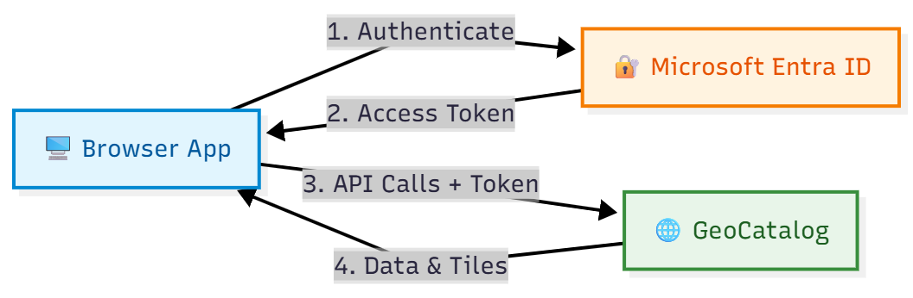
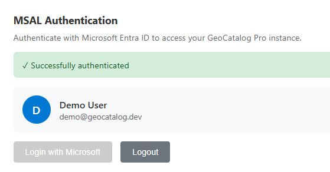
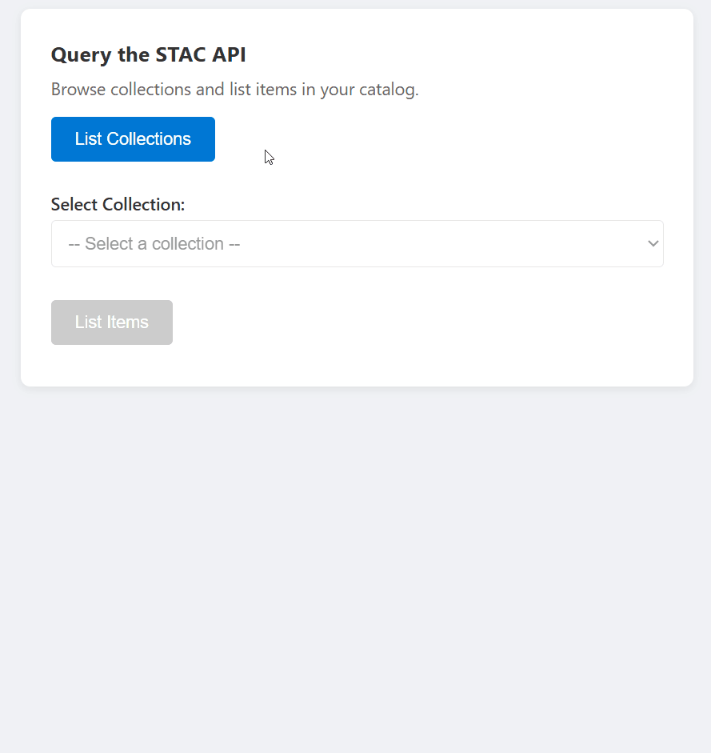
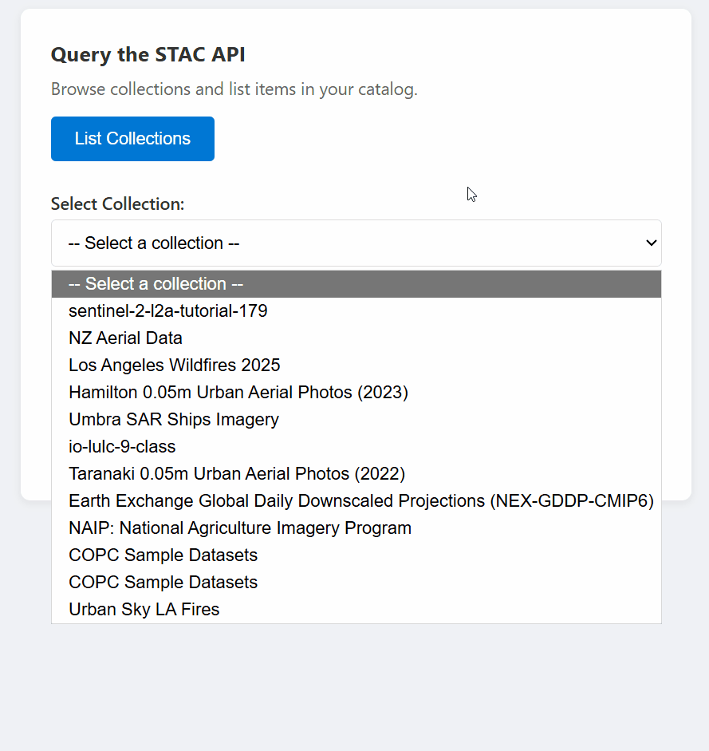
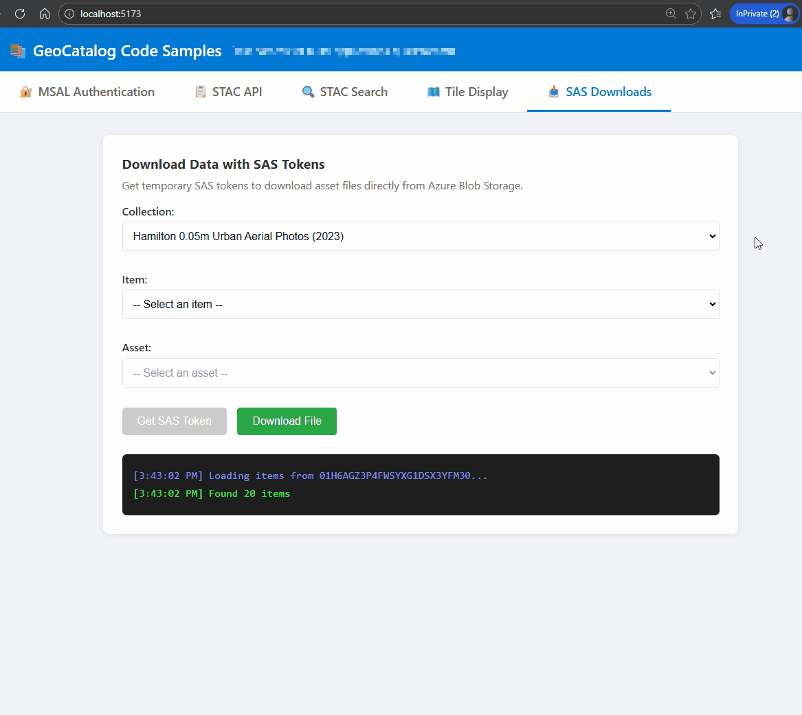

# Quickstart: Build a web application with Microsoft Planetary Computer Pro

In this quickstart, you build a web application that displays satellite imagery and geospatial data from your GeoCatalog on an interactive map. You authenticate users with Microsoft Entra ID, query STAC collections, and render map tiles—all from browser JavaScript.

**What you learn:**

- Authenticate users and acquire access tokens using MSAL.js
- Query the STAC API to discover collections and items
- Display raster tiles on a MapLibre GL map with authorization headers
- Create seamless mosaic layers across entire collections
- Download raw assets using SAS tokens

The code patterns work with any modern JavaScript framework (React, Vue, Angular) or vanilla JavaScript. GeoCatalog APIs have full CORS support, so you can call them directly from `localhost` during development—no proxy required.

You can download and test this code from the [Microsoft Planetary Computer Pro public GitHub repository](https://github.com/Azure/microsoft-planetary-computer-pro/tree/main/tools/javascript-sample).

## Prerequisites

- An Azure account with an active subscription. [Create an account for free](https://azure.microsoft.com/free/?WT.mc_id=A261C142F).
- A deployed [GeoCatalog resource](./deploy-geocatalog-resource.md) with at least one collection containing items.
- Your user identity must have **GeoCatalog Reader** (or higher) access to the GeoCatalog resource. See [Manage access to a GeoCatalog resource](./manage-access.md).
- [Node.js](https://nodejs.org/) version 18 or later.

## Architecture overview

A typical GeoCatalog web application follows this architecture:

[  ](media/web-application-architecture.png#lightbox)


## Register your application in Microsoft Entra ID

Before your web application can authenticate users, register it in Microsoft Entra ID. This quickstart uses a **Single Page Application (SPA)** registration, which is ideal for client-side JavaScript applications and local development. The API integration patterns shown in later steps work with any application type.

> [!NOTE]
> For production applications with a backend server, consider choosing a different registration type (Web, Native, etc.). See [Configure application authentication](./application-authentication.md) for guidance on choosing the right approach for your scenario.

### Register as a single-page application

1. Go to **Microsoft Entra ID** in the Azure portal. 
1. Select **App registrations** from the side panel.
1. Select **New registration**.
1. Enter a name for your application (for example, "GeoCatalog Web App").
5. Under **Supported account types**, select **Accounts in this organizational directory only**.
1. Under **Redirect URI**, select **Single-page application (SPA)** and enter your development URL (for example, `http://localhost:5173`).
1. Select **Register**.

After registration, note the following values from the **Overview** page:
- **Application (client) ID**
- **Directory (tenant) ID**

For more information, [review quickstart app registration](/entra/identity-platform/quickstart-register-app). 

### Grant API permissions

Your application needs permission to call the GeoCatalog API on behalf of signed-in users:

1. In your app registration, select **API permissions** > **Add a permission**.
1. Select **APIs my organization uses** and search for **Azure Orbital Spatio**.
1. Select **Delegated permissions** and check **user_impersonation**.
1. Select **Add permissions**.
1. If you're an admin, select **Grant admin consent** to consent on behalf of all users in your tenant.

## Configure your application

Your application needs the following configuration values. How you provide these values depends on your build tooling (environment variables, config files, and so on):

| Configuration | Value | Description |
|--------------|-------|-------------|
| Catalog URL | `https://{name}.{region}.geocatalog.spatio.azure.com` | Your GeoCatalog endpoint |
| Tenant ID | From app registration | Your Microsoft Entra tenant |
| Client ID | From app registration | Your application's client ID |
| API Scope | `https://geocatalog.spatio.azure.com/.default` | Always use this exact value |

## Install dependencies

Install the Microsoft Authentication Library (MSAL) for browser applications and a map library:

```bash
npm install @azure/msal-browser maplibre-gl
```

- **@azure/msal-browser** - Handles OAuth 2.0 authentication with Microsoft Entra ID
- **maplibre-gl** - Open-source map library for tile visualization

> [!TIP]
> **Project structure:** The code samples in this quickstart are standalone functions you can organize however you prefer. A common pattern:
> - `auth.js`: MSAL configuration and token functions
> - `api.js`: STAC API, Tiler API, and SAS token functions
> - `map.js`: MapLibre initialization and tile layer management
> - `App.js` or `main.js`: Wire everything together with your UI
>
> Each function receives its dependencies (access tokens, URLs) as parameters, making them easy to integrate into any framework or project structure.

## Implement MSAL authentication

[  ](media/sample-authentication.png#lightbox)


Configure MSAL for browser authentication. The following example shows the key configuration and token acquisition pattern:

```javascript
import { PublicClientApplication, InteractionRequiredAuthError } from '@azure/msal-browser';

// Configuration - replace with your values or load from environment/config
const msalConfig = {
  auth: {
    clientId: 'YOUR_CLIENT_ID',
    authority: 'https://login.microsoftonline.com/YOUR_TENANT_ID',
    redirectUri: window.location.origin,
  },
  cache: {
    cacheLocation: 'sessionStorage',
    storeAuthStateInCookie: false,
  },
};

// Create MSAL instance
const msalInstance = new PublicClientApplication(msalConfig);

// GeoCatalog API scope - always use this exact value
const scopes = ['https://geocatalog.spatio.azure.com/.default'];

/**
 * Acquire an access token for GeoCatalog API calls.
 * Tries silent acquisition first, falls back to popup if needed.
 */
async function getAccessToken() {
  const account = msalInstance.getActiveAccount() || msalInstance.getAllAccounts()[0];
  
  if (!account) {
    throw new Error('No authenticated account. Call login() first.');
  }

  try {
    // Try silent token acquisition (uses cached token)
    const result = await msalInstance.acquireTokenSilent({ account, scopes });
    return result.accessToken;
  } catch (error) {
    // If silent fails (token expired), fall back to popup
    if (error instanceof InteractionRequiredAuthError) {
      const result = await msalInstance.acquireTokenPopup({ scopes });
      return result.accessToken;
    }
    throw error;
  }
}

/**
 * Sign in the user via popup.
 */
async function login() {
  const result = await msalInstance.loginPopup({ scopes });
  msalInstance.setActiveAccount(result.account);
  return result.account;
}

/**
 * Sign out the user.
 */
function logout() {
  msalInstance.logoutPopup();
}
```

## STAC API: Query collections and items

The GeoCatalog STAC API provides endpoints for discovering and querying geospatial data. All requests require an `Authorization` header with a Bearer token obtained from [Implement MSAL authentication](#implement-msal-authentication).

### List collections

[  ](media/list-stac-collections.gif#lightbox)


```javascript
const API_VERSION = '2025-04-30-preview';

async function listCollections(accessToken, catalogUrl) {
  const url = `${catalogUrl}/stac/collections?api-version=${API_VERSION}`;
  
  const response = await fetch(url, {
    headers: {
      'Authorization': `Bearer ${accessToken}`,
    },
  });
  
  if (!response.ok) {
    throw new Error(`Failed to list collections: ${response.statusText}`);
  }
  
  const data = await response.json();
  return data.collections; // Array of STAC Collection objects
}
```

### List items in a collection

[  ](media/list-stac-items.gif#lightbox)

```javascript
const API_VERSION = '2025-04-30-preview';

async function listItems(accessToken, catalogUrl, collectionId, limit = 10) {
  const url = `${catalogUrl}/stac/collections/${collectionId}/items?limit=${limit}&api-version=${API_VERSION}`;
  
  const response = await fetch(url, {
    headers: {
      'Authorization': `Bearer ${accessToken}`,
    },
  });
  
  if (!response.ok) {
    throw new Error(`Failed to list items: ${response.statusText}`);
  }
  
  const data = await response.json();
  return data.features; // Array of STAC Item objects
}
```

### Search across collections

[  ](media/stac-search-demo.gif#lightbox)

```javascript
const API_VERSION = '2025-04-30-preview';

async function searchItems(accessToken, catalogUrl, searchParams) {
  const url = `${catalogUrl}/stac/search?api-version=${API_VERSION}`;
  
  const response = await fetch(url, {
    method: 'POST',
    headers: {
      'Authorization': `Bearer ${accessToken}`,
      'Content-Type': 'application/json',
    },
    body: JSON.stringify(searchParams),
  });
  
  if (!response.ok) {
    throw new Error(`Search failed: ${response.statusText}`);
  }
  
  return await response.json();
}

// Example usage:
const results = await searchItems(token, catalogUrl, {
  collections: ['my-collection'],
  bbox: [-122.5, 37.5, -122.0, 38.0],  // [west, south, east, north]
  datetime: '2024-01-01/2024-12-31',
  limit: 20,
});
```

---

## Tile URLs: Build URLs for map visualization

The GeoCatalog Tiler API serves raster data as map tiles. Construct tile URLs with the following pattern:

### Single item tiles

[  ](media/tile-single-image.gif#lightbox)

```http
{catalogUrl}/data/collections/{collectionId}/items/{itemId}/tiles/{z}/{x}/{y}@1x.png
  ?api-version=2025-04-30-preview
  &tileMatrixSetId=WebMercatorQuad
  &assets=visual
```

### Tile URL builder function

```javascript
const API_VERSION = '2025-04-30-preview';

/**
 * Build a tile URL template for a STAC item.
 * Returns a URL with {z}/{x}/{y} placeholders for use with map libraries.
 */
function buildTileUrl(catalogUrl, collectionId, itemId, options = {}) {
  const { assets = 'visual', colormap, rescale } = options;
  
  const base = `${catalogUrl}/data/collections/${collectionId}/items/${itemId}/tiles/{z}/{x}/{y}@1x.png`;
  
  const params = new URLSearchParams();
  params.set('api-version', API_VERSION);
  params.set('tileMatrixSetId', 'WebMercatorQuad');
  params.set('assets', assets);
  
  if (colormap) params.set('colormap_name', colormap);
  if (rescale) params.set('rescale', rescale);
  
  return `${base}?${params.toString()}`;
}

// Example usage:
const tileUrl = buildTileUrl(
  'https://mygeocatalog.northcentralus.geocatalog.spatio.azure.com',
  'aerial-imagery',
  'image-001',
  { assets: 'visual' }
);
```

### Key tile parameters

| Parameter | Required | Description |
|-----------|----------|-------------|
| `api-version` | Yes | API version (`2025-04-30-preview`) |
| `tileMatrixSetId` | Yes | Use `WebMercatorQuad` for web maps |
| `assets` | Yes | Asset names to render (example: `visual`, `image`) |
| `colormap_name` | No | Named colormap (example: `viridis`, `terrain`) |
| `rescale` | No | Value range for scaling (example: `0,255`) |
| `asset_bidx` | No | Band indices (example: `image\|1,2,3` for RGB) |

> [!NOTE]
> For collections with four-band imagery (like NAIP with RGB + NIR), use `asset_bidx=image|1,2,3` to select only the RGB bands. The tiler can't encode four bands as PNG.

---

## Map integration: Display tiles with MapLibre GL

Map libraries like MapLibre GL, Leaflet, and OpenLayers can display raster tiles. The key challenge is **adding authorization headers** to tile requests, since these libraries fetch tiles directly.

### MapLibre GL example

MapLibre GL provides a `transformRequest` option to inject headers:

```javascript
import maplibregl from 'maplibre-gl';
import 'maplibre-gl/dist/maplibre-gl.css';

// Store the current access token
let currentAccessToken = null;

function initializeMap(containerId, accessToken) {
  currentAccessToken = accessToken;
  
  const map = new maplibregl.Map({
    container: containerId,
    style: {
      version: 8,
      sources: {
        osm: {
          type: 'raster',
          tiles: ['https://tile.openstreetmap.org/{z}/{x}/{y}.png'],
          tileSize: 256,
          attribution: '© OpenStreetMap contributors',
        },
      },
      layers: [{ id: 'osm', type: 'raster', source: 'osm' }],
    },
    center: [0, 0],
    zoom: 2,
    // Add authorization header to tile requests
    transformRequest: (url, resourceType) => {
      // Only add auth for GeoCatalog tile requests
      if (url.includes('geocatalog.spatio.azure.com') && currentAccessToken) {
        return {
          url,
          headers: { 'Authorization': `Bearer ${currentAccessToken}` },
        };
      }
      return { url };
    },
  });
  
  return map;
}

function addTileLayer(map, tileUrl, bounds) {
  // Remove existing layer and source if present
  if (map.getLayer('data-layer')) {
    map.removeLayer('data-layer');
  }
  if (map.getSource('data-tiles')) {
    map.removeSource('data-tiles');
  }
  
  // Add tile source
  map.addSource('data-tiles', {
    type: 'raster',
    tiles: [tileUrl],
    tileSize: 256,
    minzoom: 10,  // Many aerial collections require zoom 10+
    maxzoom: 18,
  });
  
  // Add tile layer
  map.addLayer({
    id: 'data-layer',
    type: 'raster',
    source: 'data-tiles',
  });
  
  // Zoom to bounds [west, south, east, north]
  if (bounds) {
    map.fitBounds([[bounds[0], bounds[1]], [bounds[2], bounds[3]]], { padding: 50 });
  }
}
```

> [!IMPORTANT]
> The `transformRequest` function is called for every tile request. Store the access token in a variable that `transformRequest` can access, and update it when the token refreshes.

---

## Mosaic tiles: Display collection-wide imagery

[  ](media/display-mosaic.gif#lightbox)


To view all items in a collection as a seamless layer, register a mosaic search and use the returned search ID:

```javascript
const API_VERSION = '2025-04-30-preview';

/**
 * Register a mosaic search for a collection.
 * Returns a search ID that can be used to fetch mosaic tiles.
 */
async function registerMosaic(catalogUrl, collectionId, accessToken) {
  const url = `${catalogUrl}/data/mosaic/register?api-version=${API_VERSION}`;
  
  const response = await fetch(url, {
    method: 'POST',
    headers: {
      'Authorization': `Bearer ${accessToken}`,
      'Content-Type': 'application/json',
    },
    body: JSON.stringify({
      collections: [collectionId],
    }),
  });
  
  if (!response.ok) {
    throw new Error(`Failed to register mosaic: ${response.statusText}`);
  }
  
  const data = await response.json();
  // Note: API returns 'searchid' (lowercase), not 'searchId'
  return data.searchid;
}

/**
 * Build a mosaic tile URL template.
 */
function buildMosaicTileUrl(catalogUrl, searchId, collectionId, options = {}) {
  const { assets = 'visual' } = options;
  
  const base = `${catalogUrl}/data/mosaic/${searchId}/tiles/{z}/{x}/{y}@1x.png`;
  
  const params = new URLSearchParams();
  params.set('api-version', API_VERSION);
  params.set('tileMatrixSetId', 'WebMercatorQuad');
  params.set('collection', collectionId);
  params.set('assets', assets);
  
  return `${base}?${params.toString()}`;
}
```

---

## SAS tokens: Download raw assets

The SAS API provides time-limited tokens for downloading raw asset files (GeoTIFFs, COGs, and other files) directly from Azure Blob Storage. Use this option when you need the original source files rather than rendered tiles.

> [!IMPORTANT]
> SAS tokens enable **downloads only** in browser applications. Due to Azure Blob Storage CORS policies, browsers can't read blob data via JavaScript `fetch()`. See the [Browser limitations](#browser-limitations) section.

[  ](media/download-via-sas-token.gif#lightbox)

### Get a SAS token

```javascript
const API_VERSION = '2025-04-30-preview';

/**
 * Get a SAS token for accessing assets in a collection.
 * Returns a token string that can be appended to asset URLs.
 */
async function getCollectionSasToken(accessToken, catalogUrl, collectionId) {
  const url = `${catalogUrl}/sas/token/${collectionId}?api-version=${API_VERSION}`;
  
  const response = await fetch(url, {
    headers: {
      'Authorization': `Bearer ${accessToken}`,
    },
  });
  
  if (!response.ok) {
    throw new Error(`Failed to get SAS token: ${response.statusText}`);
  }
  
  const data = await response.json();
  return data.token; // SAS token string
}
```

### Build a signed download URL

```javascript
/**
 * Build a signed URL for downloading an asset.
 * Appends the SAS token to the asset's href.
 */
function buildSignedAssetUrl(assetHref, sasToken) {
  const separator = assetHref.includes('?') ? '&' : '?';
  return `${assetHref}${separator}${sasToken}`;
}

// Example usage:
const sasToken = await getCollectionSasToken(accessToken, catalogUrl, 'my-collection');
const assetHref = item.assets['visual'].href;
const signedUrl = buildSignedAssetUrl(assetHref, sasToken);
```

### Trigger a file download

```javascript
/**
 * Trigger a browser download for an asset file.
 * Works by creating a temporary anchor element.
 */
function downloadAsset(signedUrl, filename) {
  const link = document.createElement('a');
  link.href = signedUrl;
  link.download = filename || 'download';
  document.body.appendChild(link);
  link.click();
  document.body.removeChild(link);
}

// Example: Download an asset
downloadAsset(signedUrl, 'aerial-image.tif');
```

### Browser limitations

SAS tokens work differently in browsers versus server-side code:

| Use Case | Browser | Server-side |
|----------|---------|-------------|
| Download files (user selects link) | ✅ Works | ✅ Works |
| Read blob data via `fetch()` | ❌ CORS blocked | ✅ Works |
| Process raw pixels in JavaScript | ❌ Not possible | ✅ Works |

Browser downloads work because navigation (clicking links) bypasses CORS. However, `fetch()` requests to Azure Blob Storage are blocked because the storage account doesn't include your application's origin in its CORS policy.

If your application needs to read and process raw asset data in the browser, implement a server-side proxy:

> [!NOTE]
> The following code is a simplified example to illustrate the proxy pattern. For production applications, your proxy endpoint should authenticate requests (for example, by forwarding the user's Bearer token or using session authentication) and validate that the user is authorized to access the requested resources.

```javascript
// ❌ Browser: This fails due to CORS
const response = await fetch(signedUrl);
const data = await response.arrayBuffer(); // Error!

// ✅ Browser: Call your backend instead
const response = await fetch('/api/proxy-asset', {
  method: 'POST',
  body: JSON.stringify({ collectionId, itemId, assetName })
});
const data = await response.json(); // Works!
```

Your backend can fetch the blob using the SAS token and return processed results.

---

## Development considerations

### CORS support

GeoCatalog APIs include full CORS support with `Access-Control-Allow-Origin: *`. Browser-based applications can make direct requests to GeoCatalog from any origin, including `http://localhost` during development. No proxy or workaround is required.

The API allows the `Authorization` header in CORS requests, so authenticated `fetch()` calls work directly from browser JavaScript.

### Choosing the right data access method

| Method | Browser `fetch()` | Browser Downloads | Server-side | Best For |
|--------|-------------------|-------------------|-------------|----------|
| **Tiler API** | ✅ Fully supported | ✅ Yes | ✅ Yes | Map visualization |
| **SAS Tokens** | ❌ CORS blocked | ✅ Yes | ✅ Yes | Raw file downloads |

- **Tiler API**: Use for displaying imagery on maps. Returns rendered PNG or WebP tiles with full CORS support. See [Tile URLs](#tile-urls-build-urls-for-map-visualization) and [Map integration](#map-integration-display-tiles-with-maplibre-gl).

- **SAS Tokens**: Use for downloading original source files (GeoTIFFs, COGs). Browser downloads work, but `fetch()` is blocked by Azure Blob Storage CORS policies. See [SAS tokens](#sas-tokens-download-raw-assets) for details and workarounds.

### Token refresh

Access tokens expire, typically after one hour. Your application should:

1. Handle 401 errors by acquiring a new token.
1. Use MSAL's silent token acquisition, which automatically refreshes expired tokens.
1. Update the token reference used by your map's `transformRequest`.

### Error handling

Handle common error scenarios:

| HTTP Status | Cause | Solution |
|-------------|-------|----------|
| 401 | Token expired or invalid | Refresh the access token |
| 404 | Item or collection not found | Verify IDs exist |
| 424 | Tile outside data extent | Expected - handle gracefully |

## Troubleshooting

| Error | Cause | Solution |
|-------|-------|----------|
| "AADSTS50011: Reply URL mismatch" | Redirect URI in code doesn't match Microsoft Entra ID registration | Add your development URL (for example, `http://localhost:3000`) as a SPA redirect URI in your app registration |
| "Invalid scope" error | Using GeoCatalog URL instead of API scope | Use `https://geocatalog.spatio.azure.com/.default` as the scope |
| 401 Unauthorized on tile requests | Map library not including auth headers | Use `transformRequest` (MapLibre) to add the Bearer token; ensure token is current |
| Tiles don't align with basemap | Wrong tile matrix set | Use `tileMatrixSetId=WebMercatorQuad` for Web Mercator projection (EPSG:3857) |
| "Couldn't decode image" | Wrong asset name, multiband imagery, or outside data extent | Check `item_assets` for valid names; use `asset_bidx=image\|1,2,3` for RGB; 404/424 outside coverage is expected |

## Next steps

> [!div class="nextstepaction"]
> [Explore authentication patterns for different application types](./application-authentication.md)

> [!div class="nextstepaction"]
> [View the data visualization sample gallery](./data-visualization-samples.md)

> [!div class="nextstepaction"]
> [Get started with data cubes for geospatial analysis](./data-cube-quickstart.md)

## Related content

- [Connect and build applications with your data](./build-applications-with-planetary-computer-pro.md)
- [Use the GeoCatalog Explorer](./use-explorer.md)
- [GeoCatalog REST API reference](/rest/api/planetarycomputer)
- [MapLibre GL JS documentation](https://maplibre.org/maplibre-gl-js/docs/)
- [MSAL.js documentation](https://github.com/AzureAD/microsoft-authentication-library-for-js)
