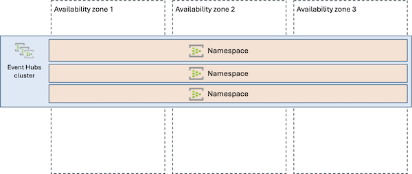
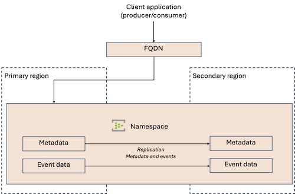
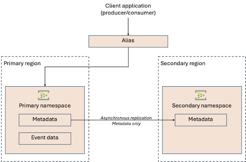

# Reliability in Azure Event Hubs

Azure Event Hubs is a native data-streaming service in the cloud that can stream millions of events per second, with low latency, from any source to any destination. You can use Event Hubs to ingest and store streaming data, and you can work with client applications that are designed for Apache Kafka or that use the Azure Event Hubs client SDKs.

This article describes reliability support in [Azure Event Hubs](../event-hubs/event-hubs-about.md). It covers intra-regional resiliency via [availability zones](#availability-zone-support) and [multi-region support options](#multi-region-support).

[!INCLUDE [Shared responsibility description](includes/reliability-shared-responsibility-include.md)]

## Production deployment recommendations

To learn how to deploy Event Hubs to support your solution's reliability requirements, and how reliability affects other aspects of your architecture, see [Architecture best practices for Azure Event Hubs in the Azure Well-Architected Framework](/azure/well-architected/service-guides/event-hubs).

## Reliability architecture overview

This section describes some of the important aspects of how Event Hubs works that are most relevant from a reliability perspective. The section introduces the logical architecture, which include the resources and features that you deploy and use. It also discusses the physical architecture, which provides details on how the service works under the covers.

### Logical architecture

An Event Hubs [**namespace**](../event-hubs/event-hubs-features.md#namespace) is the management container for one or more event hubs. Management tasks such as allocating streaming capacity, configuring network security, and enabling geo-resilency and geo-disaster recovery are handled at the namespace level.

Within a namespace, you can organize events into an **event hub**, or **topic** for Apache Kafka applications. The event hub or topic is an append-only distributed log of your events.

Each event hub contains one or more [**partitions**](/azure/event-hubs/event-hubs-scalability#partitions), which are sequences of sequential events. Partitions enable your event hub to perform parallel processing and allow for horizontal scaling. Event Hubs only guarantees ordering within a single partition. Partitioning is an important aspect of your application's reliability design. When you design your application, you need to make a tradeoff between maximizing availability and consistency. For most applications, to maximize uptime, you should avoid addressing partitions directly from your client applications. For more information, see [Availability and consistency in Event Hubs](../event-hubs/event-hubs-availability-and-consistency.md).

Consumers that read from the event hub can read their events sequentially by maintaining their own **checkpoint**, which is the identifier of the last event they received.

To learn more about the fundamental concepts in Event Hubs, see [Features and terminology in Azure Event Hubs](../event-hubs/event-hubs-features.md).

### Physical architecture

A namespace runs within a **cluster**, which provides the underlying compute and storage resources. Most namespaces run on clusters that are shared with other Azure customers. When your namespace uses the Premium tier, the namespace is allocated dedicated resources within a shared cluster. When you use the Dedicated tier, you have a cluster dedicated to your namespaces. To learn more about dedicated clusters, see [Azure Event Hubs Dedicated tier overview](../event-hubs/event-hubs-dedicated-overview.md). Whichever tier and cluster type you use, Microsoft manages the clusters and their underlying virtual machines and storage.

To achieve redundancy, each cluster has multiple replicas that process read and write requests. For high availability and performance optimization, all data is stored on three storage replicas. You can scale your namespace's compute resources by deploying throughput units, processing units, or capacity units, depending on the tier. For more information, see [Scaling with Event Hubs](../event-hubs/event-hubs-scalability.md).

Clusters span multiple physical machines and racks, which reduces the risk of catastrophic failures affecting your namespace. In regions with availability zones, clusters are spread across separate physical datacenters. The [Availability zone support](#availability-zone-support) section of this document describes this support in more detail.

## Transient faults

[!INCLUDE [Transient fault description](includes/reliability-transient-fault-description-include.md)]

Azure Event Hubs service implements transparent failure detection and failover mechanisms so that the service continues to operate within the assured service-levels and typically without noticeable interruptions when failures occur.

When you're designing client applications to work with Event Hubs, follow this guidance:

- **Use the built-in retry policies in Event Hubs SDKs**, which implement exponential backoff by default. The SDKs automatically retry operations for retryable errors like network timeouts, throttling responses, or when the server is busy.
- **Configure appropriate timeout values** based on your application requirements. The default timeout is typically 60 seconds, but you can adjust this based on your scenario.
- **Implement checkpointing** in your event processor to track progress and enable recovery from the last processed position after transient failures.
- **Use batching for send operations** to improve throughput and reduce the impact of transient network issues on individual messages.

## Availability zone support

[!INCLUDE [Availability zone support description](includes/reliability-availability-zone-description-include.md)]

Azure Event Hubs supports zone-redundant deployments in all service tiers. When you create an Event Hubs namespace in a supported region, zone redundancy is automatically enabled at no additional cost. The zone-redundant deployment model applies to all Event Hubs features including Capture, Schema Registry, and Kafka protocol support.

The service transparently replicates your configuration, metadata, and event data across three availability zones in the region, providing automatic failover capability without any customer intervention required. All Event Hubs components including compute, networking, and storage are replicated across zones. The service has enough capacity reserves to instantly cope with the complete, catastrophic loss of a zone. This ensures that even if an entire availability zone becomes unavailable, Event Hubs continues to operate without data loss or interruption to your streaming applications.

### Region support

Zone-redundant Event Hubs namespaces can be deployed in [any Azure region that supports availability zones](./regions-list.md).

### Cost

There's no extra cost for zone redundancy with Event Hubs.

### Configure availability zone support

Event Hubs namespaces automatically support zone redundancy when deployed in [supported regions](#region-support). No further configuration is required.

### Normal operations

This section describes what to expect when Event Hubs namespaces are configured for zone redundancy and all availability zones are operational.

- **Traffic routing between zones**. Event Hubs operates in an active/active model where infrastructure in three availability zones simultaneously process incoming events.

- **Data replication between zones**. Event Hubs uses synchronous replication across availability zones. When an event is sent to Event Hubs, it's written to replicas in multiple zones before the write operation is acknowledged to the client. This ensures zero data loss even if an entire zone becomes unavailable. The synchronous replication approach provides strong consistency guarantees while maintaining low latency through optimized replication protocols.

### Zone-down experience

This section describes what to expect when Event Hubs namespaces are configured for zone redundancy and there's an availability zone outage.

- **Detection and response**: The Event Hubs service is responsible for detecting a failure in an availability zone. You don't need to do anything to initiate a zone failover.

- **Notification**: Event Hubs doesn't notify you when a zone is down. However, you can use [Azure Service Health](/azure/service-health/overview) to understand the overall health of the Event Hubs service, including any zone failures.

  Set up alerts to receive notifications of zone-level problems. For more information, see [Create Service Health alerts in the Azure portal](/azure/service-health/alerts-activity-log-service-notifications-portal).

- **Active requests**: During a zone failure, active requests might be dropped. If your clients handle [transient faults](#transient-faults) appropriately by retrying after a short period of time, it's unlikely they'll be substantially affected.

- **Expected data loss**: No data loss occurs during a zone failure because events are synchronously replicated across zones before acknowledgment.

- **Expected downtime**: A zone failure might cause a few seconds of downtime. If your clients handle [transient faults](#transient-faults) appropriately by retrying after a short period of time, it's unlikely they'll be substantially affected.

- **Traffic rerouting**: Event Hubs detects the loss of the zone. Then, any new requests are automatically redirected to another replica in one of the healthy availability zones.
    
    Event Hubs client SDKs typically handle connection management and retry logic transparently.

### Zone recovery

When an availability zone recovers, Event Hubs automatically reintegrates the zone into the active service topology. The recovered zone begins accepting new connections and processing events alongside the other zones. Data that was replicated to surviving zones during the outage remains intact, and normal synchronous replication resumes across all zones. No customer action is required for zone recovery and reintegration.

### Testing for zone failures

Because Event Hubs fully manages traffic routing, failover, and zone recovery for zone failures, you don't need to validate availability zone failure processes or provide any further input.

## Multi-region support

Azure Event Hubs provides two types of multi-region support:

- **[Geo-replication (Premium and Dedicated tiers)](#geo-replication)** provides active-active replication of both metadata and event data between a primary and one or more secondary regions. Geo-replication is the preferred approach for most applications that need to be resilient to region outages, including those that have a low tolerance for the loss of event data.

- **[Metadata geo-disaster recovery (Standard tier and above)](#metadata-geo-disaster-recovery)** provides active-passive replication of configuration and metadata between a primary and a secondary region, but it doesn't replicate event data. Geo-disaster recovery is intended for applications that can tolerate some loss of event data during a disaster scenario, and that need to quickly resume operations in another region.

Both geo-replication and metadata geo-disaster recovery require you to manually initiate failover or promotion of a secondary region to become the new primary region. Microsoft doesn't automatically perform failover or promotion for you, even if your primary region is down.

### Geo-replication

Geo-replication, which is available in the Premium and Dedicated tiers, provides replication of both metadata (entities, configuration and properties) and data (event payloads) for the namespace. Geo-replication lets you configure the replication approach for your namespace's configuration and event data. Geo-replication ensures that your events are always available in another region, and that you can switch to use the secondary region when you need to. Schema registry metadata and data is also replicated.

Geo-replication is useful for most scenarios where you need to be resilient to region outages and when you have a low tolerance for the loss of event data.

The namespace can be thought of as being extended across regions, with one region being the primary and the others being secondaries. You see a single namespace in your Azure subscription, no matter how many secondary regions you configure for geo-replication.

    
At any time, you can *promote* the secondary region to become a primary region. When you promote a secondary, Event Hubs repoints the namespace's FQDN (fully qualified domain name) to the selected secondary region, and the previous primary region is demoted to a secondary region. When you promote a secondary region to primary, you decide whether to perform a *planned promotion*, which means you wait for data to finish being replicated, or to perform a *forced promotion* that might result in data loss in some situations.

> [!NOTE]
> Event Hubs geo-replication uses the term *promotion* because it best represents the process of promoting a secondary to primary (and subsequently demoting a secondary to primary). You might also see the term *failover* used to describe the general process.

This section provides a summary of some of the important aspects of geo-replication, but it's important you review the full documentation to understand exactly how it works. For more information, see [Azure Event Hubs Geo-replication](../event-hubs/geo-replication.md).

#### Region support

You can select any Azure region where Event Hubs is available for your primary or secondary regions. Because you're not restricted to Azure paired regions, you have the flexibility to choose secondary regions based on your requirements for latency, compliance, or data residency.

#### Requirements

To enable geo-replication, your namespace must be in the Premium or Dedicated tier.

#### Considerations

When you enable geo-replication, consider the following:

- **Checkpoint format:**  The format of checkpoints changes. For more information, see [Consuming data](../event-hubs/geo-replication.md#consuming-data).

- **Private endpoints:** If you use private endpoints to connect to your namespace, you also need to configure networking in your primary and secondary regions. For more information, see [Private endpoints](../event-hubs/geo-replication.md#private-endpoints).

#### Cost

When you enable geo-replication, you pay for processing units in each region, plus inter-region data transfer charges for replication traffic. For more information, see [Pricing](../event-hubs/geo-replication.md#pricing).

#### Configure multi-region support

- **Enable geo-replication on a new or existing namespace.** To set up active-active replication between a newly created namespace, see [Enable Geo-replication on a new namespace](../event-hubs/use-geo-replication.md#enable-geo-replication-on-a-new-namespace). To set up active-active replication on an existing namespace, see [Enable Geo-replication on a existing namespace](../event-hubs/use-geo-replication.md#enable-geo-replication-on-an-existing-namespace).

    When you configure geo-replication, you select how you want your data to be replicated. You can select synchronous or asynchronous replication. If you configure asynchronous replication, you also must specify the maximum replication lag you're prepared to accept. See [Normal operations](#normal-operations-1) for a summary of how these replication modes work and their tradeoffs.

- **Change replication approach.** To change between synchronous and asynchronous replication modes, see [Switch replication mode](../event-hubs/use-geo-replication.md#switch-replication-mode).

- **Disable geo-replication.** To disable geo-replication to a secondary region, see [Remove a secondary](../event-hubs/use-geo-replication.md#remove-a-secondary).

#### Capacity planning and management

When planning for multi-region deployments, ensure that both regions have sufficient capacity to handle the full load if one region fails.

For geo-replication, both regions actively process events, so size each region to handle the expected load plus overhead for replication traffic. Monitor metrics like incoming messages, throughput unit utilization, and replication lag to ensure the namespace has adequate capacity in each region.

#### Normal operations

This section describes what to expect when an Event Hubs namespace is configured for geo-replication, and the primary region is operational.

- **Traffic routing between regions**. Client applications connect through the FQDN for your namespace, and their traffic is routed to the primary region.

    Only the primary region actively processes events from clients during normal operations. The secondary region receives replicated events but otherwise remains passive in standby mode.

- **Data replication between regions**. The way data is replicated between the primary and secondary regions depends on whether your replication pairing is configured to use synchronous or asynchronous replication.

    - *Synchronous:* Events are replicated to the secondary region before the write operation completes.
    
        This mode provides the greatest assurance that your event data is safe because it must be committed in the primary and secondary region. However, synchronous replication substantially increases the write latency for incoming events. It also requires that the secondary region be available to accept the write operation, so an outage in any secondary region causes the write operation to fail.

    - *Asynchronous:* Events are written to the primary region and then the write operation completes. A short time later, the events are replicated to the secondary region.
    
        This mode provides a higher write throughput than synchronous replication because there's no inter-region replication latency during write operations. Also, the asynchronous replication mode can tolerate the loss of a secondary region while still allowing write operations in the primary region. However, if the primary region has an outage, any data that hasn't yet been replicated to the secondary region might be unavailable or lost.

        When you configure asynchronous replication, you configure the maximum acceptable lag time for replication to take. At any time, you can verify the current replication lag [by using Azure Monitor metrics](../event-hubs/geo-replication.md#monitoring-data-replication).
        
        If the asynchronous replication lag increases beyond the maximum you specify, the primary region starts to throttle incoming requests so that the replication can catch up. To avoid this situation, it's important to select secondary regions that aren't too geographically distant, and to ensure that your capacity is sufficient for the throughput.

    For more information, see [Replication modes](../event-hubs/geo-replication.md#replication-modes).

#### Region-down experience

This section describes what to expect when an Event Hubs namespace is configured for geo-replication and there's an outage in the primary or a secondary region.

- **Detection and response**: You're responsible for deciding when to promote your namespace's secondary region to become the new primary region. Microsoft doesn't make this decision or initiate the process for you, even if there's a region outage.

    To learn how to promote a secondary region to be the new primary, see [Promote secondary](../event-hubs/use-geo-replication.md#promote-secondary).
    
    When you promote a secondary region, you must choose whether to perform a *planned promotion* or a *forced promotion*. A planned promotion waits for the secondary region to catch up before accepting new traffic, so it eliminates data loss but introduces downtime.
    
    During an outage in the primary region, you typically need to perform a forced promotion. If the primary region is still available and you choose to trigger a promotion for another reason, you might choose to perform a planned promotion.

- **Notification**: Event Hubs doesn't notify you when a region is down. However, you can use [Azure Service Health](/azure/service-health/overview) to understand the overall health of the Event Hubs service, including any region failures. You can use the information, alongside other metrics, to decide when to promote a secondary region to primary.

    Set up alerts to receive notifications of region-level problems. For more information, see [Create Service Health alerts in the Azure portal](/azure/service-health/alerts-activity-log-service-notifications-portal).

- **Active requests**: The behavior depends on whether the region outage is in the primary or a secondary region:

    - *Primary region outage:* If the primary region is unavailable, all active requests are terminated. Client applications should retry operations once the promotion is complete.

    - *Secondary region outage:* An outage in the secondary region might cause problems for active requests in the following situations:

        - If you use the synchronous replication mode, no writes can be completed in the primary region if any secondary region is unavailable.
        - If you use the asynchronous replication mode, your namespace will start throttling and won't accept new events once the replication lag reaches the maximum replication lag you've configured.

        To continue using the namespace in the primary region, you can remove the secondary namespace from your geo-replication configuration.

- **Expected data loss**: The amount of data loss you can expect depends on the type of promotion you perform (planned or forced) and the replication mode (synchronous or asynchronous):

    - *Planned promotion:* No data loss is expected.
    
        However, during a region outage, a planned promotion might not be possible because it requires all of the primary and secondary regions to be available.

    - *Forced promotion, synchronous replication:* No data loss is expected.

    - *Forced promotion, asynchronous replication:* You might experience some data loss for recent events that haven't yet been replicated to the secondary region. The amount depends on the replication lag. At any time, you can verify the current replication lag [by using Azure Monitor metrics](../event-hubs/geo-replication.md#monitoring-data-replication).

- **Expected downtime**: The amount of downtime you can expect depends on the type of promotion you perform (planned or forced):

    - *Planned promotion:* The first step in a planned promotion is for the data to finish replicating to the secondary region. Usually that completes quickly, but in some situations it might take up to the length of the replication lag. After the replication completes, the promotion process typically takes approximately 5 to 10 minutes, although it can sometimes take longer for DNS entries to be fully replicated and updated by clients.
    
        No writes are accepted in the primary region during the entire promotion process.

        However, during a region outage, a planned promotion might not be possible because it requires all of the primary and secondary regions to be available.

    - *Forced promotion:* During a forced promotion, Event Hubs doesn't wait for any data replication to complete, and it initiates the promotion immediately. The promotion process typically takes approximately 5 to 10 minutes, although it can sometimes take longer for DNS entries to be fully replicated and updated by clients.

        No writes are accepted in the primary region during the entire promotion process.

- **Traffic rerouting**: After the promotion completes, the namespace's FQDN points to the new primary region. However, this redirection depends on client applications updating their DNS records and honoring the time-to-live (TTL) of the namespace DNS records.

    In some situations, consumer applications need to be configured to behave consistently after region promotion occurs. For more information, see [Consuming data](../event-hubs/geo-replication.md#consuming-data).

#### Region recovery

After the original primary region recovers, you may want to promote the namespace's primary region again. To return the namespace to its original primary region, you must follow the same region promotion process.

If you performed a forced promotion, then any data that was lost is unrecoverable, even after the primary region is now available.

#### Testing for region failures

You can test geo-replication by temporarily promoting the secondary region to primary and validate that your client applications can switch between regions with minimal disruption.

Monitor the promotion duration and validate that your runbooks and automation work correctly. After testing, you can fail back to the original configuration.

However, be aware of the potential downtime and data loss that you might experience during and after the promotion process. Typically it's a good practice to test geo-replication in a non-production environment that mirrors the configuration of your production namespace.

### Metadata geo-disaster recovery

Metadata geo-disaster recovery, available in the Standard tier and above, is a solution to assist in your recovery from disaster scenarios, including the catastrophic loss of a region. Geo-disaster recovery only replicates the configuration and metadata of your namespace, but it doesn't replicate event data. It assists disaster recovery by ensuring a namespace in another region is preconfigured and ready to immediately accept events from clients. Geo-disaster recovery is intended as a one-way recovery solution, and doesn't support failback to the prior primary region.

Metadata geo-disaster recovery is most useful for applications that don't have a strict need to maintain every event and that can tolerate some loss of data during a disaster scenario. For example, if your events represent sensor readings that you later aggregate, it might be acceptable to lose some events from a lost region as long as you can quickly start to process new events in another region.

> [!IMPORTANT]
> Geo-disaster recovery enables continuity of operations with the same configuration, but **doesn't replicate the event data**. If you need to replicate event data, or if you need to operate multiple regional namespaces in active-active configurations for resiliency purposes, consider using [geo-replication](#geo-replication) or an [alternative multi-region approach](#alternative-multi-region-approaches).

When you configure metadata geo-disaster recovery, you create an *alias* that client applications connect to. The alias is an FQDN (fully qualified domain name). By default, the alias directs all traffic to the primary namespace.

If the primary region fails or there's another type of disaster, you can manually initiate a single-time, one-way failover move from the primary to the secondary at any time. The failover is nearly instantaneous once initiated. During the failover process, the geo-disaster recovery alias is repointed to the secondary namespace. After the move, the pairing is then removed.

This section provides a summary of some of the important aspects of geo-disaster recovery, but it's important you review the full documentation to understand exactly how it works. For more information, see [Azure Event Hubs - Geo-disaster recovery](../event-hubs/event-hubs-geo-dr.md).

#### Region support

You can select any Azure region where Event Hubs is available for your primary or secondary namespace. Because you're not restricted to Azure paired regions, you have the flexibility to choose secondary regions based on your requirements for latency, compliance, or data residency.

#### Requirements

- **Primary namespace tier:** Your primary namespace must be in the Standard tier or above to use metadata geo-disaster recovery.

- **Secondary namespace tier:** Metadata geo-disaster recovery supports specific combinations of tiers for the primary and secondary namespaces. For detailed information, see [Supported namespace pairs](../event-hubs/event-hubs-geo-dr.md#supported-namespace-pairs).

#### Considerations

- **Role assignments:** Microsoft Entra role-based access control (RBAC) assignments to entities in the primary namespace aren't replicated to the secondary namespace. Create role assignments manually in the secondary namespace to secure access to them.

- **Schema registry:** Schema registry metadata is replicated when you use metadata geo-disaster recovery, but data within the schema registry isn't replicated.

- **Application design:** Geo-disaster recovery requires specific considerations when you design your client applications. For more information, see [Considerations](../event-hubs/event-hubs-geo-dr.md#considerations).

- **Private endpoints:** If you use private endpoints to connect to your namespace, you need to configure networking in both your primary and secondary region. For more information, see [Private endpoints](../event-hubs/event-hubs-geo-dr.md#private-endpoints).

#### Cost

When you enable metadata geo-disaster recovery, you pay for both the primary and secondary namespaces, plus inter-region data transfer charges for replication traffic.

#### Configure multi-region support

- **Create metadata geo-disaster recovery pairing.** To configure disaster recovery between primary and secondary namespaces see [Setup and failover flow](../event-hubs/event-hubs-geo-dr.md#setup).

- **Disable metadata geo-disaster recovery.** To break the pairing between namespaces, see [Setup and failover flow](../event-hubs/event-hubs-geo-dr.md#setup).

#### Capacity planning and management

When planning for multi-region deployments, ensure that both regions have sufficient capacity to handle the full load if one region fails. Although the secondary remains passive during normal operations, it must be ready to handle your traffic immediately after failover. Consider how you can scale secondary namespace capacity so it's ready to receive production traffic. If you can tolerate additional downtime during the failover process, you can scale the secondary namespace capacity during or after failover. If you need to reduce downtime, you can provision capacity in the secondary namespace ahead of time so it's always ready to receive production load.

#### Normal operations

This section describes what to expect when an Event Hubs namespace is configured for geo-disaster recovery, and the primary region is operational.

- **Traffic routing between regions**. Client applications connect through the geo-disaster recovery alias for your namespace, and their traffic is routed to the primary namespace in the primary region.

    Only the primary namespace actively processes events from clients during normal operations. The secondary remains passive in standby mode, and any requests to access data in the secondary namespace fail.

- **Data replication between regions**. Only configuration metadata is replicated between the namespaces. Replication of configuration occurs continuously and is performed asynchronously.

    All event data remains in the primary namespace only and isn't replicated to the secondary namespace.

#### Region-down experience

This section describes what to expect when an Event Hubs namespace is configured for geo-disaster recovery and there's an outage in the primary region.

- **Detection and response:** You must monitor region health and initiate failover manually. Microsoft doesn't perform failover or promote a secondary region automatically, even if your primary region is down.

    To learn how to initiate failover, see [Manual failover](../event-hubs/event-hubs-geo-dr.md#manual-failover).

    Remember that failover is a one-way operation, so you need to reestablish the geo-disaster recovery pairing later. For more information, see [Region recovery](#region-recovery-1).

- **Notification**: Event Hubs doesn't notify you when a region is down. However, you can use [Azure Service Health](/azure/service-health/overview) to understand the overall health of the Event Hubs service, including any region failures. You can use the information, alongside other metrics, to decide when to initiate a failover.

    Set up alerts to receive notifications of region-level problems. For more information, see [Create Service Health alerts in the Azure portal](/azure/service-health/alerts-activity-log-service-notifications-portal).

- **Active requests:** Any active requests in progress are terminated when the failover starts. Client applications should retry operations once the failover completes.

- **Expected data loss:** 

    - *Metadata:* Generally all configuration and metadata is expected to be replicated to the secondary namespace. However, because metadata replication occurs asynchronously, any recent changes might not have been replicated, especially complex changes. Verify the configuration of your secondary namespace before clients start to access it.

    - *Event data:* Event data isn't replicated between regions, so all of the events in your primary namespace are unavailable if its region is down.
    
        However, the events aren't permanently lost except in a catastrophic disaster that causes the total loss of the primary region. Assuming the region recovers, you can retrieve events from the primary namespace later.

- **Expected downtime:** Failover typically occurs within 5 to 10 minutes, although it can sometimes take longer for DNS entries to be fully replicated and updated by clients.

- **Traffic rerouting:** Clients that use the geo-disaster recovery alias to connect to the namespace are automatically redirected to the secondary namespace after failover. However, this redirection depends on client applications updating their DNS records and honoring the time-to-live (TTL) of the namespace DNS records.

#### Region recovery

After the original primary region recovers, you must manually re-establish the pairing and optionally fail back. Create a new geo-disaster recovery pairing with the recovered region as secondary, then perform another failover if you want to return to the original region. This process involves potential data loss of events sent to the temporary primary.

If the disaster caused the loss of all zones in the primary region, your data might be unrecoverable. However, in other scenarios, your event data is preserved in the primary namespace from before the failover is recoverable, and the historic events can be obtained from the old primary namespace once access is restored. You're responsible for configuring your applications to receive process those events. Microsoft doesn't automatically restore them into your secondary region.

#### Testing for region failures

To test your response and disaster recovery processes, you can perform a planned failover during a maintenance window. Initiate failover from your primary namespace to your secondary namespace, and verify that your applications can connect and process events from the new primary.

Monitor the failover duration and validate that your runbooks and automation work correctly. After testing, you can fail back to the original configuration.

However, be aware of the potential downtime and data loss that you might experience during and after the failover process. Typically it's a good practice to test geo-replication in a non-production environment that mirrors the configuration of your production namespace.

### Alternative multi-region approaches

Geo-replication and metadata geo-disaster recovery provide resiliency to region outages and other problems, and are suitable for most workloads. However, you might use an Event Hubs tier that doesn't support these features, or you might have requirements for custom replication or for maintaining multiple active regions simultaneously.

There are a range of design patterns to achieve different types of multi-region support in Event Hubs. Many of the patterns require deploying multiple namespaces and using services like Azure Functions to replicate events between them. To learn more, see [Multi-site and multi-region federation](../event-hubs/event-hubs-federation-overview.md).

## Backups

Event Hubs isn't designed as a long-term storage location for your data. Typically, data is stored in an event hub for a short period of time, and is then processed or persisted into another data storage system.

However, if you need to retain a copy of your events, consider using [Event Hubs Capture](../event-hubs/event-hubs-capture-overview.md), which saves copies of events to an Azure Blob Storage account.

## Service-level agreement

[!INCLUDE [SLA description](includes/reliability-service-level-agreement-include.md)]

Your namespace's availability SLA is higher when it uses the Premium or Dedicated tiers.

### Related content

- [Event Hubs documentation](../event-hubs/event-hubs-about.md)
- [Azure reliability overview](/azure/reliability/overview)
