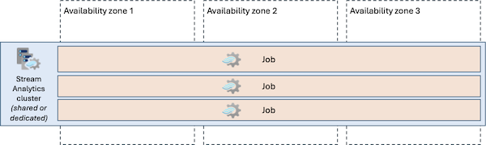

# Reliability in Azure Stream Analytics

Azure Stream Analytics is a fully managed real-time analytics service designed to process and analyze streaming data from multiple sources simultaneously. Stream Analytics lets you build complex event processing pipelines with SQL-like queries while providing built-in reliability features to ensure continuous data processing. This article describes reliability support in [Stream Analytics](../stream-analytics/stream-analytics-introduction.md). It covers intra-regional resiliency via [availability zones](#availability-zone-support) and [multi-region deployment approaches](#multi-region-support).

[!INCLUDE [Shared responsibility description](includes/reliability-shared-responsibility-include.md)]

> [!IMPORTANT]
> When you consider the reliability of Stream Analytics, you also need to consider the reliability of your data sources, including inputs and outputs. Improving the resiliency of Stream Analytics alone might have limited impact if the other components aren't equally resilient. Depending on your resiliency requirements, you might need to make configuration changes across multiple areas.

## Production deployment recommendations

To ensure high reliability in production environments with Stream Analytics, we recommend that you:

> [!div class="checklist"]
> - **Use availability zones:** Deploy your streaming jobs and other resources in regions that support availability zones.
> - **Deploy sufficient capacity:** Set your streaming units based on your expected throughput, with additional capacity for handling peak loads and potential zone failures, and with a buffer above your baseline requirements in case of sudden increases.
> - **Monitor health:** Implement comprehensive monitoring using Azure Monitor metrics and diagnostic logs to track job health, input/output events, and resource utilization. Configure alerts for critical metrics like watermark delay and runtime errors to detect issues before they impact data processing. For more information, see [Monitor Azure Stream Analytics](../stream-analytics/monitor-azure-stream-analytics.md).
> - **For mission-critical streaming workloads:** Consider implementing a multi-region deployment strategy with synchronized job configurations across regions. While Stream Analytics doesn't provide native multi-region replication, you can achieve regional redundancy by deploying identical jobs in multiple regions with appropriate data routing mechanisms. For more information, see [Multi-region support](#multi-region-support).

## Reliability architecture overview

[!INCLUDE [Introduction to reliability architecture overview section](includes/reliability-architecture-overview-introduction-include.md)]

### Logical architecture

A *streaming job*, or simply *job*, is the fundamental unit in Stream Analytics that allows you to define and run your stream processing logic. A job consists of the following major components:

- *Inputs* that read streaming data from data sources, such as Azure Event Hubs, Azure IoT Hub, or Azure Storage.
- A *query* that processes and transforms the data.
- *Outputs* that continuously write results to various destinations, such as Azure SQL Database, Azure Data Lake Storage, Azure Cosmos DB, Power BI, and more.

For more information on Stream Analytics jobs and the resource model, see [Azure Stream Analytics resource model](../stream-analytics/stream-analytics-resource-model.md).

### Physical architecture

- **Worker nodes**. Stream Analytics jobs on virtual machines (VMs) called *worker nodes* that run within a *cluster*. When you use the Standard or StandardV2 SKUs, your jobs run on shared clusters. When you use the [Dedicated SKU](../stream-analytics/cluster-overview.md) your jobs run on their own dedicated cluster.

   Because the platform automatically manages worker node creation, job placement across worker nodes, health monitoring, and the replacement of unhealthy worker nodes, you don't need to see or manage the VMs directly. 

- **Streaming units**. While the platform manages worker nodes and job distribution across worker nodes, you're responsible for allocating *streaming units (SUs)* to jobs. SUs represent the compute resources that are allocated to execute a job. The higher the number of SUs, the more compute resources are allocated for the job. For more information, see [Understand and adjust Stream Analytics streaming units](../stream-analytics/stream-analytics-streaming-unit-consumption.md).

Stream Analytics maintains job state through regular *checkpointing* of state, enabling quick recovery with minimal data reprocessing in case of failures. When processing failures occur, Stream Analytics automatically restarts from the last checkpoint and reprocesses events that weren't fully processed. This guarantee applies to all built-in functions and user-defined functions within the job. However, achieving end-to-end exactly-once delivery depends on your output destination's capabilities. For more information, see [Checkpoint and replay concepts in Azure Stream Analytics jobs](../stream-analytics/stream-analytics-concepts-checkpoint-replay.md).

> [!NOTE]
> With [Azure Stream Analytics on IoT Edge](../stream-analytics/stream-analytics-edge.md) you can run jobs on your own infrastructure. When you use Stream Analytics on IoT Edge, you're responsible for configuring it to meet your reliability requirements. Stream Analytics on IoT Edge is outside the scope of this article.

## Transient faults

[!INCLUDE [Transient fault description](includes/reliability-transient-fault-description-include.md)]

Stream Analytics automatically handles many transient faults for both ingesting data from inputs and writing data to outputs through built-in retry mechanisms.

When a worker node running your job restarts, or if the job is moved between worker nodes, the job might replay some of the processing work. It's important to deploy sufficient streaming units for the job to handle these temporary increases in load.

It's a good practice to configure [output error policies](../stream-analytics/stream-analytics-output-error-policy.md). However, these policies only apply to data conversion errors, and they don't influence the behavior for handling transient faults.

## Availability zone support

[!INCLUDE [AZ support description](includes/reliability-availability-zone-description-include.md)]

Stream Analytics is automatically zone-redundant in regions that support availability zones. When you create a Stream Analytics job in a zone-enabled region, the service distributes your job's compute resources across multiple availability zones. This zone-redundant deployment model ensures that your streaming jobs continue to process data even if an entire availability zone becomes unavailable.

> [!WARNING]
> **Note to product group:** Please advise how many zones you guarantee to use.

The zone-redundant architecture applies to all Stream Analytics features including query processing, checkpointing, and job management operations. Your job's state and checkpoint data are automatically replicated across zones, ensuring no data loss and near-zero downtime during zone failures.

### Region support

Zone redundancy for Stream Analytics resources is supported in any region that supports availability zones. For the complete list of regions that support availability zones, see [Azure regions with availability zones](./regions-list.md).

### Requirements

Zone redundancy is available in all SKUs of the Stream Analytics service.

### Cost

Zone redundancy on Stream Analytics doesn't incur additional charges. You pay the same rate for streaming units whether your job runs in a zone-redundant configuration or not. For information, see [Azure Stream Analytics pricing](https://azure.microsoft.com/pricing/details/stream-analytics/).

### Configure availability zone support

- **Create a zone-redundant Stream Analytics job.** Zone redundancy is automatically enabled when you create a Stream Analytics job in a supported region. No configuration is required.

    For deployment instructions, see [Quickstart: Create a Stream Analytics job by using the Azure portal](../stream-analytics/stream-analytics-quick-create-portal.md) and [Quickstart: Create a dedicated Azure Stream Analytics cluster using Azure portal](../stream-analytics/create-cluster.md).

- **Enable zone redundancy.** For the Standard and StandardV2 SKUs, all jobs in regions with availability zones are automatically zone-redundant. You don't need to enable zone redundancy.

    For dedicated clusters, any clusters created after **PG TO CONFIRM DATE** are zone-redundant in supported regions. Dedicated clusters created before this date need to be recreated to achieve zone redundancy.

    > [!WARNING]
    > **Note to product group:** Please advise how customers can tell if their jobs/clusters are zone-redundant, such as a cutoff creation date.

- **Disable zone redundancy.** Zone redundancy can't be disabled.

### Normal operations

This section describes what to expect when Stream Analytics jobs are configured with availability zone support and all availability zones are operational.

- **Traffic routing between zones**. Stream Analytics runs each job on worker nodes. Incoming streaming data might be processed by workers in any zone, with the service automatically managing load distribution. The platform uses internal load balancing to distribute processing tasks across zones.

- **Data replication between zones**. Stream Analytics replicates job state and checkpoint data synchronously across availability zones. When your job processes events and updates its state, these changes are written to multiple zones before being acknowledged. This synchronous replication ensures zero data loss even if an entire zone becomes unavailable. The replication process is transparent to your application and doesn't impact processing latency under normal conditions.

### Zone-down experience

This section describes what to expect when Stream Analytics jobs are configured with availability zone support and there's an availability zone outage.

- **Detection and response**: The Stream Analytics platform is responsible for detecting a failure in an availability zone and responding. Jobs that are running on workers in the failed zone are marked as unhealthy, and processing workload is redistributed to workers in the remaining healthy zones. You don't need to do anything to initiate a zone failover.

- **Notification**: Stream Analytics doesn't notify you when a zone is down. However, you can use [Azure Resource Health](/azure/service-health/resource-health-overview) to monitor for the health of your gateway. You can also use [Azure Service Health](/azure/service-health/overview) to understand the overall health of the Stream Analytics service, including any zone failures.

    Set up alerts on these services to receive notifications of zone-level problems. For more information, see [Create Service Health alerts in the Azure portal](/azure/service-health/alerts-activity-log-service-notifications-portal) and [Create and configure Resource Health alerts](/azure/service-health/resource-health-alert-arm-template-guide).

- **Active requests**: Running jobs pause for a few seconds while they shift to another worker in a healthy availability zone. They automatically resume after the platform moves them.

    Stream Analytics uses checkpointing to maintain processing state. During a zone failure, in-flight events being processed by workers in the failed zone are automatically reprocessed from the last checkpoint by workers in healthy zones.

- **Expected data loss**: The job checkpointing system ensures no data loss. Some events might be reprocessed if they were already processed but not yet checkpointed.

- **Expected downtime**: Running jobs might pause for a few seconds while they shift to another worker in a healthy availability zone. They automatically resume after the platform moves them.

- **Traffic rerouting**: The service automatically redirects all new input data to workers in healthy zones. Existing connections from input sources are re-established with workers in operational zones. Output connections are similarly re-established, ensuring continuous data flow through your streaming pipeline.

### Zone recovery

When the failed availability zone recovers, Stream Analytics automatically reintegrates it into the active processing pool. Jobs begin to use the recovered infrastructure.

You don't take any action for zone recovery, because the platform handles all aspects of zone recovery operations including state synchronization and workload redistribution.

### Testing for zone failures

The Stream Analytics platform manages traffic routing, failover, and zone recovery. This feature is fully managed, so you don't need to initiate or validate availability zone failure processes.

## Multi-region support

Stream Analytics resources are deployed into a single Azure region. If the region becomes unavailable, your jobs (and dedicated clusters, if applicable) are also unavailable.

### Alternative multi-region approaches

To achieve multi-region resilience for your streaming workloads, consider deploying separate jobs in multiple regions. When you do so, you're responsible for deploying and managing the jobs, and for configuring the appropriate data routing and synchronization strategies. The Stream Analytics jobs are two separate entities. It's the responsibility of your application to both send input data into the two regional inputs and reconcile between the two regional outputs. For more information about this approach, see [Achieve geo-redundancy for Stream Analytics jobs](../stream-analytics/geo-redundancy.md).

## Backups

Because running jobs don't contain state, Stream Analytics doesn't have a built-in backup and restore feature.

However if you want to move, copy or back up the definition and configuration of your jobs, you can use the Stream Analytics extension for Visual Studio Code to export an existing job in the Azure cloud to your local computer. Once you save the entire configuration of your Stream Analytics jobs locally, you can then deploy it to the same or another Azure region. To learn how to copy, back up, and move your Stream Analytics jobs, see [Copy, back up and move your Azure Stream Analytics jobs](../stream-analytics/copy-job.md).

## Reliability during service maintenance

Stream Analytics performs automatic platform maintenance to apply security updates, deploy new features, and improve service reliability. As a result, Stream Analytics can have service updates deployed on a weekly (or more frequent) basis. The Stream Analytics service ensures any new update passes rigorous internal rings to have the highest quality.

Consider the following points to ensure your jobs are resilient to service maintenance activities:

- **Configure jobs to be resilient to replays:** Checkpoints are usually used to restore data after service maintenance. However, occasionally a replay technique needs to be used instead of a checkpoint. It's important that your jobs are configured so that replays don't cause incorrect or partial results in your output. For more information, see [Job recovery from a service upgrade](../stream-analytics/stream-analytics-concepts-checkpoint-replay.md#job-recovery-from-a-service-upgrade).

- **Consider mitigating the risk of bugs by deploying identical jobs:** The service proactively looks for many signals after deploying to each batch to get more confidence that there are no bugs introduced. However, no matter how much testing is done, there's still a risk that an existing, running job may break due to the introduction of a problem introduced by maintenance. If you are running mission-critical jobs, these risks need to be avoided.

    You can reduce the risk of a bug affecting your workload by deploying identical jobs to two Azure regions. You should then [monitor these jobs](../stream-analytics/monitor-azure-stream-analytics.md) to get notified when something unexpected happens. If one of these jobs ends up in a [Failed state](../stream-analytics/job-states.md) after a Stream Analytics service update, you should:

    - [Contact Azure support](https://azure.microsoft.com/support) to help identify the cause and resolve the problem.
    - Fail over any downstream consumers to use the healthy job output.

    When you select Azure regions to use for your secondary job, consider whether your region has a [paired region](./regions-paired.md). The [Azure regions list](./regions-list.md) has the most up-to-date information on which regions are paired. Stream Analytics guarantees that infrastructure in paired regions are updated at different times. The deployment of an update to Stream Analytics doesn't occur at the same time in a set of paired regions. As a result there is a sufficient time gap between the updates to identify potential issues and remediate them.

## Service-level agreement

[!INCLUDE [SLA description](includes/reliability-service-level-agreement-include.md)]

Stream Analytics provides separate availability SLAs for API calls to manage jobs, and for the operations of the jobs.

### Related content

- [Azure Stream Analytics documentation](../stream-analytics/index.yml)
- [Stream Analytics monitoring](../stream-analytics/stream-analytics-monitoring.md)
- [Stream processing architectures](/azure/architecture/reference-architectures/data/stream-processing-stream-analytics)
