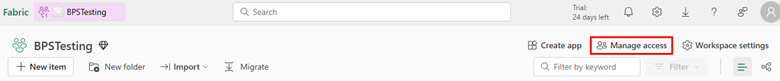

# Configure SAP source system with Azure Data Factory

In this article, we'll describe the steps required to configure SAP source system with Azure Data Factory. This document contains steps on prerequisites needed in your Azure environment and details on how to set up the connection in your Business Process Solution item.

## Prerequisites

Before we create a connection to SAP source system in our Business Process Solution item, we need to complete following prerequisites in our Azure Subscription. These prerequisites include registering required services in Azure subscription, creating service principal and deploying Self-Hosted Integration Runtime on Azure VM.

### Register services in Azure Subscription

The resource provider defines the Azure resources you can deploy to your account. A resource type's name follows the format: {resource-provider}/{resource-type}. For Business Process Solutions we need to register Storage Account, Key Vault and Data Factory resource providers. Follow the steps to register the services

1. Sign in to the [Azure Portal](https://portal.azure.com/).
2. On the Azure Portal menu, search for Subscriptions. Select it from the available options.
   :::image type="content" source="./media/configure-source-system-with-data-factory/open-subscriptions.png" alt-text="Azure Portal - Subscriptions" lightbox="./media/configure-source-system-with-data-factory/open-subscriptions.png":::
3. Select the subscription you want to view.
4. On the left menu and under Settings, select Resource providers.
   :::image type="content" source="./media/configure-source-system-with-data-factory/resource-providers.png" alt-text="Azure Portal - Resource Providers" lightbox="./media/configure-source-system-with-data-factory/resource-providers.png":::
5. Find the resource provider you want to register. In this case Microsoft.KeyVault
6. Select the resource provider to see the details of the resource provider.
7. Select the resource provider and select register.

**Repeat the above steps for Microsoft.Storage and Microsoft.DataFactory.**

### Required permissions in Azure Subscriptions

You need following permissions in the Azure Subscription or Azure Resource Group to deploy system using Azure Data Factory:

- Key Vault Secrets Officer Access: Assign Key Vault Secrets Officer access to the subscription for the user operating Enterprise Insights. Make sure it's Permanent access and not Time bound.
- Owner Role Assignment: Assign the Owner role on the subscription for the user operating Enterprise Insights. Make sure it's either Permanent access or if it's Time bound, activate it before running the configured source system operation.

### Create Service Principal

Below steps help you to set up the service principle required for Enterprise Insights. This service principle is used to access the resources in the Microsoft Fabric from Azure Data Factory.
We create the following resources in this step:

- Create a new service principle
- Create a new secret for the service principle

Follow the steps

1. Open Azure Portal by navigating to [Azure Portal](https://portal.azure.com/)
2. From the left menu, choose Microsoft Entra ID.
3. Navigate to app registrations and click on New Registration. Provide the name of the Service Principal.
   :::image type="content" source="./media/configure-source-system-with-data-factory/service-principle-name.png" alt-text="Create new App registration" lightbox="./media/configure-source-system-with-data-factory/service-principle-name.png":::
4. Click register to confirm.
5. To create a client secret, in App registrations, select your application.
6. In the Service Principal blade, navigate to Certificates & secrets section. Choose +New client secret. Provide the description of the client secret and choose validity time. Confirm by clicking Add.
   
7. Copy the value of the secret. We store it in the Key Vault. Notice that as you navigate out of this screen you won’t be able to retrieve the secret value again.
8. Navigate to the Microsoft Fabric workspace and add the created service principal as a Contributor in the workspace by clicking on the **Manage Access** button.
   

## Configure SAP source system in Business Process Solution

First step of configuration is setting up the source system; this step deploys the common artifacts required to get started. Follow the steps to configure your source system.

1. On the home screen, click on Configure source system button.
2. Click on the New source system button.
   :::image type="content" source="./media/configure-source-system-with-data-factory/create-source-system.png" alt-text="New source system button" lightbox="./media/configure-source-system-with-data-factory/create-source-system.png":::
3. Provide the inputs for the fields.
4. In the connection type, select Azure Data Factory, select subscription and location from the dropdown and enter a unique name for the resource group.
   :::image type="content" source="./media/configure-source-system-with-data-factory/create-data-factory-source-system.png" alt-text="Create new resource group" lightbox="./media/configure-source-system-with-data-factory/create-data-factory-source-system.png":::
5. Now in the System Connection section, enter the connection details for your SAP system. Here you need to enter the service principle secret we create as a part of prerequisites.
   :::image type="content" source="./media/configure-source-system-with-data-factory/enter-source-system-details.png" alt-text="SAP System connection details" lightbox="./media/configure-source-system-with-data-factory/enter-source-system-details.png":::
6. Once done, click on Create Button. You can monitor the deployment status by refreshing the page using the refresh button.
7. Once the deployment is done, you should be able to see the resources deployed to your workspace and also the resources deployed in your azure resource group.

## Deploy Self-Hosted Integration Runtime on Azure VM

You can follow detailed instructions on how to deploy and configure Self-Hosted Integration Runtime in Azure documentation: [Shared Integration Runtime](https://learn.microsoft.com/azure/data-factory/sap-change-data-capture-shir-preparation)

1. Deploy Azure VM in the same network / subnet as your SAP system. Direct connectivity between Self-Hosted Integration Runtime and SAP system is required to extract data.
2. Install SAP .NET Connector
3. Install the Java Runtime: [Download Java runtime](https://aka.ms/download-jdk/microsoft-jdk-11.0.19-windows-x64.msi)
4. Ensure that the JAVA_HOME system environment variable is set to the JDK folder (not just the JRE folder) you may also need to add the bin folder to your system's PATH environment variable.
5. Install Self-Hosted Integration Runtime. Stop at the registration step.
6. Open the Azure Data Factory and navigate to Manage -> Integration Runtimes.
7. Select Integration Runtime – SAP-IR
8. Use the Authentication Key to continue with the Self-Hosted Integration Runtime installation process. Copy the key to and complete the set up for integration runtime on your VM.
   :::image type="content" source="./media/configure-source-system-with-data-factory/integration-runtime-setting.png" alt-text="Self-Hosted Integration Runtime Key" lightbox="./media/configure-source-system-with-data-factory/integration-runtime-setting.png":::
9. Once the registration completes, the status of the Self-Hosted Integration Runtime should change to running in the Azure Data Factory.

## Next steps

Now that you have configured SAP source system with Azure Data Factory in your Business Process Solution item, you can proceed to configure dataset and relationships.

- [Configure Dataset in Business Process Solutions](configure-dataset.md)
