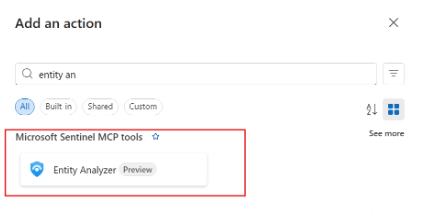

# Build logic apps with Microsoft Sentinel MCP tools (preview)

> [!IMPORTANT]
> This information relates to a prerelease product that may be substantially modified before it's released. Microsoft makes no warranties, expressed or implied, with respect to the information provided here.

You can access the value of Microsoft Sentinel's collection of Model Context Protocol (MCP) tools in [Azure Logic Apps](../../logic-apps/logic-apps-overview.md), starting with the [entity analyzer tool](sentinel-mcp-data-exploration-tool.md#entity-analyzer-preview). Security analysts and automation engineers often spend significant time creating complex Security Orchestration, Automation, and Response (SOAR) templates to enrich entities and reach verdicts.

The entity analyzer tool, built on Microsoft Sentinel data lake data, offers a single action that combines multiple data points to deliver a verdict for the entity. It supports user and URL entities, and you can easily access it through templates or integrate it into preexisting playbooks.

## Prerequisites to building a logic app

If you're new to using logic apps, see [Automate Threat Response with Playbooks in Microsoft Sentinel](../automation/automate-responses-with-playbooks.md) to get started with building them before proceeding to adding the entity analyzer tool.


## Add entity analyzer tool to a logic app

You have two options for adding the entity analyzer tool to your logic app:
- [Use an existing logic app template](#use-an-existing-logic-app-template)
- [Add to an existing logic app](#add-to-an-existing-logic-app)

### Use an existing logic app template 
You can use a logic app template for an easy and quick implementation of the entity analyzer tool. The following screenshot shows how one of the available templates (Incident Trigger Entity Analyzer) takes all users and URLs in an incident, enriches them by using the entity analyzer tool, and sends that analysis as a comment to the original incident:

:::image type="content" source="media/sentinel-mcp/logic-app-template.png" alt-text="Screenshot of the entity analyzer tool added to logic app template." lightbox="media/sentinel-mcp/logic-app-template.png":::

>[!IMPORTANT]
> Make sure that you have the **Sentinel SOAR Essentials** solution installed and up-to-date before installing a preexisting logic app template for entity analyzer. From the Microsoft Defender portal navigation menu, go to **Microsoft Sentinel** > **Content management** > **Content hub** to check and install or update.

To install a preexisting logic app template:

1. From the Microsoft Defender portal navigation menu, go to **Microsoft Sentinel** > **Configuration** > **Automation**.
1. Select **Playbook templates**, then search for **Entity Analyzer**.
1. Choose any of the following playbooks:
    - Incident Trigger Entity Analyzer
    - Url Trigger Entity Analyzer
    - HTTP Trigger Entity Analyzer
1. Select **Create playbook**.

When you create and run a playbook, insights from the entity analyzer appear as comments within an incident's details:

- The following screenshot shows the analyzer's top-level classification that a user account is compromised along with its supporting evidence, starting with the series of alerts and their associated [MITRE ATT&CK techniques](https://attack.mitre.org/), a list of malicious IP addresses the user signed in from, and a few suspicious user agents the user's activity originated from. (The IP addresses have been redacted.)

    :::image type="content" source="media/sentinel-mcp/logic-app-incident-classification.png" alt-text="Screenshot of the entity analyzer tool incident classification and evidence added to incident comments." lightbox="media/sentinel-mcp/logic-app-incident-classification.png":::

- The following screenshot shows the rest of the supporting evidence (the remaining suspicious user agents and a list of anomalous behavior). By providing these pieces of evidence, the analyzer can make security analysts, who typically have to query and analyze these themselves, feel more comfortable trusting its classification. The analyzer also gives recommendations to remediate the account compromise, and a list of data sources it used during analysis.

    :::image type="content" source="media/sentinel-mcp/logic-app-incident-recommendation.png" alt-text="Screenshot of the entity analyzer tool evidence and recommendations added to incident comments." lightbox="media/sentinel-mcp/logic-app-incident-recommendation.png":::


### Add to an existing logic app

To add the entity analyzer tool by using an existing logic app:

1. Access your logic app.
1. Select **Add a new action** and then search for **New Action**. 
1. Search for `entity analyzer` and choose the action listed under **Microsoft Sentinel MCP tools connector**.

    

1. Provide the following required information: 
    - **Workspace ID** - Microsoft Sentinel data lake workspace ID (GUID) 
    - **Look Back Days** - How far back this tool searches (depending on your use case)
    - **Properties** - Any of the following options:
        - For URL entity:
            ```
            {
            "entityType": "Url",
            "url": "[URL]"
            }
            ```
        - For user entity 
            ```
            {
            "entityType": "User",
            "userId": "[Microsoft Entra object ID]"
            }
            ```
        You can enter these properties either manually or as dynamic values from previous actions.

The following screenshot is an example output you receive from the action in the logic app:

:::image type="content" source="media/sentinel-mcp/logic-app-output.png" alt-text="Screenshot of a sample output received from the action in the logic app." lightbox="media/sentinel-mcp/logic-app-output.png":::

For more information about the specific input and output in the Connector, see [Microsoft Sentinel MCP](/connectors/sentinelmcp/).

## Authenticate to the connector
Every logic app connector requires an authentication connection. This new action type supports Microsoft Entra ID, service principals, and managed identities. As is the case with the MCP server, the logic app's identity requires **Security reader** to operate.

## Additional information

Running multiple instances of the entity analyzer at the same time can increase latency for each run. This issue is especially important when you use a **For each** loop in your entity analyzer logic apps, because it can queue multiple analyses at once (for example, multiple users in an incident, multiple incidents triggered at once). 

To prevent timeouts from too many analyses running at once, turn on the **Concurrency control** in the **For each** action. Start by setting the **Degree of parallelism** to `5` and then adjust it as needed based on how the analyzer runs in your organization.

:::image type="content" source="media/sentinel-mcp/logic-app-concurrency.png" alt-text="Screenshot of the logic app loop settings." lightbox="media/sentinel-mcp/logic-app-concurrency.png":::


For more information about loops, see [Add loops to repeat actions in workflows for Azure Logic Apps](../../logic-apps/logic-apps-control-flow-loops.md).

 
## Related content
- [Get started with Microsoft Sentinel MCP server](sentinel-mcp-get-started.md)
- [Tool collection in Microsoft Sentinel MCP server](sentinel-mcp-tools-overview.md)