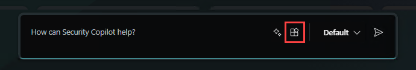

# Use an MCP tool in Microsoft Security Copilot


This article shows you how to add Microsoft Sentinel's Model Context Protocol (MCP) [collection of security tools](sentinel-mcp-tools-overview.md#available-collections) or your own custom tools to your AI agents in [Microsoft Security Copilot](/copilot/security/microsoft-security-copilot). 

For information about how to get started with MCP tools, see the following articles:
- [Get started with Microsoft Sentinel MCP server](sentinel-mcp-get-started.md)
- [Create and use custom Microsoft Sentinel MCP tools](sentinel-mcp-create-custom-tool.md)

## Add a Microsoft Sentinel tool collection

>[!IMPORTANT]
>You need to build your own custom Security Copilot agent before you can add Sentinel's collection of MCP tools. For more information, see [Build an agent from scratch using the lite experience](/copilot/security/developer/create-agent-dev#steps-to-create-your-custom-agent).

To add a Microsoft Sentinel tool collection during custom agent building, follow these steps:

1. Select **Add tool** to open the Tools catalog modal.
1.	In the **Add a tool** modal, search for and select the tools you want to add from Microsoft Sentinel's collection of MCP tools. For example, search for "data exploration" to find the data exploration tool.
1.	Select **Add selected** to add the tools to your agent.

Your agent is now connected with Sentinel's available collection of tools. You can start prompting your agent and use the tools to deliver outcomes.

## Add a custom tool collection

Custom MCP tools let you build deterministic workflows by prescribing exactly what data agents can reason over. To add your custom tool collection in Security Copilot, follow these steps:

### Step 1: Create a YAML file for your tool collection 
Use the following YAML file template to create and save your plugin. Specify which tools from your custom tool collection you want to add.

```yaml
Descriptor:
  Name: <Name of the collection>
  DisplayName: <Friendly name for the collection>
  Description: <Friendly description for the collection>
  DescriptionForModel: <Detailed description of the collection to help with AI selection>
SkillGroups:
- Format: MCP
  Settings:
    Endpoint: <Enter custom tool URL>
    TokenScope: 4500ebfb-89b6-4b14-a480-7f749797bfcd/.default
    UseStreamableHttp: true
    UsePluginAuth: false
    AllowedTools: <Comma-separated list of tool names to add>
    TimeoutInSeconds: 300
```

For more information about all the parameters you can add and configure in your YAML file, see [Model Context Protocol (MCP) plugins in Microsoft Security Copilot](/copilot/security/plugin-mcp).

### Step 2: Add the YAML file as a custom plugin
1. Go to the [Security Copilot portal](https://securitycopilot.microsoft.com/) and select the **Sources** icon in the prompt bar.

    

1. In the **Manage sources** pop-up window that appears, under **Plugins**, scroll down to the **Custom** section and select **Add plugin**.

    :::image type="content" source="media/sentinel-mcp/custom-copilot-manage-sources.png" alt-text="Screenshot of the Manage sources window in Security Copilot with the Add plugin option highlighted." lightbox="media/sentinel-mcp/custom-copilot-manage-sources.png":::

1. From the drop-down options, specify if you want to make the plugin available to just yourself or anyone in the organization. 
1. Select **Security Copilot plugin**, choose the YAML file you created previously, then select **Add**.

    :::image type="content" source="media/sentinel-mcp/custom-copilot-add-plugin.png" alt-text="Screenshot of Add plugin pop-up window in Security Copilot with Security Copilot plugin and Add options highlighted." lightbox="media/sentinel-mcp/custom-copilot-add-plugin.png":::

1. Finish the setup. Once your plugin is visible in the **Custom** section, you can turn the toggle on or off.

    :::image type="content" source="media/sentinel-mcp/custom-copilot-toggle-plugin.png" alt-text="Screenshot of Custom plugin option in Security Copilot with the added plugin visible." lightbox="media/sentinel-mcp/custom-copilot-toggle-plugin.png":::

### Step 3: Build an agent using the saved plugin
1. In the Security Copilot portal, go to **Build** and select **Start from Scratch** or open an existing custom agent.
1. In your agent skill, select **Add a tool** and find the custom plugin you saved previously.

    :::image type="content" source="media/sentinel-mcp/custom-copilot-add-tool.png" alt-text="Screenshot of Add a tool option in Security Copilot." lightbox="media/sentinel-mcp/custom-copilot-add-tool.png":::

    :::image type="content" source="media/sentinel-mcp/custom-copilot-search-tool.png" alt-text="Screenshot of Add a tool option in Security Copilot with the added plugin visible." lightbox="media/sentinel-mcp/custom-copilot-search-tool.png":::

1. Add the plugin to your agent.
 

## Related content
- [Tool collection in Microsoft Sentinel MCP server](sentinel-mcp-tools-overview.md)