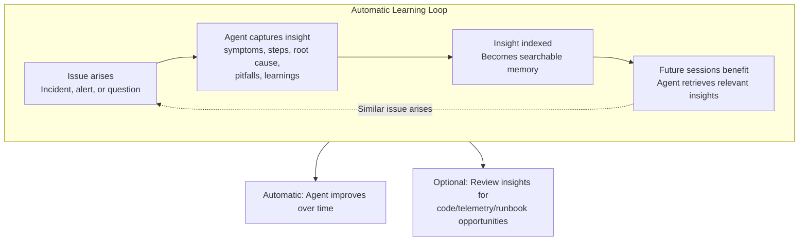

# Documentation connector in Azure SRE Agent preview

The Azure SRE Agent documentation connector automatically crawls Azure DevOps repositories to index troubleshooting guides, runbooks, and documentation for agent retrieval.

### Key features

- **Automated crawling**: Runs every 24 hours without manual intervention

- **Wide file format support**: Indexes `.md`, `.txt`, `.rst`, `.adoc`, `.html`, `.json`, `.yaml`, `.yml`, `.xml`, `.csv`, and more

- **Azure DevOps integration**: Connects to Git repositories using managed identity

- **Semantic search**: Documents are chunked, embedded, and indexed for AI-powered retrieval

### Prerequisites

Before setting up a documentation connector:

- Azure DevOps repository containing documentation
- Managed identity configured for the agent (User-Assigned or System-Assigned)
- Repository read access granted to the managed identity

### Setup

1. In the portal, go to **Settings** > **Basics** and note the managed identity name.
1. In Azure DevOps, add the managed identity as a user with **Basic** access level.
1. Grant **Read** permission on the target repository.
1. Go to **Settings** > **Connectors** and select **Add connector**.
1. Select **Documentation connector**, enter the repository URL, and select the managed identity.
1. The connector starts indexing right away.

## Session insights

As the agent handles your incidents, it learns. Session Insights capture what worked, what didn't, and key learnings from each session. The agent automatically applies that knowledge to help with similar issues in the future.

### Automatic improvement

The agent learns from every session without any manual effort:

* The agent handles an issue autonomously or works with you directly.
* The agent captures symptoms, resolution steps, root cause, and pitfalls.
* These insights become searchable memories.
* Future sessions automatically retrieve relevant past insights.

The result: the agent gets better over time, suggesting proven resolutions and avoiding known pitfalls.

### Discover opportunities

While session insights work automatically, reviewing them can surface valuable patterns you might want to act on.

| Pattern you might discover | Potential action |
|---------------------------|------------------|
| Same issue keeps recurring | Fix the underlying code or configuration |
| Agent lacks context about your service | Create a custom subagent with domain knowledge |
| Troubleshooting steps aren't documented | Update or create a runbook |
| Telemetry gaps made diagnosis harder | Improve logging or add metrics |
| Alert triggered but wasn't actionable | Tune the alert or add runbook links |

Think of session insights as a window into what the agent learns. You might find something worth acting on, or you might just let the agent handle any surfaced issues.

### How it works

Session Insights create a continuous improvement loop: the agent captures symptoms, steps, root cause, and pitfalls from each session, then retrieves relevant past insights when similar issues arise. This automatic cycle helps the agent resolve problems faster over time.

### What the agent captures

The agent captures series of data points from each session to improve future troubleshooting.

| Captured | How the agent uses it |
|----------|----------------------|
| **Symptoms observed** | Recognizes similar patterns in future problems |
| **Steps that worked** | Suggests proven resolution paths |
| **Root cause found** | Jumps to likely causes faster |
| **Pitfalls encountered** | Avoids repeating mistakes |
| **Context you provided** | Remembers facts about your environment |
| **Resources involved** | Connects past problems on same resources |

### When insights are generated

The system generates insights automatically after conversations finish, or you can request them on-demand.

- **Automatically**: After conversations finish (runs periodically, approximately every 30 minutes)
- **On-demand**: Select **Generate Session Insights** in the chat footer for immediate results (about 30 seconds)

### Browse insights

Go to **Settings** > **Session Insights** to see what the agent learned:

- **Total count** in the header
- **List of insights** with session title and timestamp
- **Detail view** with expandable Timeline and Agent Performance sections
- **Go to Thread** to revisit the original conversation

> [!NOTE]
> While periodic manual browsing of insights can surface recurring patterns worth addressing, the agent benefits from these insights whether you review them or not.

### Insight structure

Each insight includes:

- **Timeline**: Chronological milestones of the troubleshooting session (up to eight)
- **Agent Performance**: What went well, areas for improvement, and key learnings
- **Investigation quality score**: 1-5 rating for investigation completeness

## Related content

- [Memory system](./memory-system.md)
