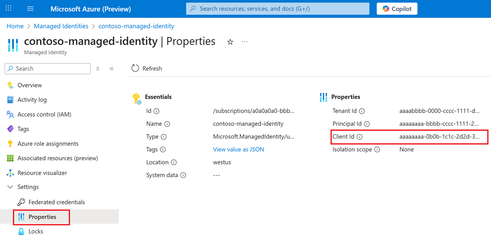
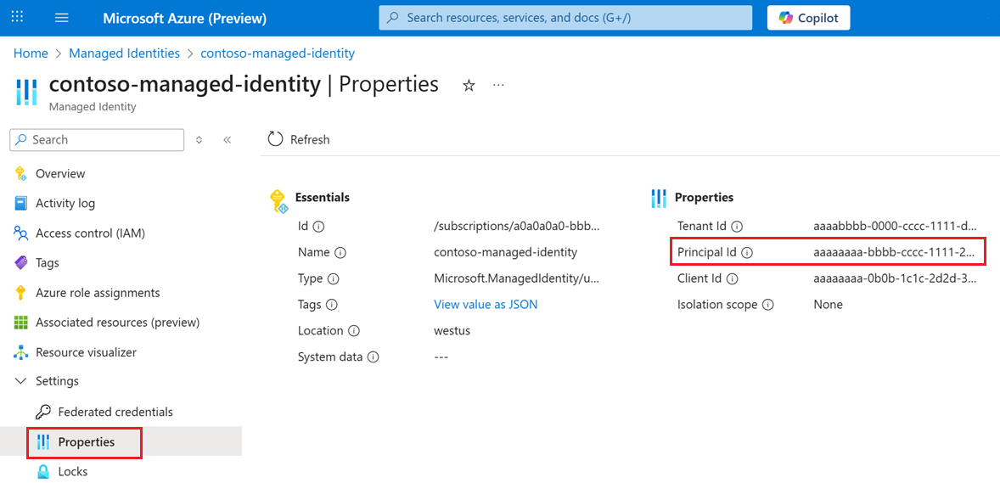
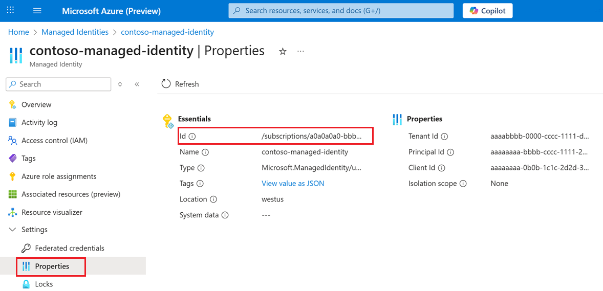

# Authorize AzCopy access by using a managed identity

Managed identities provide a secure and convenient way to authorize [AzCopy](storage-use-azcopy-v10.md) operations without storing credentials or managing SAS tokens. This authentication method is particularly valuable for automated scripts, CI/CD pipelines, and applications running on Azure Virtual Machines or other Azure services.

This article shows you how to configure AzCopy to use either system-assigned or user-assigned managed identities. You can authorize access through environment variables, the AzCopy login command, or by leveraging existing Azure CLI or Azure PowerShell sessions.

For more information about other ways to authorize access to AzCopy, see [Authorize AzCopy](storage-use-azcopy-v10.md#authorize-azcopy).

## Verify role assignments

Ensure your managed identity has the required Azure role for your intended operations:

- For download operations, use [Storage Blob Data Reader](../../role-based-access-control/built-in-roles.md#storage-blob-data-reader) (Blob Storage) or [Storage File Data Privileged Reader](../../role-based-access-control/built-in-roles.md#storage-file-data-privileged-reader) (Azure Files).

- For upload operations, use [Storage Blob Data Contributor](../../role-based-access-control/built-in-roles.md#storage-blob-data-contributor) or [Storage Blob Data Owner](../../role-based-access-control/built-in-roles.md#storage-blob-data-owner) (Blob Storage) or [Storage File Data Privileged Contributor](../../role-based-access-control/built-in-roles.md#storage-file-data-privileged-contributor) (Azure Files).

For role assignment instructions, see [Assign an Azure role for access to blob data](../blobs/assign-azure-role-data-access.md) (Blob Storage) or [Choose how to authorize access to file data in the Azure portal](../files/authorize-data-operations-portal.md) (Azure Files).

> [!NOTE]
> Role assignments can take up to five minutes to propagate.

If you're transferring blobs in an account that has a hierarchical namespace, you don't need to assign one of these roles to your security principal if you add your security principal to the access control list (ACL) of the target container or directory. In the ACL, your security principal needs write permission on the target directory, and execute permission on container and each parent directory. To learn more, see [Access control model in Azure Data Lake Storage](../blobs/data-lake-storage-access-control-model.md).

## Authorize by using environment variables

To authorize access, set in-memory environment variables. Then run any AzCopy command. AzCopy retrieves the authentication token required to complete the operation. After the operation completes, the token disappears from memory.

AzCopy retrieves the OAuth token by using the credentials that you provide. Alternatively, AzCopy can use the OAuth token of an active Azure CLI or Azure PowerShell session.

This option is great if you plan to use AzCopy inside of a script that runs without user interaction, and the script runs from an Azure Virtual Machine (VM). When you use this option, you don't need to store any credentials on the VM.

You can sign in to your account by using a system-wide managed identity that you enable on your VM, or by using the client ID, object ID, or resource ID of a user-assigned managed identity that you assign to your VM.

To learn more about how to enable a system-wide managed identity or create a user-assigned managed identity, see [Configure managed identities for Azure resources on a VM using the Azure portal](../../active-directory/managed-identities-azure-resources/qs-configure-portal-windows-vm.md#enable-system-assigned-managed-identity-on-an-existing-vm).

### Authorize by using a system-wide managed identity

First, make sure that you enable a system-wide managed identity on your VM. For more information, see [System-assigned managed identity](../../active-directory/managed-identities-azure-resources/qs-configure-portal-windows-vm.md#system-assigned-managed-identity).

Type the following command, and then press ENTER.

#### [Linux](#tab/linux)

```bash
export AZCOPY_AUTO_LOGIN_TYPE=MSI
```

#### [Windows](#tab/windows)

```powershell
$Env:AZCOPY_AUTO_LOGIN_TYPE="MSI"
```
---

Then, run any azcopy command. For example: `azcopy list https://contoso.blob.core.windows.net`.

### Authorize by using a user-assigned managed identity

First, make sure that you enable a user-assigned managed identity on your VM. For more information, see [User-assigned managed identity](../../active-directory/managed-identities-azure-resources/qs-configure-portal-windows-vm.md#user-assigned-managed-identity). 

Type the following command, and then press ENTER.

#### [Linux](#tab/linux)

```bash
export AZCOPY_AUTO_LOGIN_TYPE=MSI
```

#### [Windows](#tab/windows)

```powershell
$Env:AZCOPY_AUTO_LOGIN_TYPE="MSI"
```
---

Next, set environment variables for either the client ID, object ID, or resource ID of the user-assigned managed identity. 

#### Use a client ID

To authorize by using a client ID, type the following command, and then press ENTER.

##### [Linux](#tab/linux)

```bash
export AZCOPY_MSI_CLIENT_ID=<client-id>
```

##### [Windows](#tab/windows)

```powershell
$Env:AZCOPY_MSI_CLIENT_ID="<client-id>"
```
---

Replace the `<client-id>` placeholder with the client ID of the user-assigned managed identity.

You can find the client ID in the Azure portal by viewing the properties of the managed identity. The following screenshot shows the location of the client ID property.

> [!div class="mx-imgBorder"]
> 

#### Use an object ID

To authorize by using an object ID, type the following command, and then press ENTER.

##### [Linux](#tab/linux)

```bash
export AZCOPY_MSI_OBJECT_ID=<object-id>
```

##### [Windows](#tab/windows)

```powershell
$Env:AZCOPY_MSI_OBJECT_ID="<object-id>"
```

---

Replace the `<object-id>` placeholder with the object ID of the user-assigned managed identity.

You can find the object ID in the Azure portal by viewing the properties of the managed identity. The following screenshot shows the location of the object ID (also called the *principal ID*).

> [!div class="mx-imgBorder"]
> 

#### Use a resource ID

To authorize by using a resource ID, type the following command, and then press ENTER.

##### [Linux](#tab/linux)

```bash
export AZCOPY_MSI_RESOURCE_STRING=<resource-id>
```

##### [Windows](#tab/windows)

```powershell
$Env:AZCOPY_MSI_RESOURCE_STRING="<resource-id>"
```

---

Replace the `<resource-id>` placeholder with the resource ID of the user-assigned managed identity.

You can find the resource ID in the Azure portal by viewing the properties of the managed identity. The following screenshot shows the location of the resource ID property.

> [!div class="mx-imgBorder"]
> 

## Authorize by using the AzCopy authentication login command

Instead of using in-memory variables, authorize access by using the `azcopy login` command.

The azcopy login command retrieves an OAuth token and then places that token into a secret store on your system. If your operating system doesn't have a secret store such as a Linux keyring, the azcopy authentication login command doesn't work because there's nowhere to place the token.

### Authorize with a system-wide managed identity

First, make sure that you enable a system-wide managed identity on your VM. For more information, see [System-assigned managed identity](../../active-directory/managed-identities-azure-resources/qs-configure-portal-windows-vm.md#system-assigned-managed-identity).

Then, in your command console, type the following command, and then press the ENTER key.

```azcopy
azcopy login --identity
```

### Authorize with a user-assigned managed identity

First, make sure that you enable a user-assigned managed identity on your VM. For more information, see [User-assigned managed identity](../../active-directory/managed-identities-azure-resources/qs-configure-portal-windows-vm.md#user-assigned-managed-identity). Then, sign in by using either the client ID, object ID, or resource ID of the user-assigned managed identity. 

#### Sign in by using a client ID

Type the following command, and then press ENTER.

```azcopy
azcopy login --identity --identity-client-id "<client-id>"
```

Replace the `<client-id>` placeholder with the client ID of the user-assigned managed identity.

You can find the client ID in the Azure portal by viewing the properties of the managed identity. The following screenshot shows the location of the client ID property.

> [!div class="mx-imgBorder"]
> 

#### Sign in by using an object ID

Type the following command, and then press ENTER.

```azcopy
azcopy login --identity --identity-object-id "<object-id>"
```

Replace the `<object-id>` placeholder with the object ID of the user-assigned managed identity.

You can find the object ID in the Azure portal by viewing the properties of the managed identity. The following screenshot shows the location of the object ID (also called the *principal ID*).

> [!div class="mx-imgBorder"]
> 

#### Sign in by using a resource ID

Type the following command, and then press ENTER.

```azcopy
azcopy login --identity --identity-resource-id "<resource-id>"
```

Replace the `<resource-id>` placeholder with the resource ID of the user-assigned managed identity.

You can find the resource ID in the Azure portal by viewing the properties of the managed identity. The following screenshot shows the location of the resource ID property.

> [!div class="mx-imgBorder"]
> 

## Authorize with Azure CLI

When you sign in by using Azure CLI, Azure CLI gets an OAuth token that AzCopy uses to authorize operations.

To enable AzCopy to use that token, type the following command, and then press the **ENTER** key.

### [Linux](#tab/linux)

```bash
export AZCOPY_AUTO_LOGIN_TYPE=AZCLI
export AZCOPY_TENANT_ID=<tenant-id>
```

### [Windows](#tab/windows)

```powershell
$Env:AZCOPY_AUTO_LOGIN_TYPE="PSCRED"
$Env:AZCOPY_TENANT_ID="<tenant-id>"
```

---

For more information about how to sign in by using the Azure CLI, see [Sign into Azure with a managed identity using Azure CLI](/cli/azure/authenticate-azure-cli-managed-identity).

## Authorize with Azure PowerShell

If you sign in by using Azure PowerShell, Azure PowerShell obtains an OAuth token that AzCopy can use to authorize operations.  

To enable AzCopy to use that token, type the following command, and then press the **ENTER** key.

```PowerShell
$Env:AZCOPY_AUTO_LOGIN_TYPE="PSCRED"
$Env:AZCOPY_TENANT_ID="<tenant-id>"
```

For more information about how to sign in by using Azure PowerShell, see [Login with a managed identity](/powershell/azure/authenticate-noninteractive#login-with-a-managed-identity).

## Next steps

- For more information about AzCopy, see [Get started with AzCopy](storage-use-azcopy-v10.md).

- If you have questions, encounter problems, or have general feedback, submit them [on GitHub](https://github.com/Azure/azure-storage-azcopy).
