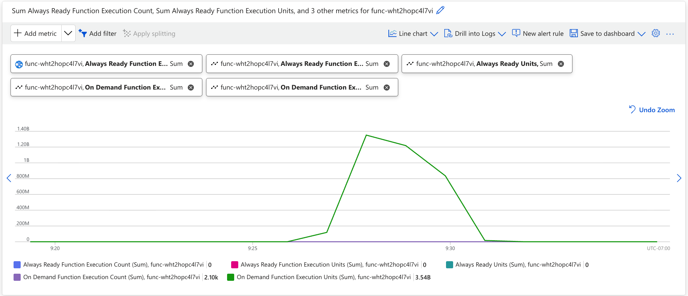

The app-level metrics available to your app depend on the type of consumption plan you use.

#### [Flex Consumption plan](#tab/flex-consumption-plan)

These Azure Monitor metrics are related to Flex Consumption plan billing:

[!INCLUDE [functions-flex-consumption-metrics-table](functions-flex-consumption-metrics-table.md)]

#### [Consumption plan](#tab/consumption-plan)

These Azure Monitor metrics are related to Consumption plan billing:

[!INCLUDE [functions-flex-consumption-metrics-table](functions-consumption-metrics-table.md)]

---

For more information, see [Azure Functions monitoring data reference](../articles/azure-functions/monitor-functions-reference.md).

To better understand the costs of your functions, use Azure Monitor to view cost-related metrics that your function apps generate. You can view Monitor metrics by using one of these tools:

#### [Portal](#tab/portal/flex-consumption-plan)

Use [Azure Monitor metrics explorer](/azure/azure-monitor/essentials/metrics-getting-started) to view cost-related data for your Flex Consumption plan function apps in a graphical format. 

1. In the [Azure portal], go to your function app.

1. In the left panel, scroll down to **Monitoring** and select **Metrics**.

1. From **Metric**, select **On Demand Function Execution Count** and **Sum** for **Aggregation**. This selection adds the sum of the execution counts during the chosen period to the chart.

1. Select **Add metric** and add **On Demand Function Execution Units**, **Always Ready Function Execution Count**, **Always Ready Function Execution Units**, and **Always Ready Units**  to the chart. 

The resulting chart contains the totals for all the Flex Consumption execution metrics in the chosen time range, which in this example is a custom time range.



Because the number of On Demand Function Execution Units is greater than On Demand Function Execution Count, and there were no [always ready instances](../articles/azure-functions/flex-consumption-plan.md#always-ready-instances) on the app, the chart just shows On Demand Function Execution Units.

This chart shows a total of 3.54 billion `On Demand Function Execution Units` consumed in a 16-minute period, measured in MB-milliseconds. To convert to GB-seconds, divide by 1,024,000. In this example, the function app consumed `3,540,000,000 / 1,024,000 = 3,457.03` GB-seconds. You can take this value and multiply it by the current price of On Demand Execution Time on the [Functions pricing page](https://azure.microsoft.com/pricing/details/functions/), which gives you the cost of these 16 minutes, assuming you already used any free grants of execution time. You can use this same calculation with the The Always Ready Function Execution Units metric and the Always Ready Execution Time billing meter cost, as well as with the Always Ready Units metric and the Always Ready Baseline billing meter cost, to find out the GB-seconds costs for always ready instances.

To calculate the On Demand Total Executions cost, take the On Demand Function Execution Count sum for the same time period, convert to millions, and then multiply by the On Demand Total Executions price on the [Functions pricing page](https://azure.microsoft.com/pricing/details/functions/). For example, 2,100 executions in the example above converts to `0.0021` million executions. You can use this same calculation with the Always Ready Function Execution Count metric and the Always Ready Total Executions billing meter to find out the cost for executions handled by always ready instance.

#### [Azure CLI](#tab/azure-cli/flex-consumption-plan)

The [Azure CLI](/cli/azure/) has commands for retrieving metrics. You can execute CLI commands locally or in the portal using [Azure Cloud Shell](../articles/cloud-shell/overview.md). For example, the following [az monitor metrics list](/cli/azure/monitor/metrics#az-monitor-metrics-list) command returns hourly data over the same time period used before.

Make sure to replace `<AZURE_SUBSCRIPTION_ID>` with your Azure subscription ID running the command, `<RESOURCE_GROUP_NAME>` with the resource group name, and `<FUNCTION_APP_NAME>` with the function app name.

```azurecli-interactive
az monitor metrics list --resource /subscriptions/<AZURE_SUBSCRIPTION_ID>/resourceGroups/<RESOURCE_GROUP_NAME>/providers/Microsoft.Web/sites/<FUNCTION_APP_NAME> --metric OnDemandFunctionExecutionUnits,OnDemandFunctionExecutionCount,AlwaysReadyFunctionExecutionUnits,AlwaysReadyUnits,AlwaysReadyFunctionExecutionCount --aggregation Total --interval PT1H --start-time 2025-10-24T16:24:00Z --end-time 2025-10-24T16:33:00Z
```

This command returns a JSON payload that looks like the following example:

```json
{
  "cost": 40,
  "interval": "PT1H",
  "namespace": "Microsoft.Web/sites",
  "resourceregion": "westus2",
  "timespan": "2025-10-24T16:24:00Z/2025-10-24T16:33:00Z",
  "value": [
    {
      "displayDescription": "On Demand Function Execution Units. For Flex Consumption FunctionApps only.",
      "errorCode": "Success",
      "id": "/subscriptions/<AZURE_SUBSCRIPTION_ID>/resourceGroups/rg-eventhubs-demo/providers/Microsoft.Web/sites/func-wht2hopc4l7vi/providers/Microsoft.Insights/metrics/OnDemandFunctionExecutionUnits",
      "name": {
        "localizedValue": "On Demand Function Execution Units",
        "value": "OnDemandFunctionExecutionUnits"
      },
      "resourceGroup": "rg-eventhubs-demo",
      "timeseries": [
        {
          "data": [
            {
              "timeStamp": "2025-10-24T16:24:00Z",
              "total": 3540992000.0
            }
          ],
          "metadatavalues": []
        }
      ],
      "type": "Microsoft.Insights/metrics",
      "unit": "Count"
    },
    {
      "displayDescription": "On Demand Function Execution Count. For Flex Consumption FunctionApps only.",
      "errorCode": "Success",
      "id": "/subscriptions/<AZURE_SUBSCRIPTION_ID>/resourceGroups/rg-eventhubs-demo/providers/Microsoft.Web/sites/func-wht2hopc4l7vi/providers/Microsoft.Insights/metrics/OnDemandFunctionExecutionCount",
      "name": {
        "localizedValue": "On Demand Function Execution Count",
        "value": "OnDemandFunctionExecutionCount"
      },
      "resourceGroup": "rg-eventhubs-demo",
      "timeseries": [
        {
          "data": [
            {
              "timeStamp": "2025-10-24T16:24:00Z",
              "total": 2102.0
            }
          ],
          "metadatavalues": []
        }
      ],
      "type": "Microsoft.Insights/metrics",
      "unit": "Count"
    },
    {
      "displayDescription": "Always Ready Function Execution Units. For Flex Consumption FunctionApps only.",
      "errorCode": "Success",
      "id": "/subscriptions/<AZURE_SUBSCRIPTION_ID>/resourceGroups/rg-eventhubs-demo/providers/Microsoft.Web/sites/func-wht2hopc4l7vi/providers/Microsoft.Insights/metrics/AlwaysReadyFunctionExecutionUnits",
      "name": {
        "localizedValue": "Always Ready Function Execution Units",
        "value": "AlwaysReadyFunctionExecutionUnits"
      },
      "resourceGroup": "rg-eventhubs-demo",
      "timeseries": [
        {
          "data": [
            {
              "timeStamp": "2025-10-24T16:24:00Z",
              "total": 0.0
            }
          ],
          "metadatavalues": []
        }
      ],
      "type": "Microsoft.Insights/metrics",
      "unit": "Count"
    },
    {
      "displayDescription": "Always Ready Units. For Flex Consumption FunctionApps only.",
      "errorCode": "Success",
      "id": "/subscriptions/<AZURE_SUBSCRIPTION_ID>/resourceGroups/rg-eventhubs-demo/providers/Microsoft.Web/sites/func-wht2hopc4l7vi/providers/Microsoft.Insights/metrics/AlwaysReadyUnits",
      "name": {
        "localizedValue": "Always Ready Units",
        "value": "AlwaysReadyUnits"
      },
      "resourceGroup": "rg-eventhubs-demo",
      "timeseries": [
        {
          "data": [
            {
              "timeStamp": "2025-10-24T16:24:00Z",
              "total": 0.0
            }
          ],
          "metadatavalues": []
        }
      ],
      "type": "Microsoft.Insights/metrics",
      "unit": "Count"
    },
    {
      "displayDescription": "Always Ready Function Execution Count. For Flex Consumption FunctionApps only.",
      "errorCode": "Success",
      "id": "/subscriptions/<AZURE_SUBSCRIPTION_ID>/resourceGroups/rg-eventhubs-demo/providers/Microsoft.Web/sites/func-wht2hopc4l7vi/providers/Microsoft.Insights/metrics/AlwaysReadyFunctionExecutionCount",
      "name": {
        "localizedValue": "Always Ready Function Execution Count",
        "value": "AlwaysReadyFunctionExecutionCount"
      },
      "resourceGroup": "rg-eventhubs-demo",
      "timeseries": [
        {
          "data": [
            {
              "timeStamp": "2025-10-24T16:24:00Z",
              "total": 0.0
            }
          ],
          "metadatavalues": []
        }
      ],
      "type": "Microsoft.Insights/metrics",
      "unit": "Count"
    }
  ]
}

```
This particular response shows that from `2025-10-24T16:24:00Z` to `2025-10-24T16:33:00Z`, the app consumed 3,540,992,000 MB-milliseconds (3458.00 GB-seconds) of On Demand Function Execution Units, and 2,102 executions (0.0021 million executions) of On Demand Function Execution Counts.

#### [Azure PowerShell](#tab/azure-powershell/flex-consumption-plan) 

The [Azure PowerShell](/powershell/azure/) has commands for retrieving metrics. You can use Azure PowerShell from a local command environment or directly from the portal using [Azure Cloud Shell](../articles/cloud-shell/overview.md). For example, the following [Get-AzMetric](/powershell/module/az.monitor/get-azmetric) command returns hourly data over the same time period used before.

Make sure to replace `<AZURE_SUBSCRIPTION_ID>` with your Azure subscription ID running the command, `<RESOURCE_GROUP_NAME>` with the resource group name, and `<FUNCTION_APP_NAME>` with the function app name.

```azurepowershell-interactive
Get-AzMetric -ResourceId /subscriptions/<AZURE_SUBSCRIPTION_ID>/resourceGroups/<RESOURCE_GROUP_NAME>/providers/Microsoft.Web/sites/<FUNCTION_APP_NAME> -MetricName OnDemandFunctionExecutionUnits,OnDemandFunctionExecutionCount,AlwaysReadyFunctionExecutionUnits,AlwaysReadyUnits,AlwaysReadyFunctionExecutionCount -AggregationType Total -TimeGrain 01:00:00 -StartTime 2025-10-24T16:24:00Z -EndTime 2025-10-24T16:33:00Z
```

This command returns an output that looks like the following example:

```Output
Id         : /subscriptions/<AZURE_SUBSCRIPTION_ID>/resourceGroups/rg-eventhubs-demo/providers/Microsoft.Web/sites/func-wht2hopc4l7vi/providers/Microsoft.Insights/metrics/OnDemandFunctionExecutionUnits
Name       : 
                LocalizedValue : On Demand Function Execution Units
                Value          : OnDemandFunctionExecutionUnits
             
Type       : Microsoft.Insights/metrics
Unit       : Count
Data       : {Microsoft.Azure.Commands.Insights.OutputClasses.PSMetricValue, 
             Microsoft.Azure.Commands.Insights.OutputClasses.PSMetricValue, 
             Microsoft.Azure.Commands.Insights.OutputClasses.PSMetricValue, 
             Microsoft.Azure.Commands.Insights.OutputClasses.PSMetricValue…}
Timeseries : {Microsoft.Azure.Management.Monitor.Models.TimeSeriesElement}

Id         : /subscriptions/<AZURE_SUBSCRIPTION_ID>/resourceGroups/rg-eventhubs-demo/providers/Microsoft.Web/sites/func-wht2hopc4l7vi/providers/Microsoft.Insights/metrics/OnDemandFunctionExecutionCount
Name       : 
                LocalizedValue : On Demand Function Execution Count
                Value          : OnDemandFunctionExecutionCount
             
Type       : Microsoft.Insights/metrics
Unit       : Count
Data       : {Microsoft.Azure.Commands.Insights.OutputClasses.PSMetricValue, 
             Microsoft.Azure.Commands.Insights.OutputClasses.PSMetricValue, 
             Microsoft.Azure.Commands.Insights.OutputClasses.PSMetricValue, 
             Microsoft.Azure.Commands.Insights.OutputClasses.PSMetricValue…}
Timeseries : {Microsoft.Azure.Management.Monitor.Models.TimeSeriesElement}

Id         : /subscriptions/<AZURE_SUBSCRIPTION_ID>/resourceGroups/rg-eventhubs-demo/providers/Microsoft.Web/sites/func-wht2hopc4l7vi/providers/Microsoft.Insights/metrics/AlwaysReadyFunctionExecutionUnits
Name       : 
                LocalizedValue : Always Ready Function Execution Units
                Value          : AlwaysReadyFunctionExecutionUnits
             
Type       : Microsoft.Insights/metrics
Unit       : Count
Data       : {Microsoft.Azure.Commands.Insights.OutputClasses.PSMetricValue, 
             Microsoft.Azure.Commands.Insights.OutputClasses.PSMetricValue, 
             Microsoft.Azure.Commands.Insights.OutputClasses.PSMetricValue, 
             Microsoft.Azure.Commands.Insights.OutputClasses.PSMetricValue…}
Timeseries : {Microsoft.Azure.Management.Monitor.Models.TimeSeriesElement}

Id         : /subscriptions/<AZURE_SUBSCRIPTION_ID>/resourceGroups/rg-eventhubs-demo/providers/Microsoft.Web/sites/func-wht2hopc4l7vi/providers/Microsoft.Insights/metrics/AlwaysReadyUnits
Name       : 
                LocalizedValue : Always Ready Units
                Value          : AlwaysReadyUnits
             
Type       : Microsoft.Insights/metrics
Unit       : Count
Data       : {Microsoft.Azure.Commands.Insights.OutputClasses.PSMetricValue, 
             Microsoft.Azure.Commands.Insights.OutputClasses.PSMetricValue, 
             Microsoft.Azure.Commands.Insights.OutputClasses.PSMetricValue, 
             Microsoft.Azure.Commands.Insights.OutputClasses.PSMetricValue…}
Timeseries : {Microsoft.Azure.Management.Monitor.Models.TimeSeriesElement}

Id         : /subscriptions/<AZURE_SUBSCRIPTION_ID>/resourceGroups/rg-eventhubs-demo/providers/Microsoft.Web/sites/func-wht2hopc4l7vi/providers/Microsoft.Insights/metrics/AlwaysReadyFunctionExecutionCount
Name       : 
                LocalizedValue : Always Ready Function Execution Count
                Value          : AlwaysReadyFunctionExecutionCount
             
Type       : Microsoft.Insights/metrics
Unit       : Count
Data       : {Microsoft.Azure.Commands.Insights.OutputClasses.PSMetricValue, 
             Microsoft.Azure.Commands.Insights.OutputClasses.PSMetricValue, 
             Microsoft.Azure.Commands.Insights.OutputClasses.PSMetricValue, 
             Microsoft.Azure.Commands.Insights.OutputClasses.PSMetricValue…}
Timeseries : {Microsoft.Azure.Management.Monitor.Models.TimeSeriesElement}
```

The `Data` property contains the actual metric values.

#### [Portal](#tab/portal/consumption-plan)

Use [Azure Monitor metrics explorer](/azure/azure-monitor/essentials/metrics-getting-started) to view cost-related data for your Consumption plan function apps in a graphical format. 

1. In the [Azure portal], go to your function app.

1. In the left panel, scroll down to **Monitoring** and select **Metrics**.  

1. From **Metric**, select **Function Execution Count** and **Sum** for **Aggregation**. This selection adds the sum of the execution counts during the chosen period to the chart.

    

1. Select **Add metric** and repeat steps 2-4 to add **Function Execution Units** to the chart. 

The resulting chart contains the totals for both execution metrics in the chosen time range, which in this case is two hours.


Because the number of execution units is much greater than the execution count, the chart shows only execution units.

This chart shows a total of 1.11 billion `Function Execution Units` consumed in a two-hour period, measured in MB-milliseconds. To convert to GB-seconds, divide by 1,024,000. In this example, the function app consumed `1,110,000,000 / 1,024,000 = 1,083.98` GB-seconds. Multiply this value by the current price of execution time on the [Functions pricing page](https://azure.microsoft.com/pricing/details/functions/), which gives you the cost of these two hours, assuming you already used any free grants of execution time. 

#### [Azure CLI](#tab/azure-cli/consumption-plan)

The [Azure CLI](/cli/azure/) has commands for retrieving metrics. You can execute CLI commands locally or in the portal using [Azure Cloud Shell](../articles/cloud-shell/overview.md). For example, the following [az monitor metrics list](/cli/azure/monitor/metrics#az-monitor-metrics-list) command returns hourly data over the same time period used before.

Make sure to replace `<AZURE_SUBSCRIPTION_ID>` with your Azure subscription ID running the command.

```azurecli-interactive
az monitor metrics list --resource /subscriptions/<AZURE_SUBSCRIPTION_ID>/resourceGroups/metrics-testing-consumption/providers/Microsoft.Web/sites/metrics-testing-consumption --metric FunctionExecutionUnits,FunctionExecutionCount --aggregation Total --interval PT1H --start-time 2019-09-11T21:46:00Z --end-time 2019-09-11T23:18:00Z
```

This command returns a JSON payload that looks like the following example:

```json
{
  "cost": 0.0,
  "interval": "1:00:00",
  "namespace": "Microsoft.Web/sites",
  "resourceregion": "centralus",
  "timespan": "2019-09-11T21:46:00Z/2019-09-11T23:18:00Z",
  "value": [
    {
      "id": "/subscriptions/XXXXXXX-XXXX-XXXX-XXXX-XXXXXXXXXXX/resourceGroups/metrics-testing-consumption/providers/Microsoft.Web/sites/metrics-testing-consumption/providers/Microsoft.Insights/metrics/FunctionExecutionUnits",
      "name": {
        "localizedValue": "Function Execution Units",
        "value": "FunctionExecutionUnits"
      },
      "resourceGroup": "metrics-testing-consumption",
      "timeseries": [
        {
          "data": [
            {
              "average": null,
              "count": null,
              "maximum": null,
              "minimum": null,
              "timeStamp": "2019-09-11T21:46:00+00:00",
              "total": 793294592.0
            },
            {
              "average": null,
              "count": null,
              "maximum": null,
              "minimum": null,
              "timeStamp": "2019-09-11T22:46:00+00:00",
              "total": 316576256.0
            }
          ],
          "metadatavalues": []
        }
      ],
      "type": "Microsoft.Insights/metrics",
      "unit": "Count"
    },
    {
      "id": "/subscriptions/XXXXXXX-XXXX-XXXX-XXXX-XXXXXXXXXXX/resourceGroups/metrics-testing-consumption/providers/Microsoft.Web/sites/metrics-testing-consumption/providers/Microsoft.Insights/metrics/FunctionExecutionCount",
      "name": {
        "localizedValue": "Function Execution Count",
        "value": "FunctionExecutionCount"
      },
      "resourceGroup": "metrics-testing-consumption",
      "timeseries": [
        {
          "data": [
            {
              "average": null,
              "count": null,
              "maximum": null,
              "minimum": null,
              "timeStamp": "2019-09-11T21:46:00+00:00",
              "total": 33538.0
            },
            {
              "average": null,
              "count": null,
              "maximum": null,
              "minimum": null,
              "timeStamp": "2019-09-11T22:46:00+00:00",
              "total": 13040.0
            }
          ],
          "metadatavalues": []
        }
      ],
      "type": "Microsoft.Insights/metrics",
      "unit": "Count"
    }
  ]
}
```
This particular response shows that from `2019-09-11T21:46` to `2019-09-11T23:18`, the app consumed 1,110,000,000 MB-milliseconds (1,083.98 GB-seconds).

#### [Azure PowerShell](#tab/azure-powershell/consumption-plan) 

The [Azure PowerShell](/powershell/azure/) has commands for retrieving metrics. You can use Azure PowerShell from a local command environment or directly from the portal using [Azure Cloud Shell](../articles/cloud-shell/overview.md). For example, the following [Get-AzMetric](/powershell/module/az.monitor/get-azmetric) command returns hourly data over the same time period used before.

Make sure to replace `<AZURE_SUBSCRIPTION_ID>` with your Azure subscription ID running the command.

```azurepowershell-interactive
Get-AzMetric -ResourceId /subscriptions/<AZURE_SUBSCRIPTION_ID>/resourceGroups/metrics-testing-consumption/providers/Microsoft.Web/sites/metrics-testing-consumption -MetricName  FunctionExecutionUnits,FunctionExecutionCount -AggregationType Total -TimeGrain 01:00:00 -StartTime 2019-09-11T21:46:00Z -EndTime 2019-09-11T23:18:00Z
```

This command returns an output that looks like the following example:

```Output
Id         : /subscriptions/<AZURE_SUBSCRIPTION_ID>/resourceGroups/metrics-testing-consumption/providers/Microsoft.Web/sites/metrics-testing-consumption/providers/Microsoft.Insights/metrics/FunctionExecutionUnits
Name       : 
                LocalizedValue : Function Execution Units
                Value          : FunctionExecutionUnits
             
Type       : Microsoft.Insights/metrics
Unit       : Count
Data       : {Microsoft.Azure.Commands.Insights.OutputClasses.PSMetricValue, 
             Microsoft.Azure.Commands.Insights.OutputClasses.PSMetricValue, 
             Microsoft.Azure.Commands.Insights.OutputClasses.PSMetricValue, 
             Microsoft.Azure.Commands.Insights.OutputClasses.PSMetricValue…}
Timeseries : {Microsoft.Azure.Management.Monitor.Models.TimeSeriesElement}

Id         : /subscriptions/<AZURE_SUBSCRIPTION_ID>/resourceGroups/metrics-testing-consumption/providers/Microsoft.Web/sites/metrics-testing-consumption/providers/Microsoft.Insights/metrics/FunctionExecutionCount
Name       : 
                LocalizedValue : Function Execution Count
                Value          : FunctionExecutionCount
             
Type       : Microsoft.Insights/metrics
Unit       : Count
Data       : {Microsoft.Azure.Commands.Insights.OutputClasses.PSMetricValue, 
             Microsoft.Azure.Commands.Insights.OutputClasses.PSMetricValue, 
             Microsoft.Azure.Commands.Insights.OutputClasses.PSMetricValue, 
             Microsoft.Azure.Commands.Insights.OutputClasses.PSMetricValue…}
Timeseries : {Microsoft.Azure.Management.Monitor.Models.TimeSeriesElement}
```

The `Data` property contains the actual metric values.

---

[Azure portal]: https://portal.azure.com